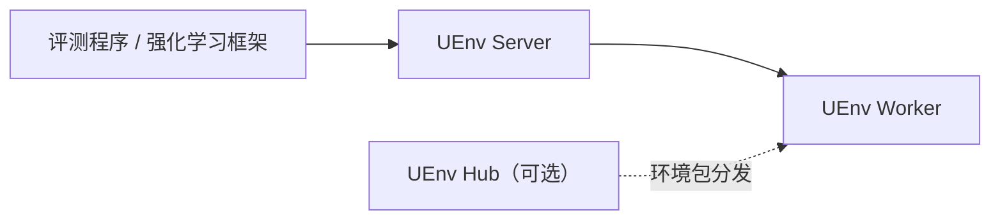

# 架构与组件

UEnv 对外呈现三个组件：UEnv Server、UEnv Worker 和可选的 UEnv Hub。理解它们的职责，以及 UEnv Server 与 UEnv Worker 之间的双向网络，是部署和使用 UEnv 的基础。

## 总体架构

评测程序或强化学习框架接管任务数据后，在自身一侧直接将其转换为 UEnv Server 接入的标准数据包，再交给 UEnv Server；转换是框架接入代码的职责，链路上没有独立的转换组件。

| 组件 | 通常运行在哪里 | 用户需要知道的职责 |
|---|---|---|
| 评测程序 / 强化学习框架 | 任务主机或训练主机 | 准备样本并转换为标准数据包，消费状态、奖励和轨迹 |
| UEnv Server | 中心服务主机 | 管理 UEnv Worker，选择执行节点，跟踪 Episode 并汇总结果 |
| UEnv Worker | 一台或多台环境执行主机 | 运行环境、调用模型、计算奖励并回报结果 |
| UEnv Hub（可选） | 独立主机 | 保存和分发有版本的环境包，供 UEnv Worker 同步 |

## 组件边界

- 框架接入代码处理上层框架与 UEnv Server 之间的数据和生命周期转换；UEnv Worker 的选择由 UEnv Server 统一完成。
- UEnv Server 保存 UEnv Worker 的注册和状态，并根据环境能力与剩余容量选择 UEnv Worker。
- UEnv Worker 负责实际执行；全局调度由 UEnv Server 决定，上层框架连接同一个 UEnv Server 入口即可获得全部执行能力。
- UEnv Hub 负责环境包的存储、摘要校验和版本分发；Episode 调度始终只在 UEnv Server 与 UEnv Worker 之间进行。

因此，接入新的强化学习框架时实现对应的接入代码；增加执行容量时新增 UEnv Worker；日常任务始终连接同一个 UEnv Server 入口。

## 网络连接

UEnv 各组件之间的网络连接如下：

| 发起方 | 目标 | 默认端口 | 用途 |
|---|---|---:|---|
| 评测程序 / 强化学习框架 | UEnv Server | 50051/TCP | 提交标准数据包、接收结果 |
| UEnv Worker | UEnv Server | 50051/TCP | 注册、心跳和最终结果上报 |
| UEnv Server | UEnv Worker | 50054/TCP | 派发 Episode、取消和准备环境 |
| UEnv Worker | UEnv Hub | 8080/TCP | 同步环境包（使用 UEnv Hub 时） |

其中 UEnv Server 与 UEnv Worker 之间是双向连接：两个方向各自发起、缺一不可。单机部署中这两个方向都在本机完成；多机部署必须分别放通和验证，具体命令见[多机部署](../2-部署UEnv/02-multi-node.md)。

## 可选 UEnv Hub

UEnv Hub 保存带版本和摘要校验的环境包，供 UEnv Worker 同步；Episode 调度始终只在 UEnv Server 与 UEnv Worker 之间进行。当多台 UEnv Worker 需要统一自定义环境版本、发布或回滚环境时，参见[部署和使用 UEnv Hub](../2-部署UEnv/05-hub.md)。
