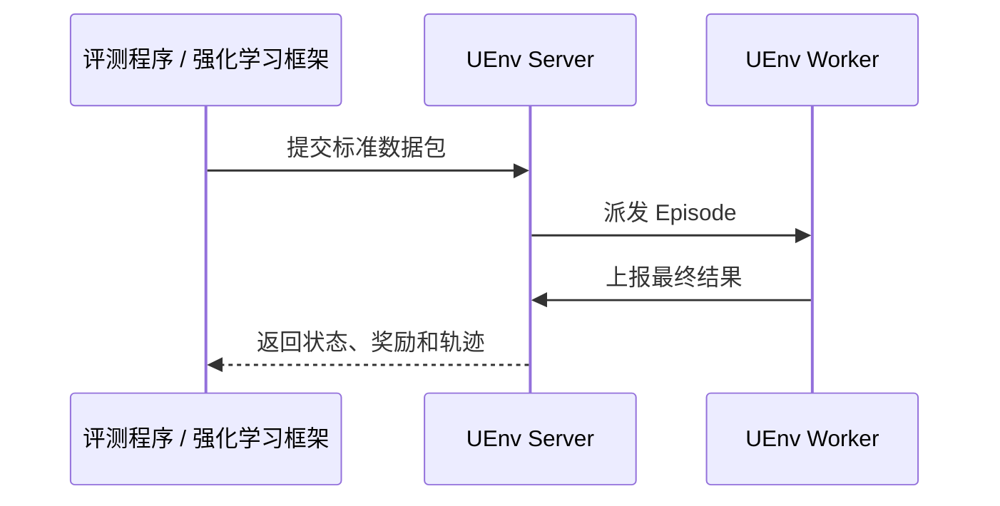

# 一次 Episode 如何完成

**Episode** 是一条任务样本的一次环境执行。评测和强化学习训练使用相同的执行链路，只是上层组织样本和使用结果的方式不同。

## 执行过程

整个执行过程分为五步：

1. 评测程序或强化学习框架接管任务数据，直接将其转换为 UEnv Server 接入的标准数据包。
2. 转换时补齐目标环境、模型访问方式和运行限制，并把请求发送给 UEnv Server。
3. UEnv Server 从已注册 UEnv Worker 中选择能力和剩余容量符合要求的节点。
4. UEnv Worker 运行环境、调用模型并形成最终结果。
5. UEnv Server 汇总结果并返回，框架再把它映射回评测或训练所需的形式。

## 返回结果

一次完成的 Episode 至少有终态；根据任务类型，还可以包含：

| 结果 | 含义 |
|---|---|
| 状态 | 已完成、失败或超时 |
| 奖励（reward） | 环境对整次执行或步骤给出的分数 |
| 轨迹（trajectory） | 执行中的动作、观察、得分和相关元数据 |

评测流程通常汇总这些结果形成指标；强化学习训练会把奖励和可用的响应数据交给训练框架。

## 中断和恢复

- UEnv Worker 心跳异常后，UEnv Server 会暂停向它派发新 Episode。
- UEnv Worker 暂时无法上报最终结果时，会保留待确认结果并在恢复连接后重试。
- UEnv Server 重启后，UEnv Worker 会重新注册，再恢复为可调度状态。
- 调用方最终应得到完成、失败或超时之一，不应依赖无限等待来判断任务结束。

租约、运行实例标识、幂等和结果重放等实现细节为上述流程提供可靠性保障，具体定义见[协议与调用方向](../6-查阅参考/04-protocols.md)。

## 下一步

部署从[单机部署](../2-部署UEnv/01-single-node.md)开始，再扩展到[多机部署](../2-部署UEnv/02-multi-node.md)。部署阶段验证服务、注册和网络；真实任务在后续评测、强化学习训练和案例中执行。
