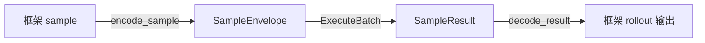

# 自定义强化学习框架接入

如果你的强化学习框架还没有现成的 UEnv 接入，不需要改造 UEnv Server 或 UEnv Worker。你只需在框架侧完成两个映射，再调用一次 UEnv 批量接口：



- `encode_sample` 负责把框架数据转成 UEnv 公开请求 `SampleEnvelope`。
- `decode_result` 负责把 UEnv 公开结果 `SampleResult` 转回框架需要的 token、mask、reward 和轨迹。
- 批量调用负责保存 ID 对应关系，即使结果乱序到达也能正确回填。

下面的示例直接使用当前发布包中的 `adapter_core_pb2` 和 `AdapterCoreServiceStub`。`EpisodeRequest` 是 UEnv 内部类型，自定义框架不应导入或构造它。

## 1. 先选对接入位置

把 UEnv 调用放在“本批 sample 已经确定，本地 rollout 还没有开始”的 hook 上。一条典型训练链路是：sample 选择、框架预处理、UEnv rollout、loss、参数更新。

接入前确认三件事：

1. 一条 sample 产生几个 rollout。多个 rollout 必须有各自的 `request_id`。
2. UEnv Worker 是否需要调用当前策略模型。如果需要，先准备 Worker 可访问的 model endpoint。
3. 目标框架需要哪些输出字段，以及在哪个对象上回填它们。

如果框架已经在本地生成 response，只希望 UEnv 评分，这属于“后置 reward”模式，不是完整 rollout 接入。此时 token 和 mask 仍由框架保留，response 如何放入 `env_config_json` 要以目标环境的字段说明为准。

## 2. 准备公开 gRPC client

以仓库版本进行 Python 开发时，在仓库根目录执行：

```bash
python3 -m venv .venv
. .venv/bin/activate
python -m pip install -e ./uenv-bridge
python -m pip install pytest
```

其他语言的 client 应从 `proto/uenv/v1/adapter_core.proto` 生成，并固定对应的 UEnv release。不要复制后自行修改 proto。

训练进程启动时创建一个 channel/stub，后续批次复用它；不要每条 sample 新建连接。

```python
import grpc

from uenv.bridge.gen import adapter_core_pb2 as pb
from uenv.bridge.gen import adapter_core_pb2_grpc as rpc

channel = grpc.insecure_channel("127.0.0.1:50051")
stub = rpc.AdapterCoreServiceStub(channel)

reply = stub.HealthCheck(pb.HealthCheckRequest(), timeout=5)
if not reply.ok:
    raise RuntimeError("UEnv AdapterCore RPC is unavailable")

# 训练结束时执行：channel.close()
```

`HealthCheck` 通过只说明 AdapterCore RPC 可达和版本可读，不代表 Worker、目标环境或模型已就绪。生产边界见[生产运行语义](./06-runtime-semantics.md)。

## 3. 实现 `encode_sample`

先在框架侧统一出下列数据。它们可以来自 dataset、runner 配置或当前 rollout 上下文：

```python
sample = {
    "id": "sample-42",
    "uenv": {
        "env_type": "your_env",
        "env_config": {...},       # 字段由 your_env 定义
        "episode_config": {"max_steps": 8, "seed": 42},
        "reward_config": {...},    # 按目标环境/奖励插件填写
        "timeout_seconds": 300,
    },
}
```

`env_config` 不是强化学习框架的通用 schema，而是**目标 UEnv 环境的专用输入**。例如不同环境可能需要 question、数据集名、代码仓库或任务 ID；必须查看该环境的文档，不要在通用适配器中假定一定存在 `question` 或 `target`。

下面是一个可直接改造的映射实现：

```python
import json
import uuid
from dataclasses import dataclass
from typing import Any, Mapping


def json_object_bytes(name: str, value: Mapping[str, Any]) -> bytes:
    if not isinstance(value, Mapping):
        raise TypeError(f"{name} must be a JSON object")
    return json.dumps(
        dict(value), ensure_ascii=False, separators=(",", ":")
    ).encode("utf-8")


@dataclass(frozen=True)
class RolloutContext:
    run_id: str
    batch_id: str
    sample_index: int       # 展开后 rollout 批次中的稳定位置
    rollout_index: int      # 同一 sample 的第几次 rollout
    framework: str = "my_rl_framework"
    parallel_mode: str = "sync"
    model: Mapping[str, Any] | None = None


@dataclass(frozen=True)
class PreparedEnvelope:
    request_id: str
    sample_index: int
    original: Mapping[str, Any]
    envelope: pb.SampleEnvelope


def stable_request_id(sample_id: str, ctx: RolloutContext) -> str:
    key = (
        f"{ctx.run_id}:{ctx.batch_id}:{sample_id}:"
        f"{ctx.sample_index}:{ctx.rollout_index}"
    )
    return f"rl-{uuid.uuid5(uuid.NAMESPACE_URL, key).hex}"


def encode_model_endpoint(config: Mapping[str, Any]) -> pb.ModelEndpoint:
    if not config.get("url") or not config.get("model_name"):
        raise ValueError("model endpoint requires url and model_name")
    return pb.ModelEndpoint(
        endpoint_type=str(config.get("endpoint_type", "http")),
        url=str(config["url"]),
        model_name=str(config["model_name"]),
        generation_config_json=json_object_bytes(
            "generation_config", config.get("generation_config", {})
        ),
        max_retries=int(config.get("max_retries", 0)),
    )


def encode_sample(
    sample: Mapping[str, Any], ctx: RolloutContext
) -> PreparedEnvelope:
    uenv = sample.get("uenv")
    if not isinstance(uenv, Mapping):
        raise ValueError("sample.uenv must be an object")

    request_id = stable_request_id(str(sample["id"]), ctx)
    kwargs: dict[str, Any] = {}
    if ctx.model is not None:
        kwargs["model_endpoint"] = encode_model_endpoint(ctx.model)

    envelope = pb.SampleEnvelope(
        request_id=request_id,
        batch_id=ctx.batch_id,
        sample_index=ctx.sample_index,
        framework=ctx.framework,
        env_type=str(uenv["env_type"]),
        parallel_mode=ctx.parallel_mode,
        env_config_json=json_object_bytes(
            "env_config", uenv.get("env_config", {})
        ),
        episode_config_json=json_object_bytes(
            "episode_config", uenv.get("episode_config", {})
        ),
        reward_config_json=json_object_bytes(
            "reward_config", uenv.get("reward_config", {})
        ),
        timeout_seconds=int(uenv.get("timeout_seconds", 300)),
        correlation_id=f"{ctx.run_id}:{ctx.batch_id}:{request_id}",
        sample_context_json=json_object_bytes("sample_context", {
            "run_id": ctx.run_id,
            "source_sample_id": str(sample["id"]),
            "rollout_index": ctx.rollout_index,
        }),
        env_package_id=str(uenv.get("env_package_id", "")),
        env_package_version=str(uenv.get("env_package_version", "")),
        **kwargs,
    )
    return PreparedEnvelope(request_id, ctx.sample_index, sample, envelope)
```

提交前至少检查：`request_id` 在批次内唯一，`env_type` 非空，JSON 字段都是 object，`timeout_seconds` 为正数，环境要求的字段齐全，payload 中不包含密钥。

### 什么时候必须填 `model_endpoint`

| 运行方式 | 是否填写 | 原因 |
|---|---|---|
| UEnv Worker 在 rollout 中调用当前策略 | 必须 | Worker 需要 URL、模型名和生成参数 |
| 框架主机上的模型没有对外服务 | 先启动 model gateway，再填 | Worker 不能直接调用框架内的 Python 对象 |
| 环境全程不调用模型 | 可省略 | 没有模型回调 |
| 后置 reward，response 已由框架生成 | 通常可省略 | 此模式只让 UEnv 执行环境/判分逻辑 |

`url` 必须从 **UEnv Worker 所在网络**实际可达。Worker 不在同一台主机时，`127.0.0.1` 和 `localhost` 通常指向错误位置。

## 4. 实现 `decode_result`

`SampleResult` 顶层提供状态和 reward。训练 token/mask 位于 `trajectory_json.steps[*].rollout_trace` 中。下面的函数先校验身份和状态，再展平每一步的 trace：

```python
def decode_result(
    result: pb.SampleResult, prepared: PreparedEnvelope
) -> dict[str, Any]:
    if (
        result.request_id != prepared.request_id
        or result.sample_index != prepared.sample_index
        or result.batch_id != prepared.envelope.batch_id
    ):
        raise RuntimeError(f"result identity mismatch: {result.request_id}")

    if result.status != "completed" or not result.done:
        raise RuntimeError(
            f"UEnv Episode failed: request_id={result.request_id} "
            f"status={result.status} "
            f"error={result.error_code}:{result.error_message}"
        )

    trajectory = json.loads(result.trajectory_json.decode("utf-8") or "{}")
    if not isinstance(trajectory, dict):
        raise RuntimeError("trajectory_json must be an object")

    response_ids: list[int] = []
    response_mask: list[int] = []
    for step in trajectory.get("steps", []):
        if not isinstance(step, dict):
            continue
        trace = step.get("rollout_trace", {})
        if isinstance(trace, dict):
            response_ids.extend(int(v) for v in trace.get("response_ids", []))
            response_mask.extend(int(v) for v in trace.get("response_mask", []))

    if len(response_ids) != len(response_mask):
        raise RuntimeError(f"token/mask length mismatch: {result.request_id}")
    if not response_ids:
        raise RuntimeError(f"rollout trace has no response token: {result.request_id}")

    # 把下列 key 改成目标框架的 rollout batch 字段名。
    # prompt token 仍来自 prepared.original，不要从 UEnv 结果猜测。
    return {
        "sample_id": str(prepared.original["id"]),
        "response_ids": response_ids,
        "response_mask": response_mask,
        "reward": float(result.reward),
        "trajectory": trajectory,
        "termination_reason": result.termination_reason,
        "rollout_param_version": int(result.rollout_param_version),
        "rollout_policy_version": result.rollout_policy_version,
        "rollout_log_probs": list(result.rollout_log_probs),
    }
```

不要在结果丢失 token 时默默对 response text 重新 tokenize。如果目标框架确实需要这种兼容模式，必须固定 tokenizer 和 chat template，并在输出中标记 token 来源。

## 5. 串起一个批次

下面是完整的批量调用循环。如果一条原始 sample 需要多个 rollout，先把它展开成多条输入，并为每条设置不同的 `rollout_index`。

```python
def execute_rollout_batch(
    stub: rpc.AdapterCoreServiceStub,
    samples: list[Mapping[str, Any]],
    *,
    run_id: str,
    batch_id: str,
    model: Mapping[str, Any] | None,
) -> list[dict[str, Any]]:
    prepared = [
        encode_sample(sample, RolloutContext(
            run_id=run_id,
            batch_id=batch_id,
            sample_index=index,
            rollout_index=int(sample.get("rollout_index", 0)),
            model=model,
        ))
        for index, sample in enumerate(samples)
    ]

    by_id = {item.request_id: item for item in prepared}
    if len(by_id) != len(prepared):
        raise RuntimeError("duplicate request_id before submission")

    call_id = f"batch-call-{run_id}-{batch_id}"
    reply = stub.ExecuteBatch(
        pb.ExecuteBatchRequest(
            request_id=call_id,
            batch_id=batch_id,
            samples=[item.envelope for item in prepared],
        ),
        timeout=900,  # gRPC deadline；与 envelope.timeout_seconds 不同
    )
    if reply.request_id != call_id or reply.batch_id != batch_id:
        raise RuntimeError("batch response identity mismatch")

    restored: list[dict[str, Any] | None] = [None] * len(prepared)
    seen: set[str] = set()
    for result in reply.results:
        if result.request_id not in by_id or result.request_id in seen:
            raise RuntimeError(f"unknown or duplicate result: {result.request_id}")
        seen.add(result.request_id)
        item = by_id[result.request_id]
        restored[item.sample_index] = decode_result(result, item)

    missing = set(by_id) - seen
    if missing:
        raise RuntimeError(f"missing UEnv results: {sorted(missing)}")
    return [item for item in restored if item is not None]
```

这段逻辑的关键是 `request_id -> PreparedEnvelope`，而不是响应数组的位置。不要使用 `zip(samples, reply.results)`，因为 UEnv 不承诺结果按输入顺序返回。

将返回的字典换成目标框架的 tensor/batch 类型，就完成了框架接入的核心部分。生产环境中的流式调用、重试、背压、取消和异步策略见[生产运行语义](./06-runtime-semantics.md)。

## 6. 分层测试

不要只以“RPC 能返回”作为接入成功的标准。按以下顺序测试，可以更快定位问题：

| 层级 | 测试内容 | 关键断言 |
|---|---|---|
| 映射单测 | `encode_sample` / `decode_result` | 字段、ID、token/mask、reward 映射正确 |
| 协议测试 | 用 fake stub 返回乱序、重复、缺失和失败结果 | 不会按位置误配，异常不会进入训练 |
| 本地闭环 | 真实 UEnv Server + Worker + 目标环境 | Episode 有可追溯的终态、reward 和 trajectory |
| 框架端到端 | 真实小规模训练 | loss/update/checkpoint 符合目标框架语义 |

本地测试可以统一从以下命令启动：

```bash
python -m pytest -q my_uenv_integration/tests
```

这四层是接入过程，不是另一套“已支持”判定。某个框架能否对用户宣称为正式支持，**唯一验收入口是[支持状态与接入验收](./05-support-matrix.md)**。在状态页记录发布入口、固定版本、已知限制和验收证据之前，请将新接入标记为“实验”或“规划”。
