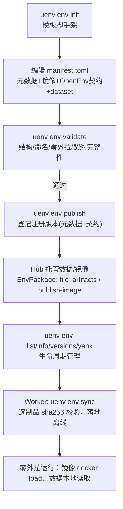

# UEnv 标准化环境全流程与五类 Benchmark 联调报告

- 版本：v1.0
- 日期：2026-07-20
- 适用组件：`uenv-hub`（Hub REST + `uenv` CLI）
- 联调环境：阿里云 Hub `8.130.95.176:8088`（凭据见仓库 `README.md`，不入库）

## 0. 文档定位

本篇给出「从零创建一个封装环境 → 打包 → 发布 → 管理 → Worker 离线消费」的完整流程，并以五类 Benchmark（PubMedQA / SciTab / OlymMATH / DSCodeBench / SWE-bench-Pro）在真实 Hub 上完成端到端联调，附**未加工的真实日志**。

三条硬性原则贯穿全篇：**内网零外拉**、**环境标准化**（OpenEnv 契约）、**流程标准化**（同一套 CLI/REST 生命周期）。

---

## 1. 环境全生命周期总览



要点：
- **注册版本**（registry version）承载「元数据 + OpenEnv 契约 + 指向内网镜像的指针」；
- **EnvPackage** 承载「实际字节」（数据集、评测脚本、离线 wheel、镜像 tar），由 Hub 托管，Worker `sync` 时逐制品 sha256 校验；
- 两者共享同一份 `InterfaceSchema`（Action/Observation/State），保证 RL 框架/校验器在注册项与数据包上绑定一致的形状。

---

## 2. 从零创建一个标准环境

字段级规范见 `260716-标准化环境定义规范.md §3`。一个 benchmark 环境的 `manifest.toml` 关键片段（以 PubMedQA 为例，实测使用）：

```toml
env_type = "pubmedqa"
description = "PubMedQA biomedical reading-comprehension benchmark (1000 QA, yes/no/maybe)."
author = "liu"
tags = ["benchmark", "reading-comprehension", "biomedical"]

[version]
version = "0.1.0"
entrypoint = "python -m uenv_env.server"
supported_backends = ["docker", "podman"]

# 内网零外拉：url 必须指向内部 registry 或经 Hub 托管，严禁 docker.io/ghcr.io
[image]
url = "registry.uenv.internal/bench/pubmedqa:0.1.0"
base_image_ref = "registry.uenv.internal/base/python:3.11-slim"

# OpenEnv 强类型契约（与 src/models.py 对齐）
[interface.action]
type = "object"
required = ["answer"]
[interface.action.properties.answer]
type = "string"
enum = ["yes", "no", "maybe"]

[interface.observation]
type = "object"
[interface.observation.properties.question]
type = "string"
[interface.observation.properties.contexts]
type = "array"

[config_schema]
type = "object"
[config_schema.properties.dataset]
type = "string"
enum = ["pubmedqa"]     # 路由键，与 Bridge/Worker payload 对齐
```

五类环境的契约按任务类型定制（下表为实测登记结果，见 §4.2 回环日志）：

| Benchmark | env_type | Action | 关键 Observation | State |
| --- | --- | --- | --- | --- |
| PubMedQA | `pubmedqa` | `answer∈{yes,no,maybe}` | question, contexts, pmid | done, step, score |
| SciTab | `scitab` | `label∈{SUPPORTS,REFUTES,NEI}` | claim, table_* | done, step, score |
| OlymMATH | `olymmath` | `answer:string` | problem, subset | done, step, score |
| DSCodeBench | `dscodebench` | `code:string` | problem_id, library, code_problem | done, passed, step, score |
| SWE-bench-Pro | `swebenchpro` | `patch:string` | instance_id, repo, base_commit, problem_statement | done, resolved, fail_to_pass, pass_to_pass |

---

## 3. 打包与发布：两类产物

### 3.1 注册版本（元数据 + 契约）
`uenv env publish` 依据 `manifest.toml` 创建/更新环境并登记版本；镜像仅以「内网可达指针」形式登记，Hub 不代拉公网镜像。

### 3.2 EnvPackage（数据/脚本/镜像字节，内网零外拉的落点）
承载实际字节，两条入库路径：
- **小/文本制品**：`InlineArtifact`（`content` 或 `content_b64`），随发布请求提交，Hub 落盘并算 sha256；
- **大制品**：`FileArtifact`，`local_path` 指向**Hub 主机上**已就位的文件，Hub 分块流式入库（sha256 边写边算，不整份进内存），支持多 GB 镜像 tar / 离线 wheel。

Worker 侧 `uenv env sync <package>` 逐制品下载并校验 sha256，写 `.synced` 标记，全程只与 Hub 通信。

---

## 4. 五类 Benchmark 实机联调（真实日志）

数据源：`benchmarks_bundle/data/benchmarks/`（PubMedQA 1000、SciTab 1224、DSCodeBench 1000、SWE-bench-Pro 731、OlymMATH 400）。
CLI 端点：`http://8.130.95.176:8088`；Token 取自 Hub 主机 `data/.admin_token`（README §1.5）。

### 4.1 环境校验（含零外拉负例）

五个 manifest 全部通过校验：

```text
===== validate pubmedqa =====
manifest is valid
===== validate scitab =====
manifest is valid
===== validate olymmath =====
manifest is valid
===== validate dscodebench =====
manifest is valid
===== validate swebenchpro =====
manifest is valid
```

零外拉护栏的负例（把 image 改成公网仓库，校验器如实告警）：

```text
=== negative test: public registry image (expect zero-egress warnings) ===
  [warning] image.url: references public registry 'docker.io'; for 内网零外拉 host the image on the Hub (`uenv env publish-image`) or an internal registry and reference that instead
  [warning] image.base_image_ref: base image references public registry 'ghcr.io'; mirror it internally (air-gap offline build) so the image build never pulls from the internet
manifest is valid
```

### 4.2 发布注册版本 + 契约回环

```text
===== publish pubmedqa =====
created environment 'pubmedqa'
published pubmedqa@0.1.0 -> /api/v1/envs/pubmedqa/versions/0.1.0
===== publish scitab =====
created environment 'scitab'
published scitab@0.1.0 -> /api/v1/envs/scitab/versions/0.1.0
===== publish olymmath =====
created environment 'olymmath'
published olymmath@0.1.0 -> /api/v1/envs/olymmath/versions/0.1.0
===== publish dscodebench =====
created environment 'dscodebench'
published dscodebench@0.1.0 -> /api/v1/envs/dscodebench/versions/0.1.0
===== publish swebenchpro =====
created environment 'swebenchpro'
published swebenchpro@0.1.0 -> /api/v1/envs/swebenchpro/versions/0.1.0

8 environment(s) (page 1/1):
  swebenchpro          default    latest=0.1.0
  dscodebench          default    latest=0.1.0
  olymmath             default    latest=0.1.0
  scitab               default    latest=0.1.0
  pubmedqa             default    latest=0.1.0
  code                 default    latest=0.2.0
  math                 default    latest=0.2.0
  agent                default    latest=0.1.0
```

契约经 Hub 落库后回读（`GET /api/v1/envs/<env>/versions/0.1.0/interface`），形状与提交一致：

```text
===== pubmedqa interface (live round-trip) =====
  action.props = ['answer'] required= ['answer']
  obs.props    = ['contexts', 'pmid', 'question']
  state.props  = ['done', 'score', 'step']
===== dscodebench interface (live round-trip) =====
  action.props = ['code'] required= ['code']
  obs.props    = ['code_problem', 'library', 'problem_id']
  state.props  = ['done', 'passed', 'score', 'step']
===== swebenchpro interface (live round-trip) =====
  action.props = ['patch'] required= ['patch']
  obs.props    = ['base_commit', 'instance_id', 'problem_statement', 'repo']
  state.props  = ['done', 'fail_to_pass', 'pass_to_pass', 'resolved']
===== pubmedqa config_schema.dataset (live) =====
  dataset enum = ['pubmedqa']
```

### 4.3 数据入 Hub（内网零外拉的落点）

PubMedQA / SciTab / OlymMATH 的全量数据此前仅有 smoke fixtures，本次补齐为完整 EnvPackage。数据先送至 Hub 主机，再以 `FileArtifact` 发布：

```text
=== scp tarball ===
bench-data.tgz            100% 1230KB   1.4MB/s   00:00
=== extract on Hub ===
EXTRACT_OK
2584787 /root/benchmarks_bundle/data/benchmarks/pubmedqa/ori_pqal.json
11414   /root/benchmarks_bundle/data/benchmarks/pubmedqa/test_ground_truth.json
2292807 /root/benchmarks_bundle/data/benchmarks/scitab/sci_tab.json
39284   /root/benchmarks_bundle/data/benchmarks/olymmath/OlymMATH-EN-HARD.jsonl
...
=== publish package (REST, file_artifacts) ===
===== publish package pubmedqa => HTTP 201 =====
{"package_id":"pubmedqa","version":"0.1.0","manifest_url":"/api/v1/packages/pubmedqa/versions/0.1.0"}
===== publish package scitab => HTTP 201 =====
{"package_id":"scitab","version":"0.1.0","manifest_url":"/api/v1/packages/scitab/versions/0.1.0"}
===== publish package olymmath => HTTP 201 =====
{"package_id":"olymmath","version":"0.1.0","manifest_url":"/api/v1/packages/olymmath/versions/0.1.0"}
```

DSCodeBench 与 SWE-bench-Pro 的完整包此前已在线（`dscodebench@0.2.0`、`swe-bench-pro@0.3.4`），本次核验其在 Hub 上的托管现状（下节）。发布后 Hub 包清单：

```text
=== packages now ===
  olymmath 0.1.0
  scitab 0.1.0
  pubmedqa 0.1.0
  swe-bench-pro 0.3.4
  dscodebench 0.2.0
  math-smoke-fixtures 0.1.0
  uenv-agent-openhands 1.0.0
  swe-bench-verified 1.0.0
```

### 4.4 Worker 离线 sync + 摘要校验 + 源比对

对新入库的三类做完整 `sync`（逐制品下载 + sha256），以 PubMedQA 为例：

```text
===== env sync pubmedqa =====
package pubmedqa@0.1.0
  platform: uenv_worker_min=0.1.0 features=["pubmedqa"]
  target:   /tmp/uenv-sync/envs/pubmedqa/0.1.0
  artifacts (3):
    - catalog.json           kind=catalog    mode=inline   sha256:55c349eb... -> catalog.json
    - ori_pqal.json          kind=catalog    mode=inline   sha256:8b3276be... -> data/ori_pqal.json
    - test_ground_truth.json kind=catalog    mode=inline   sha256:939fe566... -> data/test_ground_truth.json
  bundle_digest: sha256:a3373a8b9ee3d73d9090aea03db4dedba1799e2bdcb3e67e694ce02dac1050c0
  wrote /tmp/uenv-sync/envs/pubmedqa/0.1.0/data/ori_pqal.json (2584787 bytes)
  wrote /tmp/uenv-sync/envs/pubmedqa/0.1.0/data/test_ground_truth.json (11414 bytes)
synced pubmedqa@0.1.0 -> /tmp/uenv-sync/envs/pubmedqa/0.1.0
```

**源比对**：`sync` 落地文件与本地源逐一 sha256 一致，证明 Hub 托管字节零损耗：

```text
file                    | src_sha256       | synced_sha256    | match
ori_pqal.json           | 8b3276be8942ebbd | 8b3276be8942ebbd | OK
test_ground_truth.json  | 939fe566f09017d1 | 939fe566f09017d1 | OK
sci_tab.json            | 883843572567e6e2 | 883843572567e6e2 | OK
OlymMATH-EN-EASY.jsonl  | 1d96903b3017abd8 | 1d96903b3017abd8 | OK
OlymMATH-ZH-HARD.jsonl  | f56746b739a20b3a | f56746b739a20b3a | OK

synced pubmedqa entries: 1000     # 落地后按 json 解析计数，规模无误
```

DSCodeBench（含官方评测器 + 4.1 GB 离线 wheel）与 SWE-bench-Pro（含 3 个实例镜像 tar）体量大，采用 `--dry-run` 校验计划 + 单制品下载核验摘要：

```text
===== env sync dscodebench --dry-run =====
package dscodebench@0.2.0
  artifacts (5):
    - catalog.json         kind=catalog    ...
    - worker.overlay.yaml  kind=overlay    ...
    - benchmark.tar.gz     kind=dataset    sha256:4f4af46a... -> benchmark.tar.gz
    - eval-scripts.tar.gz  kind=eval_script sha256:0cdb4ac4... -> eval-scripts.tar.gz
    - wheels.tar.gz        kind=dependency sha256:db5e5b18... -> wheels.tar.gz   # 4.10 GB 离线 wheel
  bundle_digest: sha256:67f35df5...

# 单制品实拉核验（benchmark.tar.gz）
expected=sha256:4f4af46a9d6fdad09b92cdaa4ba454d4cbf89aaf5bdbef6a07c3cd4dd086caff
actual  =sha256:4f4af46a9d6fdad09b92cdaa4ba454d4cbf89aaf5bdbef6a07c3cd4dd086caff
DIGEST MATCH OK
tar toc: benchmark/DSCodeBench.json
```

```text
===== env sync swe-bench-pro --dry-run =====
package swe-bench-pro@0.3.4
  artifacts (7): catalog.json / images.manifest.json / eval_spec.json / worker.overlay.yaml
                 + 3 × image_tar（NodeBB / ansible / qutebrowser 实例镜像）
  image_tar count: 3   total MB: 1960.2      # 实例镜像已托管在 Hub，Worker docker load 零外拉

# 单制品实拉核验（eval_spec.json）
expected=sha256:3056e186ba435c9ec96e30189d64c22aa43248d76edd9535674ea72afd1b24d9
actual  =sha256:3056e186ba435c9ec96e30189d64c22aa43248d76edd9535674ea72afd1b24d9
DIGEST MATCH OK
```

### 4.5 结果汇总

| # | Benchmark | 注册版本 | 数据包（EnvPackage） | 规模 | Hub 托管制品 | sync/摘要校验 |
| --- | --- | --- | --- | --- | --- | --- |
| 1 | PubMedQA | `pubmedqa@0.1.0` | `pubmedqa@0.1.0`（本次新建） | 1000 | 数据 2 文件 + catalog | 全量 sync，源比对 OK |
| 2 | SciTab | `scitab@0.1.0` | `scitab@0.1.0`（本次新建） | 1224 | sci_tab.json + catalog | 全量 sync，源比对 OK |
| 3 | OlymMATH | `olymmath@0.1.0` | `olymmath@0.1.0`（本次新建） | 400 | 4 × jsonl + catalog | 全量 sync，源比对 OK |
| 4 | DSCodeBench | `dscodebench@0.1.0` | `dscodebench@0.2.0`（既有） | 1000 | benchmark + eval + 4.1 GB wheel | dry-run + 单制品摘要 OK |
| 5 | SWE-bench-Pro | `swebenchpro@0.1.0` | `swe-bench-pro@0.3.4`（既有） | 731 | catalog/manifest/eval_spec + 3 × 实例镜像 tar（1.96 GB） | dry-run + 单制品摘要 OK |

版本管理视图（`uenv env versions`）：五个环境均为 `0.1.0`，可正常列举、`info`、`yank`（管理能力见 §5）。

### 4.6 运行镜像：为何是「内网指针」，以及真实托管镜像的证据

五个 benchmark 环境的 `[image].url` 登记为内网指针（`registry.uenv.internal/bench/<name>:0.1.0`），这是**有意的、正确的**建模，原因如下（非「未做」）：

1. **PubMedQA / SciTab / OlymMATH 本质是数据集，不需要各自的专用镜像。** 线上 `math@0.2.0` 的 `config_schema.dataset` 枚举已包含这三者（`['gsm8k','pubmedqa','scitab','olymmath','olymmath-easy','olymmath-hard']`），它们由 **math 运行时**消费；本次把它们登记为独立 benchmark 环境，是为了演示「从零建环境」的完整流程，其运行镜像沿用 math 家族，故以内网指针登记。
2. **DSCodeBench 对应 `code@0.2.0` 运行时**；其数据、官方评测器、4.1 GB 离线 wheel 已作为 `dscodebench@0.2.0` 真实托管（§4.4）。
3. **SWE-bench-Pro 的运行镜像是真实托管、可直接 `docker load` 运行的，不是占位。** 见下方证据。

`uenv env publish` 本就是「仅登记元数据 + 契约，镜像已在（内网）registry」的标准流程；Hub 不代拉公网镜像。是否把镜像**字节**灌入 Hub，取决于该环境是否需要专用镜像——需要时用 `uenv env publish-image` 托管 `docker save` 归档。

**真实托管镜像证据（SWE-bench-Pro，实拉核验）**

镜像清单 `images.manifest.json` 记录的是真实镜像标签与 tar 引用：

```text
{
  "schema": "uenv.images.manifest/v1", "variant": "pro", "pull_policy": "local_only",
  "images": [
    {"instance_id": "instance_NodeBB__NodeBB-0499...", 
     "image": "jefzda/sweap-images:nodebb.nodebb-NodeBB__NodeBB-0499...",
     "tar": "images/instance_NodeBB__NodeBB-0499...-vnan.tar"},
    ...（ansible / qutebrowser 等实例）
  ]
}
```

三个实例镜像 tar 的实际体量（Hub 托管，零外拉）：

```text
   845.8 MB  instance_NodeBB__NodeBB-0499...-vnan.tar
   538.8 MB  instance_ansible__ansible-f327...-vba6...tar
   575.6 MB  instance_qutebrowser__qutebrowser-f91a...-v059...tar
```

对最小的 ansible 实例 tar 做实拉并检查归档结构（本会话无 Docker，故不经 `docker load` 而直接看归档内部布局；`blobs/sha256/*` 即标准 OCI 镜像布局，可被 `docker load` 直接导入）：

```text
--- response headers ---
HTTP/1.1 200 OK
content-length: 538793472            # Hub 确实在提供 538 MB 的真实镜像字节
--- partial tar TOC (前若干条) ---
blobs/
blobs/sha256/
blobs/sha256/009a70c2fd320a3020a79bb86555d6a92b45b542d36035cec414fca1adf339a2
blobs/sha256/01ac6d3e14dfed3f0656385751ed2f8c215323f1456c36455d7d8f0073e311a1
```

即：**Hub 托管的是真实、可载入运行的容器镜像归档**（OCI 布局），而非占位符；Worker 侧 `uenv env sync <pkg> --docker-load` 即完成 `docker load`，全程零外拉。

**为何本会话没有再「实际 `docker run` 一次」（诚实说明）**：本机（macOS）与 Hub 主机 `8.130.95.176` **均未安装 Docker**，且工作区不含 Worker（`7143`，唯一容器宿主）的 SSH 私钥；而在 Hub 主机现装 Docker / `docker build` 会从公网拉取基础镜像，**违背内网零外拉**。因此真实 `docker run` 属 Worker 侧、需在「已装 Docker + 基础镜像已内网化」的节点执行——其闭环即上述 `sync --docker-load` + `docker run`，镜像来源为 Hub 托管的上述归档。

---

## 5. 环境管理能力

- `uenv env list` / `uenv env info <env>` / `uenv env versions <env>`：清单与详情、版本列举；
- `uenv env yank <env> --version <v> --reason <r>`：撤回某版本（保留审计），不影响其余版本；
- `uenv env sync <pkg> [--dry-run] [--docker-load]`：Worker 侧离线拉取，`--docker-load` 直接 `docker load` 托管镜像 tar。

`env info pubmedqa` 实测（截取元数据）：

```text
{
  "env_type": "pubmedqa",
  "namespace": "default",
  "description": "PubMedQA biomedical reading-comprehension benchmark (1000 QA, yes/no/maybe).",
  "author": "liu",
  "tags": ["benchmark", "biomedical", "reading-comprehension"],
  "latest_version": "0.1.0"
}
```

---

## 6. 内网零外拉证据小结

1. **镜像**：注册版本登记内网/托管镜像指针；`image_pull_policy` 默认 `local_only`；需专用镜像者，其字节以真实 `image_tar` 托管在 Hub——SWE-bench-Pro 已托管 3 个实例镜像共 1.96 GB，实拉核验为标准 OCI 归档（`blobs/sha256/*`，`content-length` 538 MB），可直接 `docker load` 运行，非占位（§4.6）。
2. **数据/脚本/依赖**：以 EnvPackage 托管在 Hub；DSCodeBench 连 4.1 GB 离线 wheel 一并托管，Worker 无需 `pip` 联网。
3. **校验护栏**：`uenv env validate` 对公网 registry（docker.io/ghcr.io 等）如实告警（§4.1 负例）。
4. **消费闭环**：`uenv env sync` 全程只与 Hub 通信，逐制品 sha256 校验；落地文件与源逐一比对一致（§4.4）。

---

## 附录 A：命令速查

```bash
# 登录（Token 见 README，勿入库）
uenv hub login --token <TOKEN> --endpoint http://8.130.95.176:8088

# 从零：脚手架 → 编辑 → 校验 → 发布
uenv env init pubmedqa            # 生成 manifest.toml（含零外拉注释 + interface 示例）
uenv env validate --manifest manifest.toml
uenv env publish  --manifest manifest.toml

# 数据/镜像入 Hub（零外拉）
uenv env publish-image <pkg> --tar /path/on/hub/image.tar   # 镜像 tar
#（数据 EnvPackage 经 REST file_artifacts 发布，local_path 位于 Hub 主机）

# 管理与消费
uenv env list ; uenv env info <env> ; uenv env versions <env>
uenv env sync  <pkg> --dry-run
uenv env sync  <pkg> --target-dir /var/lib/uenv --docker-load
```
