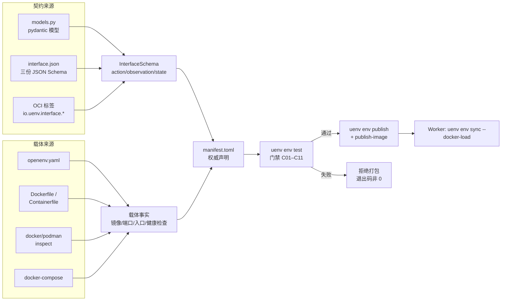
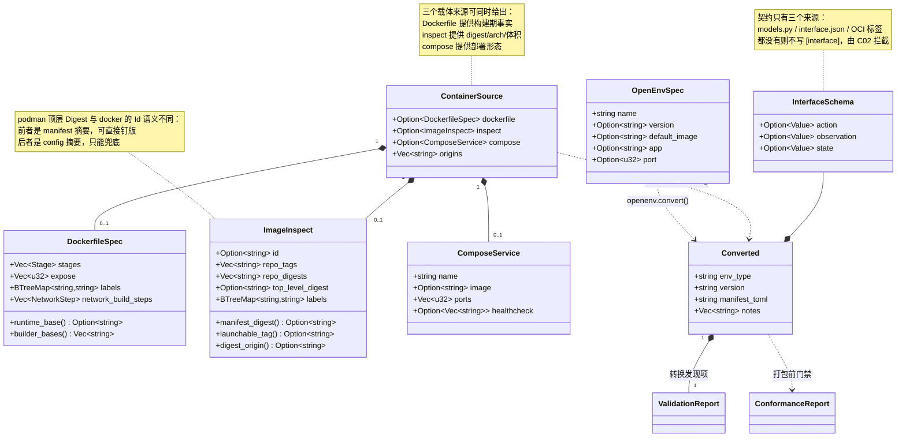
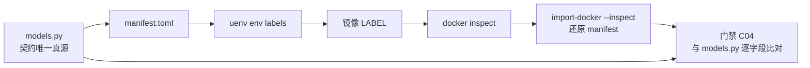
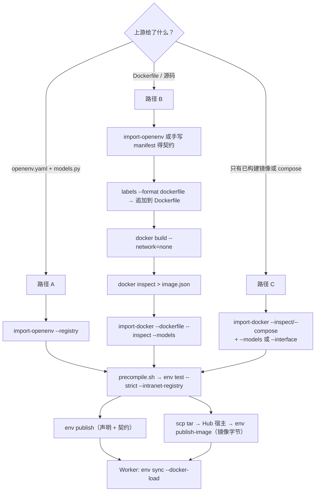

# 标准化环境转换与离线预编译规范

- 版本：v1.2（v1.0 仅覆盖 OpenEnv 来源；v1.1 补入 Docker / Podman / Compose 容器原生来源与完整转换流程；本版补记门禁 C12 上线后的版本号变化与其对转换类环境的判定影响）
- 日期：2026-07-27
- 适用组件：`uenv-hub`（注册/校验/分发）、`uenv` CLI（转换/测试门禁/发布）
- 前置文档：
  - `Docs/hub/260716-标准化环境定义规范.md`（`manifest.toml` 权威声明与数据模型）
  - `Docs/hub/260708-uenv-hub-标准化交付报告.md`（内网零外拉与断网部署两步准备）
  - `Docs/hub/260720-标准化环境全流程与五类Benchmark联调报告.md`（创建→打包→发布→管理全流程实证）

---

## 1. 目的与范围

前置三份文档解决的是「**本项目自己定义**的环境如何标准化声明、打包、发布与消费」。本规范解决其相邻的三个问题：

1. **既有环境如何进入本体系**：给定一个上游环境——它可能是 OpenEnv 工程，也可能只是一个 Dockerfile、一个已构建的镜像、或一份 docker-compose——如何机器化地转换为本项目的 `manifest.toml`，且转换过程可复核、不臆造；
2. **打包之前如何强制完成测试**：把「打包前必须完整测试」从口头约定变成一道有稳定编号、可留证、可在 CI 阻断的门禁；
3. **离线环境如何预编译**：内网机器无法访问 PyPI 与公网 registry，依赖、字节码与镜像字节必须在联网侧一次性预备，并由门禁校验其确实可用。

三条硬约束在本规范内全程保持：**内网零外拉**、**环境标准化（强类型契约）**、**流程标准化（同一套校验规则贯穿 CLI 与服务端）**。

### 1.1 转换来源矩阵

「标准化转换」不止 OpenEnv 一种来源。本版支持的来源及其定位：

| 来源 | 载体形态 | 提供契约？ | 命令 |
| --- | --- | --- | --- |
| OpenEnv 工程 | `openenv.yaml` + `models.py` + Dockerfile | 是（pydantic 模型） | `uenv env import-openenv` |
| Dockerfile / Containerfile | 构建配方 | 否 | `uenv env import-docker --dockerfile` |
| `docker inspect` / `podman inspect` / OCI image config | 已构建镜像的元数据 | 仅当镜像烘焙了 `io.uenv.interface.*` 标签 | `uenv env import-docker --inspect` |
| docker-compose / compose | 部署形态 | 否 | `uenv env import-docker --compose` |

这张表里最重要的一列是「提供契约？」。**Docker 与 Podman 只描述载体，不描述环境语义**：镜像里没有任何字段说明「一次 step 接受什么、返回什么」。因此容器原生来源必须额外提供契约（`--models` / `--interface` / OCI 标签三选一），否则转换器不写 `[interface]`，门禁 C02 直接拦截。这是本版设计的第一原则：**契约与载体分离，缺失的部分如实报缺，不猜**。

### 1.2 本次交付的代码与脚本

| 路径 | 规模 | 职责 |
| --- | --- | --- |
| `uenv-hub/uenv-hub-core/src/domain/openenv.rs` | 1463 行（新增） | `openenv.yaml` 解析、`models.py` 契约推导、`manifest.toml` 生成、镜像零外拉改写 |
| `uenv-hub/uenv-hub-core/src/domain/container.rs` | 2511 行（新增） | Dockerfile / inspect / compose 解析，OCI 标签契约读写，容器原生 → `manifest.toml` |
| `uenv-hub/uenv-hub-core/src/domain/conformance.rs` | 832 行（新增） | 打包前门禁 C01–C11，输出机器可读证据 |
| `uenv-hub/uenv-hub-core/src/domain/manifest.rs` | +89 行 | 公共 registry 判定（含镜像站）、无 host 引用的 Docker Hub 展开规则 |
| `uenv-hub/uenv-hub-client/src/bin/uenv.rs` | +782 行 | 新增 `import-openenv`、`import-docker`、`labels`、`test` |
| `uenv-hub/scripts/openenv-offline-precompile.sh` | 209 行（新增） | 离线预编译（依赖 wheel、字节码、镜像 tar）与平台自检 |

脚本置于 `uenv-hub/scripts/` 而非仓库根 `scripts/`：根目录 `.gitignore` 有 `/scripts/*` 规则，需逐项白名单才能入库，既有 `airgap-*.sh` 即因此未纳入版本管理；放在 `uenv-hub/scripts/` 可默认随仓库交付给其他成员。

---

## 2. 上游标准调研

### 2.1 OpenEnv 的规范形态与实测形态

OpenEnv（HuggingFace / meta-pytorch，RFC 002 *env spec*）的约定是：环境以 Docker 封装、以 FastAPI 暴露 HTTP，基线接口为 Gymnasium 风格的 `reset()` / `step(action)` / `state()`，并额外提供 `/health`；`Action / Observation / State` 以 pydantic 类声明，其中基类自带字段——`Observation` 携带 `done` / `reward` / `metadata`，`State` 携带 `episode_id` / `step_count`。

工程骨架（规范形态）：

```
my_env/
├── openenv.yaml      # 清单
├── models.py         # Action / Observation / State
├── client.py
├── server/app.py     # create_app(...) 构造 FastAPI
├── Dockerfile
└── pyproject.toml
```

**转换器不能只按文档写**。本次从 OpenEnv 官方组织已部署的 Space 取真实清单核对，发现实际存在三种形态，差异显著：

| 来源 | `openenv.yaml` 实际内容 | 形态特征 |
| --- | --- | --- |
| 官方文档 `concepts.md` | `name/version/description` + `action:{class_name,module}` 嵌套映射 + `default_image` + `spec_version` | 契约类以**嵌套映射**声明 |
| `openenv/coding_env`（实测） | `name/version/description` + `action: CodeAction` + `observation: CodeObservation` | 契约类以**标量类名**声明，无镜像字段 |
| `openenv/echo_env`（实测） | `spec_version: 1` / `name` / `type: space` / `runtime: fastapi` / `app: server.app:app` / `port: 8000` | **部署导向**，无 version、无契约字段 |

结论：转换器必须同时接受三种形态，且对缺失项如实告警而非填默认值。

### 2.2 可作为转换来源的标准化环境目录

OpenEnv 官方组织当前公开 14 个环境（`GET https://huggingface.co/api/spaces?author=openenv` 实测），构成可直接转换的现成来源：

```
openenv/coding_env      openenv/atari_env       openenv/chat_env        openenv/sumo_rl_env
openenv/repl            openenv/echo_env        openenv/sudoku          openenv/openspiel_env
openenv/tbench2         openenv/browsergym_env  openenv/wordle          openenv/repl_env-0.2.2
openenv/terminus_env    openenv/mini-swe-async-grpo-trackio-20260529
```

其中 `coding_env`（代码执行）、`tbench2` / `terminus_env`（终端任务）、`browsergym_env`（浏览器）、`openspiel_env`（博弈）与本项目现有 `code` / `swe` 路线直接相关，优先级最高。

容器原生来源的现成素材更多：`swebench/sweb.eval.*` 系列评测镜像（构建机上已有 20 个，单个 3.7–5.2 GB）本身就是「只有载体、没有契约」的典型，本次以其中之一作为基础镜像做实测（§9.2）。

### 2.3 各标准化格式的适配判断

| 标准 | 核心载体 | 与本体系的关系 | 结论 |
| --- | --- | --- | --- |
| **OpenEnv** | `openenv.yaml` + pydantic models + Dockerfile | 接口语义（`reset/step/state`）与契约模型可一一对应 | **已实现转换** |
| **Dockerfile / Containerfile** | 构建配方 | 提供基础镜像、`EXPOSE`、`ENTRYPOINT/CMD`、`HEALTHCHECK`、`LABEL`，并暴露构建期联网风险 | **已实现转换**（载体侧） |
| **OCI 镜像 + `docker/podman inspect`** | 镜像与 digest | 提供 digest、arch、体积、`Env`、端口、标签；配合 `io.uenv.*` 标签可自带契约 | **已实现转换**（载体 + 可选契约） |
| **docker-compose / compose spec** | 服务编排 | 提供镜像引用、端口、环境变量、healthcheck | **已实现转换**（载体侧，单服务） |
| **Gymnasium** | `gymnasium.register(id, entry_point, ...)`；id 形如 `[namespace/](name)[-vN]` | 只有 Python 侧注册表，无容器与 HTTP 封装；`EnvSpec` 可映射到 `env_type` / `version` / `entrypoint`，但 `observation_space` / `action_space` 是 `Space` 对象而非 JSON Schema，需逐类型翻译 | 建议下一步；须先确定 `Space`→JSON Schema 映射表 |
| **devcontainer.json** | 容器 + 挂载 + 环境变量 | 只描述开发运行时，不含环境契约 | 仅可作为 `[image]`/`[resources]` 的补充来源 |
| **conda `environment.yml`** | 依赖清单 | 可映射到 `[dependencies]`，且是离线预编译的输入 | 作为依赖来源支持，不作为环境定义来源 |
| **MLflow `MLproject`** | entry_points + 参数 | 面向一次性任务运行，无 episode 语义 | 不适配 |
| **SWE-bench 任务实例** | 每实例 JSON（repo/commit/测试命令） | 属于数据集而非环境，按 EnvPackage 数据制品承载 | 已在 260720 报告中落地 |

判断标准是明确的：**一个格式必须同时提供「接口契约」与「运行载体」，才算完整的标准环境来源**；只提供其中之一的降级为字段来源。Docker / Podman / Compose 属于「只有载体」，因此本版为它们补上了两条获取契约的通路：外部契约文件（`--models` / `--interface`）与镜像自描述标签（`io.uenv.interface.*`）。

---

## 3. 统一转换模型

两条来源路径最终汇入同一个数据结构与同一套校验，避免「OpenEnv 来的环境」与「Docker 来的环境」在后续流程里出现两种情况。



内部结构与产物的关系：



---

## 4. OpenEnv → UEnv 转换规范

### 4.1 字段映射表

转换在 `domain::openenv::convert` 内完成，映射关系固定且可复核：

| `openenv.yaml` | `manifest.toml` | 规则 |
| --- | --- | --- |
| `name` | `env_type` | 归一化为 `[a-z0-9._-]`，非法字符替换为 `-` |
| `version` | `[version].version` | 缺失时回落 `0.1.0`，并产生 `version` 告警（不静默） |
| `description` | `description` | 缺失时生成「Imported from OpenEnv environment 'x'」 |
| `spec_version` | `tags += openenv-spec-<n>` | 保留上游规范版本以便追溯 |
| `default_image` | `[image].url` | 见 §4.3 |
| `action` / `observation` / `state` | `[interface.*]` | 标量或嵌套映射均可；按类名在 `models.py` 定位，未声明时按基类名兜底匹配 |
| `app` + `port` | `[version].entrypoint` | 派生 `uvicorn <app> --host 0.0.0.0 --port <port>`；无 `app` 时留空并注明交由镜像 CMD |
| （规范固定） | `[version].health_check_path = "/health"` | OpenEnv 服务固定暴露 `/health` |
| （规范固定） | `[version].supported_backends = ["docker","podman"]` | |
| 工程内 `requirements.txt` | `[dependencies].requirements_path` | 由 CLI 探测；使 §7 的「已声明依赖但未 vendor」可判定 |

### 4.2 契约推导与基类字段注入

`models.py` 按 OpenEnv 规定的 pydantic 风格解析：识别 `class X(Action|Observation|State):`，逐字段读取注解与默认值，映射到 JSON Schema。

- 类型映射：`str→string`、`int→integer`、`float→number`、`bool→boolean`、`list[T]→array/items`、`Dict[..]→object`、`Optional[T]→type:[T,"null"]`、`Union[...]→type:[...]`；**无法识别的注解映射为 `{}`（任意），绝不猜测类型**。
- 必填判定：裸注解（`code: str`）为必填；`Field(...)`（首参为 `...`）为必填；`= 默认值` 或 `Field(default=...)` 为可选。
- 描述提取：`Field(description="...")` 写入 schema 的 `description`。
- **基类字段注入**：按 RFC 002 与官方 concepts 文档，`observation` 补 `done`/`reward`/`metadata`，`state` 补 `episode_id`/`step_count`，并在 `description` 内标注来源。理由：服务端实际序列化的是基类+子类的并集，只声明子类字段会使契约与线上报文不一致。

### 4.3 零外拉改写

| `default_image` | `--registry` | 结果 |
| --- | --- | --- |
| 有（含公网仓库） | 有 | 改写为 `<registry>/<env_type>:<version>`，并在 notes 记录原值→新值 |
| 有（公网仓库） | 无 | 保留原值并产生 `image.url` 告警，提示改用 `--registry` 或 `uenv env publish-image` |
| 无 | 有 | 生成内网引用 |
| 无 | 无 | 产生 `image` 告警：发布前必须补内网可达镜像 |

### 4.4 YAML 子集解析：为何不引入 YAML 依赖

`openenv.yaml` 结构简单（嵌套映射 + 标量列表），而 Hub 需支持 `cargo vendor` 离线编译。为不扩大供应链、不改动既有 vendor 包，转换器自带**严格 YAML 子集解析器**：支持注释、引号、按缩进递归的嵌套映射、`- ` 标量列表；对锚点/别名/合并键（键位与值位均检测）、块标量（`|`/`>`）、Tab 缩进、多文档一律**带行号报错**而非降级解析。该解析器本版复用于 docker-compose。

设计取舍是明确的：环境契约的转换绝不能靠猜。宁可对不支持的写法失败退出，也不产出一份看似成功、实则错误的契约。

生成的 TOML 由自写发射器输出（标量先于子表，避免序列化器排序陷阱），并以**回环测试**证明正确性：`manifest_toml_round_trips` 用 `toml` 解析生成结果，逐字段比对三份 schema 与推导结果一致。

---

## 5. 容器原生 → UEnv 转换规范

### 5.1 三类载体来源的能力边界

| 来源 | 能提供 | 不能提供 |
| --- | --- | --- |
| Dockerfile / Containerfile | 运行阶段基础镜像（含多阶段与 `ARG` 驱动的 `FROM`）、构建期联网步骤、`EXPOSE`、`ENV`、`LABEL`、`ENTRYPOINT`/`CMD`、`HEALTHCHECK`、`WORKDIR`、`USER`、`COPY` 的 requirements 路径 | 镜像 digest、实际体积、实际 arch（未构建，无从得知） |
| `docker inspect` / `podman inspect` / OCI image config | digest、arch/os、体积、`Env`、`ExposedPorts`、`Entrypoint`+`Cmd`、`Labels`、`Healthcheck`、`RepoTags`/`RepoDigests` | 基础镜像来源（除非烘焙了 `org.opencontainers.image.base.name`）、构建期风险 |
| docker-compose | 服务名、镜像引用、容器端口、环境变量、`command`、`healthcheck`、`build` 指向 | digest、契约 |
| 以上任意组合 | 载体事实 | **Action/Observation/State 契约** |

三者可同时给出并合并：`--dockerfile` 提供构建期事实，`--inspect` 提供已构建镜像的确定性事实（冲突时以 inspect 为准，因为它描述的是真实产物），`--compose` 提供部署形态。命令行会逐条打印每个字段的来源（`note: ... derived from ...`），使转换结果可以被人工复核而不必读代码。

### 5.2 关键字段的派生规则

| 字段 | 优先级 | 特殊规则 |
| --- | --- | --- |
| `env_type` | `--env-type` > `io.uenv.env_type` 标签 > 镜像引用的仓库名 > compose 服务名 | 纯 Dockerfile 来源无名可取，必须显式给出 |
| `[version].version` | `--version` > `io.uenv.version` 标签 > `org.opencontainers.image.version` 标签 > 镜像 tag | 标签值与 tag **必须是合法 semver 才被采纳**，否则告警并回落默认值 |
| `[version].entrypoint` | 镜像 config 的 `Entrypoint`+`Cmd` > Dockerfile 的 `ENTRYPOINT`/`CMD` > compose `command` | |
| `[version].health_check_path` | `io.uenv.health_check_path` 标签 > 从 `HEALTHCHECK` 命令里解析出的 URL 路径 | 都没有则告警：Worker 无法判断就绪 |
| `[image].url` | `--registry` 改写 > inspect 选出的可启动 tag > compose `image` | 选 tag 规则见 §5.3 |
| `[image].digest` | `RepoDigests` > podman 顶层 `Digest` > `Id`（config 摘要，仅兜底并注明） | 三者语义不同，notes 里写明取自哪个字段 |
| `[version].base_image` | Dockerfile 运行阶段 `FROM` > `org.opencontainers.image.base.name` 标签 | |

其中 version 的语义化校验是被真实素材逼出来的：`swebench/*` 与多数公开镜像继承自 Ubuntu 基础镜像，其 `org.opencontainers.image.version` 值为 `22.04`。若直接采纳，环境版本会变成操作系统版本。现在这类值一律拒绝并告警，要求显式 `--version`。

### 5.3 同一镜像多个 tag 时的选择

构建机上同一镜像常同时挂着工作 tag 与内网 tag（`docker tag env:1.0.1 registry.uenv.internal/envs/env:1.0.1`）。`RepoTags` 的顺序是引擎的实现细节，不能当作偏好。选择规则按「离开这台机器后是否还有意义」排序：

1. 显式私有 host（`registry.uenv.internal/...`）——**首选**；
2. 显式公共 registry（`docker.io/...`）——可用但违反零外拉，后续由 C06 判失败；
3. 无 registry host（`env:1.0.1`）——只在本机镜像存储内有意义，最后选。

### 5.4 零外拉判定：三态而非两态

镜像引用按容器引擎的 reference 语法分三类，判定结果依模式而异：

| 引用形态 | 例 | 默认（已知公共 registry 黑名单） | `--intranet-registry`（内网白名单） |
| --- | --- | --- | --- |
| 显式公共 registry | `docker.io/library/python:3.11-slim`、`ghcr.io/...`、`docker.m.daocloud.io/library/...` | **C06 失败** | **C06 失败** |
| 显式私有 host | `registry.uenv.internal/envs/env:1.0.1` | 通过 | 在白名单内通过；**不在则失败** |
| 无 registry host | `env:1.0.1`、`swebench/x:latest` | 通过（可能正是 `docker load` 进来的本地镜像） | **告警**：仅当镜像已在 Worker 本地存储时才安全，应以 Hub 托管 tar 落地 |

三点需要讲清楚：

1. **镜像站等同公网**。`dockerproxy.net`、`docker.m.daocloud.io`、`registry.docker-cn.com`、`hub-mirror.c.163.com` 等 10 个常见 Docker Hub 镜像站已进入黑名单——它们是公网出口，只是换了域名。构建机上就存在 `dockerproxy.net/swebench/...` 这样的 tag，不识别就会漏判。
2. **无 host 引用是三态里唯一「不可判定」的一类**。`swebench/x:latest` 既可能指本机已有镜像，也可能被引擎解析成 `docker.io/swebench/x:latest` 去外网拉。manifest 本身无法区分，因此不假定任何一边：默认模式放行（本地镜像是合法用法），白名单模式告警并给出唯一可靠的落地方式（`uenv env publish-image` + `uenv env sync --docker-load`）。
3. **展开写法必须准确**。诊断信息里给出引擎实际会请求的引用：单段名补 `library/`（`python:3.11` → `docker.io/library/python:3.11`），已含斜杠的不补（`swebench/x:latest` → `docker.io/swebench/x:latest`）。写错会把读者引向一个根本不存在的镜像。

### 5.5 构建期联网检测

内网构建机没有 PyPI、没有 apt 源。Dockerfile 的 `RUN` 步骤逐行扫描 `pip install`、`apt-get update/install`、`apt`、`curl`、`wget`、`git clone`、`https://` 等标记，命中即记录行号、原因与原文摘要，并在报告里汇总为一条 `build` 告警，直接给出结论与出路：**这个镜像不能在内网构建，请在联网侧构建后以镜像 tar 搬运**。

同时避免误报：带 `--no-index` 或 `--find-links` 的 `pip install` 是离线安装（正是 §7 预编译产物的用法），不算联网。

### 5.6 OCI 标签规范：让镜像自描述

契约不进镜像，转换就永远依赖镜像之外的文件。为此定义一组标签，烘焙进镜像后，**仅凭 `docker inspect` 即可还原出完整 manifest**：

| 标签 | 内容 | 对应 manifest 字段 |
| --- | --- | --- |
| `io.uenv.env_type` | 环境类型 | `env_type` |
| `io.uenv.version` | 环境版本（semver） | `[version].version` |
| `io.uenv.health_check_path` | 健康检查路径 | `[version].health_check_path` |
| `io.uenv.entrypoint` | 启动命令 | `[version].entrypoint` |
| `io.uenv.interface.action` | Action JSON Schema（紧凑 JSON） | `[interface.action]` |
| `io.uenv.interface.observation` | Observation JSON Schema | `[interface.observation]` |
| `io.uenv.interface.state` | State JSON Schema | `[interface.state]` |
| `org.opencontainers.image.base.name` | 基础镜像引用（OCI 标准标签） | `[version].base_image` |

标签由 `uenv env labels` 从 manifest 生成，不手写：

```bash
uenv env labels --manifest manifest.toml --format dockerfile   # LABEL 行，追加到 Dockerfile
uenv env labels --manifest manifest.toml --format args         # --label 形式，供 docker/podman build
uenv env labels --manifest manifest.toml --format json         # 扁平标签表
```

由此形成一个可验证的闭环：



C04 在闭环末端把还原出的契约与源头 `models.py` 再比一次。这条链上任何一环丢字段、改名字，C04 都会失败——§9.4 与 §9.7 分别给出通过与被拦截的真机日志。

### 5.7 Podman 兼容点

Podman 的 `image inspect` 与 docker 同构（同样是数组、同样的 `Config` 大写键），差异集中在两处，均已处理：

- **顶层 `Digest`**：podman 对本地构建、从未推送的镜像也给出 manifest 摘要，而 docker 只有 `Id`（config 摘要）。因此钉版优先级为 `RepoDigests` > podman `Digest` > `Id`，并在 notes 中注明取自哪个字段——摘要语义不同，混用会导致比对失败。
- **`Containerfile`**：podman 对 Dockerfile 的默认命名，已纳入目录扫描与文件名识别。

`--engine podman` 在 `uenv env build/push`、`sync --docker-load`、预编译脚本三处均已支持。需如实说明：**本次三台联调机均未安装 podman，且 apt 源不可达无法安装**（日志见 §9.8），故 podman 路径由真实形状夹具 + 单测覆盖，未在真机执行。

---

## 6. 打包前强制测试门禁

`uenv env validate` 回答「这份 manifest 是否格式正确」；门禁回答更严的问题：「这个环境是否适合被打包进内网气隙环境」。两处差异是刻意的：

- **零外拉在门禁内是失败，不是建议**。脚手架阶段引用公网镜像可以容忍，进入内网制品不行。
- **契约要与实现比对**。260716 规范要求 `models.py` 与 `[interface.*]` 一致，此前只是文字约定；C04 将其变为可执行检查。

| 编号 | 检查项 | 未通过等级 | 判定依据 |
| --- | --- | --- | --- |
| C01 | manifest 结构合法性 | 失败 | 复用服务端发布路径同一套 `validate_manifest`，两侧不会分歧 |
| C02 | 契约完整性（action/observation/state） | 失败 | 三份 schema 必须齐备 |
| C03 | 三份 schema 可编译为 JSON Schema | 失败 | `jsonschema` 编译 |
| C04 | 契约与实现（`models.py`）一致 | 失败 | 双向比对属性集合，分别报「已实现未声明」与「已声明未实现」 |
| C05 | 示例存在且满足 action schema | 无示例告警／不符失败 | 无示例即契约未被演示 |
| C06 | 零外拉：无公网 registry 引用 | 失败／无 host 引用在白名单模式下告警 | 检查 `image.url`、`image.base_image_ref`、`version.base_image`；见 §5.4 |
| C07 | 镜像已声明且 digest 固定 | 告警 | 无 `sha256:` digest 则无法发现篡改 |
| C08 | `config_schema` 与 `default_config` 一致 | 失败／未声明跳过 | |
| C09 | 可启动（entrypoint 或 image） | 失败 | |
| C10 | 健康检查路径 | 告警 | |
| C11 | 离线预编译已完成且可移植 | 失败／告警 | 见 §7 表 |
| C12 | rubric 契约与金标对齐 | 失败／缺证据告警／未声明跳过 | 后续随 rubric 契约上线，仅作用于规则判分环境（如 `qa`）；见 [环境身份与 Rubric 契约：Hub 同步调整报告](./260728-hub-env-identity-and-rubric.md) |

C12 上线后门禁版本号由 `uenv-conformance/1` 升为 `/2`，C01–C11 的判定语义不变；本文 §9 的联调日志记录的是 `/1` 时期的原始输出，未作追改。转换类环境不声明 `[rubric]`，C12 判定为跳过，因此新增检查不改变 OpenEnv／容器原生来源的门禁结论。

命令与退出码：

```bash
uenv env test --manifest manifest.toml --project <env-dir> \
              --intranet-registry registry.uenv.internal \
              --json conformance.json [--strict]
```

- 默认：存在 `Fail` 则退出码非 0；
- `--strict`：`Warn` 亦视为失败，用于正式发布前与 CI；
- `--intranet-registry`：可重复。给出后 C06 从「黑名单」切换为「白名单」，即**未列入的 registry host 一律失败**，这是内网可判定的强形式；
- `--json`：输出证据报告，可作为 EnvPackage 制品随包分发。

**强制点的分层要如实理解**：服务端会硬拒绝非法契约（实测 HTTP 422），但零外拉在服务端发布路径是**建议级**（实测 HTTP 201）。因此零外拉的强制点在门禁，门禁必须进入发布前流水线，而不能只靠人工执行。

---

## 7. 离线预编译规范

内网机器不可访问 PyPI 与公网 registry，因此依赖解析、字节码编译、镜像获取三件事必须在联网侧一次性完成。

```bash
uenv-hub/scripts/openenv-offline-precompile.sh <env-dir> \
    --platform manylinux2014_x86_64 --python-version 3.12 \
    [--image <ref>] [--engine docker|podman] [--skip-image]
```

| 产物 | 路径 | 作用 |
| --- | --- | --- |
| 依赖 wheel | `offline/wheels/*.whl` | 内网侧 `pip install --no-index --find-links offline/wheels`，全程不触网 |
| 预编译字节码 | `**/__pycache__/*.pyc` | 容器首次导入不再编译；`compileall` 非零退出即暴露语法错误，本身构成一次编译期测试 |
| 镜像归档 | `offline/images/*.tar` | `docker save` 产物，经 `uenv env publish-image` 托管到 Hub，Worker 侧 `docker load` |
| 预编译证据 | `offline/precompile.json` | 记录目标平台、wheel 数、字节码数、`compileall` 退出码，供门禁 C11 消费 |

**跨平台 wheel 陷阱**（实测得出）：平台相关 wheel 只能装在匹配平台上。在 macOS 上准备、送到 Linux Worker 的 wheelhouse **会在安装期失败**，而此时已无 PyPI 可回退。因此脚本要求显式声明目标平台，并在 vendor 后自检 wheel 平台标签：未给 `--platform` 而存在平台相关 wheel、或标签与目标不符，均置 `platform_mismatch=1`；门禁 C11 读到该标记即判失败。

C11 判定表：

| 证据 | 判定 |
| --- | --- |
| `platform_mismatch=1` | **失败**：wheelhouse 不可移植到目标平台 |
| 已声明依赖（`requirements_path` 或 `requires`）但 wheel 数为 0 | **失败**：气隙安装必然回落 PyPI |
| wheel 齐备但 `.pyc` 为 0 | 告警：首次导入将在容器内编译 |
| 证据齐备且平台匹配 | 通过 |
| 未提供 `--project` | 跳过：无证据即不臆断 |

---

## 8. 完整转换流程

三条路径共用后半段（门禁 → 发布 → 制品 → Worker 消费），差异只在前半段如何取得契约与载体。



### 8.1 路径 A：OpenEnv 工程

```bash
# 1. 转换（契约来自 models.py，镜像改写为内网引用）
uenv env import-openenv ./coding_env \
    --registry registry.uenv.internal/openenv --author liu

# 2. 离线预编译（联网侧执行一次）
uenv-hub/scripts/openenv-offline-precompile.sh ./coding_env \
    --platform manylinux2014_x86_64 --python-version 3.12 \
    --image registry.uenv.internal/openenv/coding_env:0.1.0

# 3. 门禁（必须先过，再谈打包）
uenv env test --manifest ./coding_env/manifest.toml --project ./coding_env \
    --intranet-registry registry.uenv.internal --strict --json conformance.json

# 4. 发布声明与契约
uenv env publish --manifest ./coding_env/manifest.toml
```

### 8.2 路径 B：有源码，自建自描述镜像（推荐）

契约先落到 manifest，再由 manifest 生成标签烘焙进镜像。此后镜像自带契约，异地重导入不需要任何附带文件。

```bash
# 1. 契约 → manifest
uenv env import-openenv . --registry registry.uenv.internal/envs \
    --env-type echo-container --out ./openenv-out --force

# 2. manifest → OCI 标签
uenv env labels --manifest ./openenv-out/manifest.toml \
    --format dockerfile --out ./labels.dockerfile
cat ./labels.dockerfile >> Dockerfile

# 3. 构建：基础镜像取内网命名，且关掉网络，任何外拉都会失败而非静默成功
docker build --network=none -t echo-container:1.0.1 .
docker tag echo-container:1.0.1 registry.uenv.internal/envs/echo-container:1.0.1

# 4. 已构建镜像 → manifest（digest/arch/体积来自 inspect）
docker inspect registry.uenv.internal/envs/echo-container:1.0.1 > echo.inspect.json
uenv env import-docker . --dockerfile Dockerfile --inspect echo.inspect.json \
    --models models.py --out ./from-both --force

# 5. 预编译 + 门禁
./precompile.sh . --image registry.uenv.internal/envs/echo-container:1.0.1
uenv env test --manifest ./from-both/manifest.toml --project . --strict \
    --intranet-registry registry.uenv.internal --json ./from-both/conformance.json

# 6. 发布声明；镜像字节走 Hub 托管
uenv env publish --manifest ./from-both/manifest.toml
scp offline/images/*.tar root@<hub-host>:/root/stage-echo-container-1.0.1.tar
uenv env publish-image echo-container-image --version 1.0.1 \
    --tar /root/stage-echo-container-1.0.1.tar --publisher liu
```

Worker 侧（无 registry、无外网）：

```bash
uenv env sync echo-container-image --version 1.0.1 --docker-load
```

### 8.3 路径 C：只有镜像或 compose，无源码

载体齐备但契约缺失，必须外部补入。三种补法按可维护性排序：

```bash
# C-1 镜像已烘焙 io.uenv.interface.* 标签：什么都不用给
uenv env import-docker echo.inspect.json --out ./out --force

# C-2 有 models.py（哪怕只是照着服务端报文补写的）
uenv env import-docker echo.inspect.json --models models.py \
    --env-type legacy-env --version 1.0.0 --registry registry.uenv.internal/envs --out ./out --force

# C-3 只有三份 JSON Schema
uenv env import-docker docker-compose.yml --compose-service env \
    --interface interface.json --out ./out --force
```

补契约的正确顺序是：先用 C-2/C-3 让环境进入体系，再用 §8.2 的 `labels` 把契约烘焙回镜像，之后这个环境就升级成 C-1，不再依赖外部文件。

**compose 的两个注意点**：多服务文件必须用 `--compose-service` 指定，转换器不猜（多服务里哪个是环境本体无法从文件推断）；端口取**容器侧**（`"18082:8000"` 取 8000），因为宿主侧映射是启动方的事，Worker 要访问的是容器内的服务端口。

---

## 9. 真机联调实录

联调机（凭据取自仓库 `README.md`）：

| 角色 | 主机 | 说明 |
| --- | --- | --- |
| 构建机 | `8.130.86.71`（内网 `192.168.0.132`） | Ubuntu 24.04 / glibc 2.39，docker 29.6.1，本地已有 20 余个 `swebench/*` 评测镜像；**无 podman** |
| Hub | `8.130.95.176`（内网 `192.168.0.133`） | Ubuntu 24.04 / glibc 2.39，`uenv-hub-server` 运行中，**无 docker** |

分工的现实依据：Hub 宿主没有容器引擎，构建机有；而转换本身是对 inspect JSON / Dockerfile / compose 的纯函数运算，不需要引擎。因此**镜像相关操作在构建机、Hub 相关操作走 REST**，与内网真实拓扑（构建机 + Hub + 若干 Worker）一致。

以下日志为原始输出，未作美化。标注「节选」处仅删除了与结论无关的行，未改写任何字面内容；命令经 ssh 执行，提示符为便于阅读而补写。

### 9.1 CLI 自身的离线编译

Hub 宿主的 `~/.cargo/config.toml` 指向 `rsproxy.cn`（不可达），构建机的 crates.io 索引更新在 IPv6 上挂死 15 分钟无进展。本次改为**完全离线编译**：依赖全部取自本地 cargo 缓存（本次改动未新增任何运行期依赖）。

```
$ cargo build --offline --release -p uenv-hub-client --bin uenv
   Compiling uenv-hub-core v0.1.0 (/root/uenv/uenv-hub/uenv-hub-core)
   Compiling uenv-hub-client v0.1.0 (/root/uenv/uenv-hub/uenv-hub-client)
    Finished `release` profile [optimized] target(s) in 17.61s
real	0m17.641s
```

产物经校验和核对后分发到构建机（两机同为 Ubuntu 24.04 / glibc 2.39，可直接搬运二进制）：

```
$ sha256sum target/release/uenv                  # Hub 宿主
a4422f7fe29ba6c4eaacb34e...
$ sha256sum /usr/local/bin/uenv                  # 构建机
a4422f7fe29ba6c4eaacb34e...
```

这一步本身就是零外拉的一次实证：**工具链的构建也不出网**。

### 9.2 自描述镜像的构建（构建机，网络关闭）

`build.sh` 三步：契约 → manifest；manifest → OCI 标签；关网构建。基础镜像取本机已有的 `swebench` 评测镜像，并先在内网命名空间下打标：

```
$ docker tag swebench/sweb.eval.x86_64.sympy_1776_sympy-20916:latest \
             registry.uenv.internal/base/sweb-sympy:20916

$ BASE=registry.uenv.internal/base/sweb-sympy:20916 TAG=echo-container:1.0.1 ./build.sh
== 1. contract -> manifest (OpenEnv path)
Converted -> env_type=echo-container version=1.0.1
  note: env_type 'echo-container' derived from openenv.yaml name 'echo_container'
  note: openenv.yaml declares no default_image; intranet reference 'registry.uenv.internal/envs/echo-container:1.0.1' generated
== 2. manifest -> OCI label profile
== 3. Dockerfile (local base only, no RUN, no package manager)
== 4. build with the network switched off
#5 [1/5] FROM registry.uenv.internal/base/sweb-sympy:20916
#5 resolve ... 0.0s done
#10 exporting manifest sha256:70ecb90193f70021d6126c700a826243890eadc1c89af64972f6946c509708ee done
#10 naming to docker.io/library/echo-container:1.0.1 done
echo-container:1.0.1 3.76GB
```

两个体积数字不矛盾：`docker images` 的 3.76 GB 是解包后的镜像大小，而 §9.3 中 inspect 报告的 999.2 MiB 与 `docker save` 产出的 1,047,800,320 字节是压缩后的层内容大小（BuildKit 在内容存储中保存压缩 blob）。分发按后者计量。

生成的 Dockerfile（标签值为紧凑 JSON，为便于阅读按 118 列截断）：

```
FROM registry.uenv.internal/base/sweb-sympy:20916
WORKDIR /app
COPY server.py /app/server.py
COPY models.py /app/models.py
COPY labels.json /app/labels.json
ENV UENV_ECHO_PORT=8000
EXPOSE 8000
HEALTHCHECK --interval=10s --timeout=3s --retries=3 \
  CMD /opt/miniconda3/bin/python -c "import urllib.request;urllib.request.urlopen('http://127.0.0.1:8000/health')" ||
CMD ["/opt/miniconda3/bin/python","/app/server.py"]
LABEL io.uenv.env_type="echo-container"
LABEL io.uenv.version="1.0.1"
LABEL io.uenv.health_check_path="/health"
LABEL io.uenv.interface.action="{\"properties\":{\"message\":{\"description\":\"Message to echo back\",\"type\":\"stri
LABEL io.uenv.interface.observation="{\"properties\":{\"done\":{\"description\":\"episode terminated (OpenEnv Observat
LABEL io.uenv.interface.state="{\"properties\":{\"episode_id\":{\"description\":\"current episode id (OpenEnv State ba
LABEL org.opencontainers.image.base.name="registry.uenv.internal/base/sweb-sympy:20916"
```

需如实说明两点：`registry.uenv.internal/...` 是**本机镜像存储里的 tag，并未推送到真实内网 registry**（联调环境没有内网 registry 服务）。因此镜像字节的落地方式是 §9.6 的 Hub 托管 tar；真正内网部署时，要么推送到真实内网 registry，要么继续走 Hub tar，两者都满足零外拉。

### 9.3 三种载体来源的转换

同一个镜像/工程，三种来源各自能给出什么，一目了然。

**只给 inspect（镜像自描述）**：

```
$ uenv env import-docker echo.inspect.json --out ./from-inspect --force
Image metadata: echo.inspect.json [inspect array]
  ref=echo-container@sha256:0207a00089de052812b53432d594e2287903a7e6d9593534c46bf66dea27c1e3 os/arch=linux/amd64 size=999.2 MiB ports=[8000]
Contract: <none supplied> — will be read from io.uenv.interface.* labels if present
Converted -> env_type=echo-container version=1.0.0
  interface.action: 1 field(s) ["message"]
  interface.observation: 5 field(s) ["done", "echoed_message", "message_length", "metadata", "reward"]
  interface.state: 3 field(s) ["episode_id", "step_count", "steps_taken"]
  note: env_type 'echo-container' derived from label io.uenv.env_type
  note: version '1.0.0' taken from image label
  note: contract sides action, observation, state read from OCI labels (io.uenv.interface.*)
  note: entrypoint derived from image config (Entrypoint+Cmd): /opt/miniconda3/bin/python /app/server.py
  note: health_check_path from label io.uenv.health_check_path
  note: digest taken from `RepoDigests` (image manifest digest); after pushing to the internal registry or `uenv env publish-image`, re-check it against the value the target reports
```

未提供任何契约文件，三份 schema 全部从镜像标签还原——这正是 §5.6 闭环的价值。

**只给 Dockerfile**：

```
$ uenv env import-docker Dockerfile --models models.py --registry registry.uenv.internal/envs \
      --env-type echo-container --version 1.0.0 --out ./from-dockerfile --force
Dockerfile: Dockerfile
  stages=1 runtime FROM=swebench/sweb.eval.x86_64.sympy_1776_sympy-20916:latest expose=[8000]
Contract: models.py (derived from pydantic models)
  note: source declares no built image (Dockerfile only); intranet reference 'registry.uenv.internal/envs/echo-container:1.0.0' generated — build, tag and push it before publishing
  [warning] version.base_image: runtime stage builds `FROM swebench/sweb.eval.x86_64.sympy_1776_sympy-20916:latest` with no registry host, which a container engine resolves as docker.io/swebench/sweb.eval.x86_64.sympy_1776_sympy-20916:latest — an external pull at build time
  [warning] image.digest: no inspect data, so the image cannot be digest-pinned; run `docker inspect` on the built image and re-import, or add [image].digest by hand
```

两条告警恰好界定了 Dockerfile 来源的能力边界：**没有 digest**（镜像还不存在），**基础镜像可能外拉**（无 host 引用）。

**同时给 Dockerfile + inspect**：

```
$ uenv env import-docker . --dockerfile Dockerfile --inspect echo.inspect.json --models models.py \
      --out ./from-both --force
  note: env_type 'echo-container' derived from label io.uenv.env_type
  note: version '1.0.1' taken from image label
  note: the same image also carries: echo-container:1.0.1 (no registry host), echo-container@sha256:002a9f... (no registry host) — only 'registry.uenv.internal/envs/echo-container:1.0.1' goes into the manifest
  note: entrypoint derived from image config (Entrypoint+Cmd): /opt/miniconda3/bin/python /app/server.py
  note: digest taken from `RepoDigests` (image manifest digest); ...
wrote ./from-both/manifest.toml
```

多 tag 场景按 §5.3 选中内网 tag，其余 tag 作为 note 陈述而非当成结论。

**compose 来源**（含多服务拒绝猜测）：

```
$ uenv env import-docker docker-compose.yml --models ../models.py --out ./r4 --force
error: compose file: file declares 2 services (env, sidecar); pass --compose-service to choose one

$ uenv env import-docker docker-compose.yml --compose-service env --models ../models.py --out ./r4 --force
Compose service: env (docker-compose.yml)
  note: service port 8000
wrote ./r4/manifest.toml
```

compose 里写的是 `"18082:8000"`，取到的是容器侧 8000。

### 9.4 门禁：从三条来源到严格模式全绿

三份 manifest 分别过门禁（白名单模式，节选 C04/C06/C07 与汇总行）：

```
===== from-inspect
  [PASS] C04 contract matches implementation (models.py) — declared properties match the pydantic models field-for-field
  [WARN] C06 ... reference(s) without a registry host (image.url -> echo-container:1.0.0, version.base_image -> swebench/...:latest) are only intranet-safe if the image is already in the worker's local store — ship it as a Hub-hosted tar (`uenv env publish-image` + `uenv env sync --docker-load`); a container engine would otherwise resolve them against docker.io
  [PASS] C07 runtime image declared and digest-pinned — echo-container:1.0.0 pinned by sha256:0207a000...
summary: 11 check(s), 0 failed, 3 warned

===== from-dockerfile
  [WARN] C07 runtime image declared and digest-pinned — registry.uenv.internal/envs/echo-container:1.0.0 has no sha256 digest; tampering cannot be detected
summary: 11 check(s), 0 failed, 4 warned

===== from-both
  [PASS] C07 runtime image declared and digest-pinned — registry.uenv.internal/envs/echo-container:1.0.0 pinned by sha256:c5e16855...
summary: 11 check(s), 0 failed, 3 warned
```

C04 在三条路径上都通过，说明「标签还原的契约」与「源码里的 pydantic 模型」逐字段一致。

按告警逐项修正——基础镜像改用内网命名、补 2 个示例、跑离线预编译——达到严格模式零告警：

```
$ uenv env test --manifest ./from-both/manifest.toml --project . --strict \
      --intranet-registry registry.uenv.internal --json ./from-both/conformance.json
conformance gate uenv-conformance/1 — echo-container@1.0.1
  [PASS] C01 manifest structural validity — no structural errors (same rules as the server publish path)
  [PASS] C02 OpenEnv contract completeness (action/observation/state) — all three JSON Schemas declared
  [PASS] C03 interface schemas compile — action/observation/state are valid JSON Schema documents
  [PASS] C04 contract matches implementation (models.py) — declared properties match the pydantic models field-for-field
  [PASS] C05 examples present and conform to the action schema — 2 example(s) validated against interface.action
  [PASS] C06 zero egress: no public container registry references — intranet allowlist [registry.uenv.internal]: every image reference is intranet-reachable or Hub-hosted
  [PASS] C07 runtime image declared and digest-pinned — registry.uenv.internal/envs/echo-container:1.0.1 pinned by sha256:002a9f7fb82bc6095f52fef33e59453b39e402b7354ac141796e24c1c3baf429
  [SKIP] C08 config_schema / default_config consistency — no config_schema declared
  [PASS] C09 environment is launchable (entrypoint or image) — version.entrypoint declared
  [PASS] C10 health check path declared — health_check_path=/health
  [PASS] C11 offline precompilation prepared (wheels + bytecode) — wheelhouse=0 wheel(s), precompiled=2 .pyc / 2 .py source(s), image_tar=staged
summary: 11 check(s), 0 failed, 0 warned
gate passed (strict)
```

C11 的 `wheelhouse=0` 是如实结论而非漏项：该环境只用 Python 标准库，没有 `requirements.txt`，因此没有 wheel 可 vendor；字节码与镜像 tar 均在**断网条件下**生成（`compileall exit=0`、`docker save` 1,047,800,320 字节）。若声明了依赖而 wheel 为 0，C11 会直接判失败（§7）。

### 9.5 契约的运行期一致性

声明一致不等于运行一致。启动容器实测四个端点：

```
$ docker run -d --name echo-live -p 18080:8000 echo-container:1.0.1
$ docker inspect -f '{{.State.Health.Status}}' echo-live
healthy

$ curl -s localhost:18080/health
{"status": "ok", "env": "echo-container"}

$ curl -s -XPOST localhost:18080/reset
{"observation": {"echoed_message": "", "message_length": 0, "reward": null, "done": false, "metadata": {"engine": "stdlib-http"}}, "state": {"episode_id": "f2e2b9f8-a9e9-41b0-ac3d-850671552012", "step_count": 0, "steps_taken": 0}}

$ curl -s -XPOST localhost:18080/step -d '{"message":"zero-egress"}'
{"observation": {"echoed_message": "zero-egress", "message_length": 11, "reward": null, "done": false, "metadata": {"engine": "stdlib-http"}}, "state": {"episode_id": "f2e2b9f8-...", "step_count": 1, "steps_taken": 1}}

$ curl -s -o /dev/null -w 'HTTP %{http_code}\n' -XPOST localhost:18080/step -d '{"message":""}'
HTTP 422
```

报文字段与 `[interface]` 声明逐一对应（observation 5 个、state 3 个），空 `message` 被拒绝（action schema 要求非空）。Docker 自身的 `HEALTHCHECK` 也报 `healthy`，即 C10 声明的路径是真实可用的。

Hub 侧回读同一版本的契约（`GET /api/v1/envs/echo-container/versions/1.0.1/interface`，节选）：

```json
{"action":{"properties":{"message":{"description":"Message to echo back","type":"string"}},"required":["message"],"type":"object"},
 "observation":{"properties":{"done":{"description":"episode terminated (OpenEnv Observation base)","type":"boolean"},
   "echoed_message":{"description":"The message the environment echoed","type":"string"},
   "message_length":{"description":"Length of the echoed message","type":"integer"}, ...}}}
```

至此这条链的每一环都被验证过一次：`models.py` → manifest → OCI 标签 → 镜像 → inspect → manifest → 门禁 C04 → Hub 落库 → REST 回读 → 容器实际报文。

### 9.6 镜像字节的分发与断网恢复

发布声明与发布镜像字节是两件事，分别对应 `publish` 与 `publish-image`：

```
$ uenv env publish --manifest ./from-both/manifest.toml
published echo-container@1.0.1 -> /api/v1/envs/echo-container/versions/1.0.1

$ ls -l offline/images/registry.uenv.internal_envs_echo-container_1.0.1.tar
bytes: 1047800320
$ sha256sum offline/images/registry.uenv.internal_envs_echo-container_1.0.1.tar
b9b19341b54a880129ab801d3a4e7c9d5a49fb3b3cb464ef2878111a3b33d30e

$ scp <tar> root@192.168.0.133:/root/stage-echo-container-1.0.1.tar
scp: 7.7s, 130 MB/s

$ uenv env publish-image echo-container-image --version 1.0.1 \
      --tar /root/stage-echo-container-1.0.1.tar --publisher liu
published echo-container-image@1.0.1 with 1 image tarball(s) -> /api/v1/packages/echo-container-image/versions/1.0.1
Workers can now: uenv env sync echo-container-image --docker-load
```

Hub 记录的制品元数据（sha256 与本地一致，`sync_mode=inline`，并带 `image_pull_policy=local_only` 的 Worker 覆盖项）：

```json
{"package_id":"echo-container-image","version":"1.0.1","publisher":"liu",
 "artifacts":[{"name":"stage-echo-container-1.0.1.tar","kind":"image_tar",
   "digest":"sha256:b9b19341b54a880129ab801d3a4e7c9d5a49fb3b3cb464ef2878111a3b33d30e",
   "size_bytes":1047800320,"sync_mode":"inline","media_type":"application/x-tar",
   "target_rel_path":"images/stage-echo-container-1.0.1.tar"}],
 "worker_overlay":{"swe":{"image_pull_policy":"local_only"}}}
```

**决定性验证**：删除构建机上的镜像与本地 tar，只留 Hub 上的副本，再恢复：

```
$ docker rmi -f registry.uenv.internal/envs/echo-container:1.0.1 echo-container:1.0.1
$ rm -f offline/images/*.tar
$ docker images | grep -c echo-container
0

$ uenv env sync echo-container-image --version 1.0.1 --docker-load
package echo-container-image@1.0.1
  platform: uenv_worker_min=0.1.0 features=[]
  target:   /var/lib/uenv/envs/echo-container-image/1.0.1
  artifacts (1):
    - stage-echo-container-1.0.1.tar kind=image_tar  mode=inline   sha256:b9b19341b54a880129ab801d3a4e7c9d5a49fb3b3cb464ef2878111a3b33d30e -> images/stage-echo-container-1.0.1.tar
  bundle_digest: sha256:f8347886bfc19fb1002c8250c917eda34b1845da9a9dbcfb74191fba3c4a2cd2
  wrote /var/lib/uenv/envs/echo-container-image/1.0.1/images/stage-echo-container-1.0.1.tar (1047800320 bytes)
$ docker load -i /var/lib/uenv/envs/echo-container-image/1.0.1/images/stage-echo-container-1.0.1.tar
Loaded image: registry.uenv.internal/envs/echo-container:1.0.1
  loaded 1 image tarball(s) via docker
synced echo-container-image@1.0.1 -> /var/lib/uenv/envs/echo-container-image/1.0.1
real	0m15.216s

$ docker images --format '{{.Repository}}:{{.Tag}} {{.ID}}' | grep echo-container
registry.uenv.internal/envs/echo-container:1.0.1 002a9f7fb82b
```

恢复出的镜像 ID `002a9f7fb82b` 与转换时写入 manifest 的 digest `sha256:002a9f7fb82b...` 一致；重新启动后 `/step` 正常应答：

```
$ curl -s -XPOST localhost:18081/step -d '{"message":"restored from hub"}'
{"observation": {"echoed_message": "restored from hub", "message_length": 17, ...}}
```

全程未访问任何 registry。补充验证一处容易被忽略的依赖关系——**Hub 是否真的持有字节，而不是引用暂存路径**：删掉 Hub 宿主上的暂存 tar 后重新 sync，仍然成功且校验和不变：

```
$ ssh root@192.168.0.133 'rm -f /root/stage-echo-container-1.0.1.tar'
$ uenv env sync echo-container-image --version 1.0.1 --target-dir /tmp/resync
  wrote /tmp/resync/.../images/stage-echo-container-1.0.1.tar (1047800320 bytes)
real	0m3.768s
$ sha256sum /tmp/resync/.../stage-echo-container-1.0.1.tar
b9b19341b54a880129ab801d3a4e7c9d5a49fb3b3cb464ef2878111a3b33d30e
```

### 9.7 负例集

零外拉与契约一致性都必须能拦住错误，否则通过毫无意义。

**镜像站等同公网**（素材是构建机上真实存在的镜像站 tag）：

```
$ docker inspect docker.m.daocloud.io/library/hello-world:latest > mirror.inspect.json
$ uenv env import-docker mirror.inspect.json --models ../models.py --env-type mirror-env --version 1.0.0 --out ./r1 --force
  [warning] image.url: image reference 'docker.m.daocloud.io/library/hello-world:latest' resolves to public registry 'docker.m.daocloud.io'; re-run with --registry <internal-host> so the manifest is intranet-only
$ uenv env test --manifest ./r1/manifest.toml
  [FAIL] C06 ... (known-public denylist): image.url -> docker.m.daocloud.io
summary: 11 check(s), 1 failed, 2 warned
error: conformance gate failed
```

**白名单模式拒绝未列入的 registry**（第三方厂商内网仓库也不例外）：

```
  [FAIL] C06 ... (intranet allowlist [registry.uenv.internal]): image.url -> registry.example-vendor.cn (not in the --intranet-registry allowlist)
summary: 11 check(s), 1 failed, 2 warned
error: conformance gate failed
```

**构建期联网被识别并给出出路**：

```
$ uenv env import-docker Dockerfile.net --models ../models.py --env-type net-env --version 1.0.0 \
      --registry registry.uenv.internal/envs --out ./r3 --force
Dockerfile: Dockerfile.net
  build needs network: L2 apt repository — apt-get update && apt-get install -y curl
  build needs network: L3 PyPI — pip install fastapi==0.115.0 uvicorn
  [warning] build: 2 build step(s) need the internet, so this image cannot be built inside the intranet: L2 apt repository (apt-get update && apt-get install -y curl); L3 PyPI (pip install fastapi==0.115.0 uvicorn). Build on the connected preparation host, then move it across as an image tar (scripts/openenv-offline-precompile.sh --image → `uenv env publish-image`).
  [warning] version.base_image: runtime stage builds `FROM python:3.11-slim` with no registry host, which a container engine resolves as docker.io/library/python:3.11-slim — an external pull at build time
```

**契约漂移被拦截**（只把 `models.py` 里的一个字段改名，manifest 不动）：

```
$ sed 's/echoed_message/echo_text/' ../models.py > models.py
$ uenv env test --manifest ../from-both/manifest.toml --project . --intranet-registry registry.uenv.internal
  [FAIL] C04 contract matches implementation (models.py) — observation: implemented but undeclared ["echo_text"]; observation: declared but not implemented ["echoed_message"]
summary: 11 check(s), 1 failed, 1 warned
error: conformance gate failed
```

**无契约来源时不猜**：

```
$ uenv env import-docker <只有载体的镜像>.json --out ./x --force
Contract: <none supplied> — will be read from io.uenv.interface.* labels if present
NOT ready to package: supply the contract (--models / --interface / io.uenv.interface.* labels), then re-run.
```