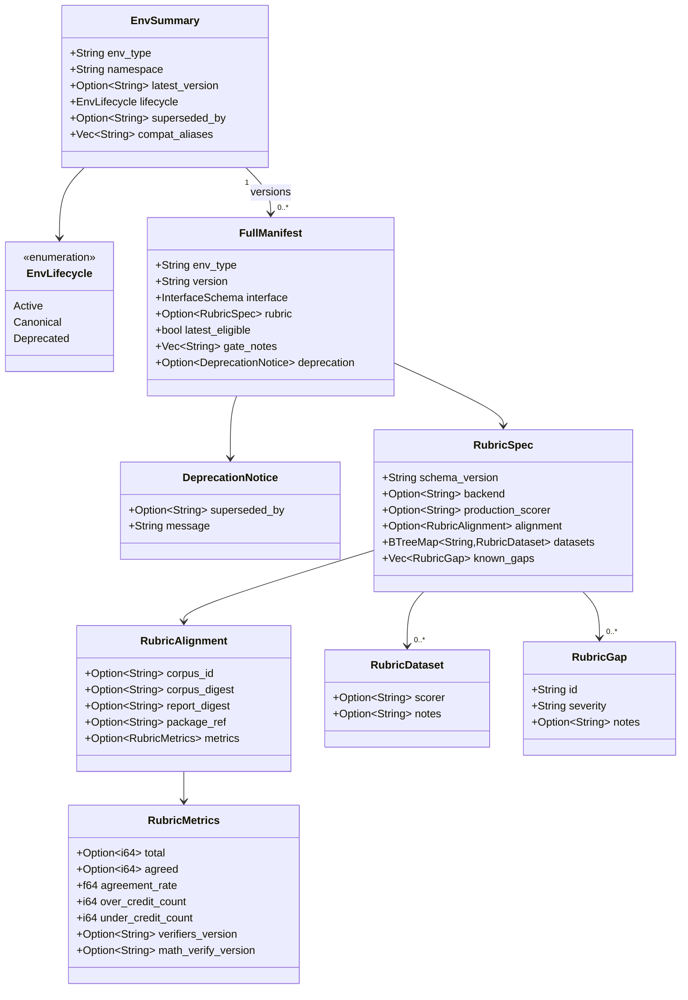
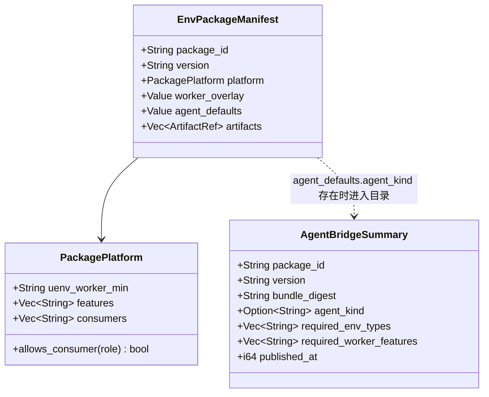

# 环境身份与 Rubric 契约：Hub 对 Server/Worker 重构的同步调整

> 版本：v1.0（2026-07-28）
> 适用范围：`uenv-hub`（types / core / server / client 四 crate）
> 上游依据：Server/Worker 侧重构说明（`演示文稿1.pptx`）、`Docs/worker/260722/Hub待调整事宜-qa制品与Rubric注册.md`、`Docs/worker/260722/跨模块调整清单-qa改造与ToolEnv-Agent.md`
> 前序文档：[标准化环境定义规范](./260716-标准化环境定义规范.md)、[标准化环境全流程与五类 Benchmark 联调报告](./260720-标准化环境全流程与五类Benchmark联调报告.md)、[标准化环境转换与离线预编译规范](./260727-标准化环境转换与离线预编译规范.md)
> 真机联调：Hub `8.130.95.176:8088`、Agent 机 `8.130.208.77`、Worker `219.147.100.43:7143`

---

## 1. 背景与判断

Server/Worker 侧本轮重构收敛了三件事，每一件都要求 Hub 侧有对应的**登记方式**，否则 Hub 只能发一个"能跑的东西"，无法回答"这次 run 到底对齐了哪一版判分口径"：

1. **环境粒度收敛**：把"窄环境（Task Environment）"与"回合栈（Episode Stack = Task Environment + Agent Scaffold + Runtime Gateway）"分开。`math` 收敛为 `qa`，`qa` 是任务环境的正式名。
2. **判分即契约**：验证型环境（`qa`）的奖励由规则产生，其可信度取决于与金标参照实现（`verifiers` + `math_verify`）的对齐结果。该结果必须随版本一起发布，且过宽（生产给分、参照不给分）必须被当成阻塞项。
3. **Agent 侧与 Worker 侧必须吃同一份制品**：DSCodeBench 走 ToolEnv Agent 编排后，Agent 机沙箱与 Worker 官方评测环境若 digest 不一致，会出现"Agent 迭代通过、官方 harness 失败"。

对应的 Hub 侧结论：**需要改数据模型，不只是 bump 版本号**。本轮实现了 7 项，逐项与上游清单（`Hub待调整事宜` §5 注册方式变更清单）对齐：

| 上游要求 | Hub 实现 | 验证 |
|----------|----------|------|
| §5.1 `qa` 正式 seed、`math` deprecated | `EnvLifecycle{active,canonical,deprecated}` + `superseded_by` + `compat_aliases`；seed 幂等对账（线上实例重启即收敛） | §8.1、§8.2 |
| §2 拉取行为：deprecated 不得让 Worker 硬失败 | 退役名仍 `200 OK`，附 `Deprecation` / `Warning: 299` / `Link: rel="successor-version"`，响应体带 `deprecation` 块 | §8.2、§8.7 |
| §5.2 模板默认走 `qa` | `qa` 模板写入 `lifecycle="canonical"` + `compat_aliases=["math"]`；`math` 模板自带 `lifecycle="deprecated"` + `superseded_by="qa"` | §8.6 |
| §5.3 Publish API 支持 `rubric` 元数据 + 附属 artifact | `RubricSpec` 进入 manifest（DTO / TOML / DB / HTTP）；语料与报告作为 EnvPackage 制品由 Hub 托管 | §8.3、§8.4 |
| §5.4 Promote 闸门：过宽 > 0 不得成为 latest | `latest_eligible` + `gate_notes`；`latest` 解析只在合规版本中取最大值 | §8.5 |
| §5.5 AgentBridge 目录 | `GET /api/v1/agent-bridges`，字段与 `uenv.v1.SyncedAgentBridge` 同名；seed `uenv-agent-toolenv@1.0.0` | §8.8 |
| §4.2 方案 A：同一 package 双消费者 | `platform.consumers` + `uenv env sync --consumer` 角色校验 | §8.9 |
| §5.7 错误 Rubric 版本可 yank 但保留 digest | 沿用既有 yank；yank 后 `latest` 在合规版本中重算 | §8.5 |

发布前门禁新增 **C12（rubric 契约与金标对齐）**，门禁版本号随之升为 `uenv-conformance/2`。

不在本轮范围（避免误派）：Server `CodeAgentBackend` / poller 常驻、Worker 插件内的 olymmath 判分修复本身、7142 临时 vLLM。Hub 只负责**声明**该修复落在哪个 version。

---

## 2. 数据模型

### 2.1 环境身份与判分契约



`RubricMetrics` 同时接受两套键名：对齐脚本实际输出的 `agreement_rate` / `over_credit_count` / `under_credit_count`，以及上游契约草案里的 `agreement` / `too_lenient` / `too_strict`（后者作为 serde alias）。这样 `metrics.json` 可以原样喂进 CLI，不需要人工改键名——**改键名这一步就是引入笔误的地方**。

### 2.2 制品消费者与 Agent 目录



`consumers` 为空表示 **仅 Worker**，与该字段引入之前的语义一致；否则不做兼容处理，历史包会在一次升级后突然对 Agent 机可见。取值常量：`worker` / `toolenv-agent` / `openhands-agent`。

`AgentBridgeSummary` 的三个主字段（`package_id` / `version` / `bundle_digest`）与 `uenv.v1.SyncedAgentBridge` 逐字对应，因此 Agent 在 `RegisterAgent.synced_agent_bridges` 里上报的内容可以直接与 Hub 发布的内容比对，不需要中间映射表。

### 2.3 数据库迁移

`uenv-hub/migrations/0003_lifecycle_and_rubric.sql`：

```sql
ALTER TABLE envs ADD COLUMN lifecycle TEXT NOT NULL DEFAULT 'active';
ALTER TABLE envs ADD COLUMN superseded_by TEXT;
ALTER TABLE envs ADD COLUMN compat_aliases TEXT;   -- JSON array of former names

CREATE INDEX idx_envs_lifecycle ON envs(lifecycle);

ALTER TABLE env_versions ADD COLUMN rubric_json TEXT;          -- JSON RubricSpec
ALTER TABLE env_versions ADD COLUMN latest_eligible INTEGER NOT NULL DEFAULT 1;
ALTER TABLE env_versions ADD COLUMN gate_notes TEXT;           -- JSON array
```

迁移经 `sqlx::migrate!` 内嵌，线上库（`/root/uenv/uenv-hub/data/hub.db`）升级前已备份为 `hub.db.bak-20260727200803`。默认值保证既有行语义不变：老版本一律 `active` + 允许成为 `latest`。

---

## 3. 环境身份：更名不等于删除

Worker 启动时按 `env.types` 逐个拉 `GET /api/v1/envs/{env_type}/versions/latest`，在 `prewarm_on_startup` 打开时把非 2xx 当致命错误。因此退役名一旦返回 404/410，任何还配着 `math` 的节点都会起不来——这不是"提醒用户迁移"，而是"让别人的机器挂掉"。

实现选择：**保持 200，用标准头传递退役信息**。

- `Deprecation: true`（RFC 8594）
- `Warning: 299 - "env_type `math` is deprecated; use `qa` for new workloads"`（RFC 9111）
- `Link: </api/v1/envs/qa/versions/latest>; rel="successor-version"`（RFC 8288）
- 响应体附 `deprecation.{superseded_by,message}`，给不读 header 的客户端留一条路

`qa` 侧记录 `compat_aliases=["math"]`，保留"这个名字是从哪儿接过来的"这一事实。

`seed` 的 `ensure_env` 做**对账**而非仅插入：线上已存在的 env，如果 lifecycle 字段与仓库声明不一致，就地更新并打印一行日志。这样线上 Hub 只需换二进制重启即可收敛，不需要手工 SQL。CLI 侧对应能力是 `uenv env publish` 在发现身份漂移时自动 `PATCH /envs/{env_type}`（见 §8.6 的单测覆盖 `patching_an_existing_env_moves_its_identity`）。

---

## 4. Rubric 契约与证据通道

### 4.1 为什么进 Hub

本轮金标结论：生产判分（Rust `score_action`）与 `verifiers` + `math_verify` 的一致率 96.55%（58 例中 56 例），**过宽 0**，过严 2（均已作为产品决策保留）。若 Hub 只发插件二进制，训练/评测无法声明"对齐了哪一版语料、是否含 olymmath 子串包含漏洞的修复"。

### 4.2 三条命令

```bash
# ① 把语料与对齐报告灌进 Hub（EnvPackage，Hub 托管字节，不依赖第三方）
uenv env rubric publish qa-rubric-align --version 0.1.0 \
  --corpus data/alignment/qa_rubric_corpus.jsonl \
  --metrics temp/alignment/qa_rubric/metrics.json

# ② 由真实报告推导 [rubric] 块（含两个 digest），写回 manifest.toml
uenv env rubric import --metrics temp/alignment/qa_rubric/metrics.json \
  --corpus data/alignment/qa_rubric_corpus.jsonl \
  --corpus-id 'qa_rubric_corpus@2026-07-25' \
  --package-ref 'qa-rubric-align@0.1.0'

# ③ 查询某版本对齐的是哪一版金标（训练侧记录用）
uenv env rubric show qa --version latest
```

`import` 是**推导**而不是手写：`agreement_rate` / `over_credit_count` / `under_credit_count` 取自报告本身，`corpus_digest` / `report_digest` 由文件现算，per-dataset 路由取自报告的 `by_dataset`。因此"声明的指标"与"声明所依据的证据"不可能互相打架。重复执行 `import` 会替换而不是追加 `[rubric]`（TOML 不允许重复键），写盘前先解析一遍，语法不合法就不落盘。

`known_gaps` 保持人工填写：它是产品决策（"这两条过严是有意保留的"），不是测量结果。

### 4.3 发布闸门与 C12

闸门规则（`uenv-hub-core/src/domain/rubric.rs`，默认值可配）：

| 项 | 默认 | 行为 |
|----|------|------|
| `max_over_credit` | 0 | 超过则 **不得 promote 为 latest** |
| `min_agreement_rate` | 0.95 | 低于则不得 promote |
| `enforce` | true | 关闭后只记 `gate_notes` 不拦 promote |

两个阈值取自 `verify_qa_rubric_alignment.py` 的默认参数（`--min-agreement 0.95`、`--max-over-credit 0`），使 Hub 闸门与对齐脚本对"什么叫对齐"保持同一口径——本地跑过的语料不会在 Hub 侧被换标准重判。

语义上刻意区分**发布**与**成为 latest**：过宽版本仍然可以 publish、可以按精确版本号拉取（可追溯、可复盘），但 `latest` 解析会跳过它。理由是"删掉证据"比"留着但不默认使用"更糟。`yank` 之后 `latest` 也只在合规版本里重算。

C12 的四种结论：无 rubric → SKIP；结构非法或过宽越线 → FAIL；有指标但缺 corpus/report digest → WARN（"证据不可下载"）；其余 → PASS。

---

## 5. Agent 侧制品分发

- **同包双消费者（上游推荐方案 A）**：`platform.consumers` 声明允许的消费者角色，`uenv env sync --consumer <role>` 校验。Agent 机与 Worker 因此拉的是同一个 `package_id@version`，也就是同一组 artifact digest。
- **AgentBridge 目录**：`GET /api/v1/agent-bridges` 列出所有声明了 `agent_defaults.agent_kind` 的包的最新非 yank 版本。选择器用"是否声明 agent_kind"而不是"包名前缀"，因为前者是包自己的声明，后者是命名约定。
- **seed `uenv-agent-toolenv@1.0.0`**：Agent 机以 `agent_bridge_id=uenv-agent-toolenv` 注册（见 `config/uenv-toolenv.env.example`），Hub 必须在这个 id 下有东西，否则 Agent 上报的 id 指向一个 Hub 无法背书的对象，脚手架只能继续靠手工 scp。制品取自 `uenv-bridge/scripts/benchmark/`（driver + reporter + 官方评测脚本），`agent_defaults.required_env_package` 显式写明必须与之配套的 `dscodebench@0.1.0`。
- **`uenv-agent-openhands` 补登记为 1.0.1**：`1.0.0` 早于 `agent_kind` / `consumers` 字段存在，而 seed 是"存在即跳过"，重写已发布版本又违反"禁止 silent overwrite"，所以补字段走**新版本**。制品字节不变，因此 `bundle_digest` 与 1.0.0 完全一致（见 §8.8 实测），已同步过 1.0.0 的 Agent 上报的 digest 依然对得上。

---

## 6. 内网零外拉的保持情况

| 环节 | 本轮是否引入外网依赖 | 说明 |
|------|----------------------|------|
| Rubric 语料/报告 | 否 | 作为 EnvPackage 制品由 Hub 托管、按 sha256 校验下发 |
| ToolEnv 脚手架 | 否 | 从仓库文件 seed 成 inline artifact，Agent 机 `uenv agent-bridge sync` 从 Hub 取 |
| 新增依赖 | 否 | 未新增第三方 crate，`uenv-hub/Cargo.lock` 未变动（仓库根 `Cargo.lock` 的变动来自并入的 Worker 侧分支：`uenv-math-env` 增加 `serde_json`） |
| 镜像 | 不变 | 仍走既有 `publish-image` / `sync --docker-load` 通道，C06 仍把公网 registry 引用判为失败 |

CLI 侧本轮无新增运行期外部命令；`rubric import` 只做本地文件读取与 sha256。

---

## 7. 变更文件

| 文件 | 变更 |
|------|------|
| `uenv-hub-types/src/lib.rs` | `EnvLifecycle`、`DeprecationNotice`、`RubricSpec` 家族、`PackagePlatform.consumers`、`AgentBridgeSummary`；`EnvSummary` / `FullManifest` / `CreateEnvRequest` / `EnvPatchRequest` / `PublishVersionRequest` / `PublishVersionResponse` 扩字段 |
| `migrations/0003_lifecycle_and_rubric.sql` | 新增：身份三列 + rubric/闸门三列 + lifecycle 索引 |
| `uenv-hub-core/src/domain/rubric.rs` | 新增：契约结构校验 + promote 闸门（含单测） |
| `uenv-hub-core/src/domain/manifest.rs` | `validate_publish` 接入 rubric 校验，并与 `config_schema` 的 dataset 枚举交叉核对（声明了环境跑不了的 dataset scorer，在发布时就报错，而不是在给奖励时） |
| `uenv-hub-core/src/domain/conformance.rs` | 门禁升 `uenv-conformance/2`，新增 C12 |
| `uenv-hub-core/src/{models,convert,repository}.rs` | 落库/回读身份与 rubric；`latest` 解析改走 `latest_eligible` |
| `uenv-hub-core/src/seed.rs` | `qa` canonical + `qa@0.3.0` 带 rubric；`math` deprecated；`ensure_env` 对账；seed `uenv-agent-toolenv@1.0.0`、`uenv-agent-openhands@1.0.1`；各包补 `consumers` |
| `uenv-hub-core/src/templates.rs` | `qa` / `math` 模板写入身份与 rubric 生成指引 |
| `uenv-hub-server/src/routes.rs` | deprecation 三个响应头 + 响应体字段；`GET /agent-bridges`；publish 回传 `promoted_to_latest` / `gate_notes` |
| `uenv-hub-client/src/bin/uenv.rs` | `env rubric {import,show,publish}`；`env sync --consumer`；`env publish-image --consumer`（可重复，默认 `worker`）；`agent-bridge {list,sync --consumer}`；`env publish` 身份对账 |
| `uenv-hub-client/src/{client,manifest_file}.rs` | `patch_env` / `list_agent_bridges`；`manifest.toml` 支持身份与 `[rubric]` |

测试：`cargo test --workspace` **126 项全绿**（core 单测 96、CLI 单测 5、repository 集成 10、server e2e 13、其余 2）。新增覆盖包括退役名 200+头、rubric 契约发布、过宽版本禁 promote、C12 四态、AgentBridge 目录只列脚手架、consumers 角色校验、身份 PATCH 迁移、`rubric import` 幂等与拒收非报告文件。

---

## 8. 真机联调记录

以下为实际执行输出，未做美化；仅对超长 JSON 用 `[…]` 截断，对 token 做遮蔽。

环境：Hub `8.130.95.176`（4C16G，x86_64，`cargo 1.96.0`）；Agent 机 `8.130.208.77`；Worker `219.147.100.43:7143`。Hub 侧 `release` 构建 36.5s，重启前备份 `data/hub.db` → `hub.db.bak-20260727200803`。

### 8.1 升级与 seed 对账（Hub 启动日志）

```
2026-07-27T12:09:30.414482Z  INFO uenv_hub_core::seed: reconciled env lifecycle identity env_type="qa" lifecycle="canonical"
2026-07-27T12:09:30.415600Z  INFO uenv_hub_core::seed: seeded env manifest env_type="qa" version=0.3.0
2026-07-27T12:09:30.416325Z  INFO uenv_hub_core::seed: reconciled env lifecycle identity env_type="math" lifecycle="deprecated"
2026-07-27T12:09:30.417398Z  INFO uenv_hub_core::seed: reconciled env lifecycle identity env_type="code" lifecycle="canonical"
2026-07-27T12:09:30.419454Z  INFO uenv_hub_core::seed: seeded AgentBridgePackage package_id="uenv-agent-toolenv" version="1.0.0"
2026-07-27T12:09:30.420750Z  INFO uenv_hub_server: uenv-hub-server listening addr=0.0.0.0:8088
[第二次重启，补登记 openhands 目录字段]
2026-07-27T12:12:24.750221Z  INFO uenv_hub_core::seed: seeded AgentBridgePackage package_id="uenv-agent-openhands" version="1.0.1"
```

线上原有的 `qa@0.2.0`（由 `math` 镜像发布）保持在版本表内，未被覆盖。

### 8.2 身份与退役头

```
$ curl -s -H "Authorization: Bearer ***" http://8.130.95.176:8088/api/v1/envs?per_page=50
  qa             latest=0.4.0    lifecycle=canonical  superseded_by=None  aliases=['math']
  code           latest=0.2.0    lifecycle=canonical  superseded_by=None  aliases=None
  math           latest=0.2.0    lifecycle=deprecated superseded_by=qa    aliases=None
  swebenchpro    latest=0.1.0    lifecycle=active     superseded_by=None  aliases=None
  dscodebench    latest=0.1.0    lifecycle=active     superseded_by=None  aliases=None
  olymmath       latest=0.1.0    lifecycle=active     superseded_by=None  aliases=None
  scitab         latest=0.1.0    lifecycle=active     superseded_by=None  aliases=None
  pubmedqa       latest=0.1.0    lifecycle=active     superseded_by=None  aliases=None
  agent          latest=0.1.0    lifecycle=active     superseded_by=None  aliases=None

$ curl -sD - -o /dev/null -H "Authorization: Bearer ***" \
    http://8.130.95.176:8088/api/v1/envs/math/versions/latest
HTTP/1.1 200 OK
content-type: application/json
etag: "d810afb59eb365db1004ecc41977bf9479ab872dcec163635a86dc7d367d58ee"
deprecation: true
warning: 299 - "env_type `math` is deprecated; use `qa` for new workloads"
link: </api/v1/envs/qa/versions/latest>; rel="successor-version"
x-request-id: req_3701ce1bdf2d4c9aa31b7e9dbe9dfb97
```

### 8.3 Rubric 证据入库（真实对齐报告）

对齐报告取自 Worker 机实跑产物 `7143:/root/UEnv/temp/alignment/qa_rubric/metrics.json`（`verifiers 0.2.1` / `math_verify 0.9.0`，58 例、56 一致、过宽 0、过严 2），语料与仓库内 `data/alignment/qa_rubric_corpus.jsonl` 校验一致：

```
$ shasum -a 256 metrics.json qa_rubric_corpus.jsonl
a0c4704dee8795644ae9fd952c43f25a54289902b638553733138291928ac8da  metrics.json
ae73604d28facc6b12d8a8c72fb8a39e4ee78869bf7cedfcee774564cc1a6ba6  qa_rubric_corpus.jsonl

$ uenv env rubric publish qa-rubric-align --version 0.1.0 \
    --corpus qa_rubric_corpus.jsonl --metrics metrics.json --publisher liu
published rubric evidence qa-rubric-align@0.1.0 -> /api/v1/packages/qa-rubric-align/versions/0.1.0
reference it from manifest.toml: uenv env rubric import --package-ref qa-rubric-align@0.1.0 …
```

### 8.4 推导 `[rubric]` → 门禁 → 发布 `qa@0.4.0`

```
$ uenv env validate --manifest manifest.toml
manifest is valid

$ uenv env rubric import --metrics metrics.json --corpus qa_rubric_corpus.jsonl \
    --corpus-id 'qa_rubric_corpus@2026-07-25' --package-ref 'qa-rubric-align@0.1.0'
alignment: agreement=0.9655 over_credit=0 under_credit=2
promotion gate: OK (this version may become `latest`)
wrote [rubric] into manifest.toml
```

生成的块（节选，digest 由文件现算）：

```toml
[rubric.alignment]
corpus_digest = "sha256:ae73604d28facc6b12d8a8c72fb8a39e4ee78869bf7cedfcee774564cc1a6ba6"
corpus_id = "qa_rubric_corpus@2026-07-25"
package_ref = "qa-rubric-align@0.1.0"
report_digest = "sha256:a0c4704dee8795644ae9fd952c43f25a54289902b638553733138291928ac8da"

[rubric.alignment.metrics]
agreed = 56
agreement_rate = 0.9655172413793104
math_verify_version = "0.9.0"
over_credit_count = 0
total = 58
under_credit_count = 2
verifiers_version = "0.2.1"

[rubric.datasets.gsm8k]
notes = "aligned 15/16"
scorer = "gsm8k"
```

发布前门禁：

```
$ uenv env test --manifest manifest.toml --json conformance-qa-0.4.0.json
conformance gate uenv-conformance/2 — qa@0.4.0
  [PASS] C01 manifest structural validity — no structural errors (same rules as the server publish path)
  [PASS] C02 OpenEnv contract completeness (action/observation/state) — all three JSON Schemas declared
  [PASS] C03 interface schemas compile — action/observation/state are valid JSON Schema documents
  [SKIP] C04 contract matches implementation (models.py) — models.py not supplied; drift cannot be checked
  [WARN] C05 examples present and conform to the action schema — no examples/*.json supplied; the contract is undemonstrated
  [PASS] C06 zero egress: no public container registry references — known-public denylist: every image reference is intranet-reachable or Hub-hosted
  [WARN] C07 runtime image declared and digest-pinned — no [image] declared; the worker can only launch via entrypoint
  [PASS] C08 config_schema / default_config consistency — config_schema is a valid schema and default_config satisfies it
  [PASS] C09 environment is launchable (entrypoint or image) — version.entrypoint declared
  [PASS] C10 health check path declared — health_check_path=/health
  [SKIP] C11 offline precompilation prepared (wheels + bytecode) — no offline evidence supplied (run with --project pointing at the prepared env)
  [PASS] C12 rubric contract & gold-standard alignment — agreement=0.9655, over_credit=0, under_credit=2, scorer=uenv-math-plugin/score_action
summary: 12 check(s), 0 failed, 2 warned
evidence written to conformance-qa-0.4.0.json
gate passed

$ uenv env publish --manifest manifest.toml
published qa@0.4.0 -> /api/v1/envs/qa/versions/0.4.0
```

两条 WARN 属实且是 `qa` 的固有形态：`qa` 是 process 插件环境（无运行镜像，C07），本次未随包提交 `examples/*.json`（C05）。二者不阻塞发布，`--strict` 下会被当作失败。

回读（训练侧记录用）：

```
$ uenv env rubric show qa --version latest
{
  "schema_version": "1",
  "backend": "verifiers+math_verify",
  "production_scorer": "uenv-math-plugin/score_action",
  "alignment": {
    "corpus_id": "qa_rubric_corpus@2026-07-25",
    "corpus_digest": "sha256:ae73604d28facc6b12d8a8c72fb8a39e4ee78869bf7cedfcee774564cc1a6ba6",
    "report_digest": "sha256:a0c4704dee8795644ae9fd952c43f25a54289902b638553733138291928ac8da",
    "package_ref": "qa-rubric-align@0.1.0",
    "metrics": { "total": 58, "agreed": 56, "agreement_rate": 0.9655172413793104,
                 "over_credit_count": 0, "under_credit_count": 2,
                 "verifiers_version": "0.2.1", "math_verify_version": "0.9.0" }
  },
  "datasets": { […6 个数据集路由…] }
}
```

证据字节可下载、且与声明的 digest 一致：

```
$ uenv env sync qa-rubric-align --version 0.1.0 --target-dir ./synced --consumer toolenv-agent
package qa-rubric-align@0.1.0
  artifacts (2):
    - corpus.jsonl           kind=rubric_corpus mode=inline   sha256:ae73604d…1a6ba6 -> rubric/corpus.jsonl
    - metrics.json           kind=rubric_report mode=inline   sha256:a0c4704d…8ac8da -> rubric/metrics.json
  bundle_digest: sha256:dfa0a6ccf3a841a2ead1b68bb66ae35cc50b5f5ccf875cc9c3a3b459a4cf6ea1
  wrote ./synced/envs/qa-rubric-align/0.1.0/rubric/corpus.jsonl (7806 bytes)
  wrote ./synced/envs/qa-rubric-align/0.1.0/rubric/metrics.json (17481 bytes)
synced qa-rubric-align@0.1.0 -> ./synced/envs/qa-rubric-align/0.1.0
```

### 8.5 发布闸门实测（过宽 > 0）

构造方法明示：取上述真实 `metrics.json`，把 `gsm8k-009`（原为过严）翻转为"生产给分、参照不给分"，`over_credit_count` 置 1。该文件在报告内自带 `note: DERIVED FIXTURE`，仅用于验证闸门。

```
$ uenv env rubric import --metrics metrics.overcredit.json --corpus qa_rubric_corpus.jsonl \
    --package-ref 'qa-rubric-align@0.1.0'
alignment: agreement=0.9655 over_credit=1 under_credit=1
promotion gate: BLOCKED
  - over-credit cases 1 exceed the allowed 0: the scorer rewards answers the reference rejects, which a policy can exploit
wrote [rubric] into manifest.toml

$ uenv env test --manifest manifest.toml
  [FAIL] C12 rubric contract & gold-standard alignment — gold-standard alignment insufficient: over-credit cases 1
         exceed the allowed 0: the scorer rewards answers the reference rejects, which a policy can exploit.
         Re-run verify_qa_rubric_alignment.py and fix the scorer before packaging.
summary: 12 check(s), 1 failed, 2 warned
error: conformance gate failed

$ uenv env publish --manifest manifest.toml      # 绕过本地门禁强行发布，验证服务端闸门
published qa@0.4.1 -> /api/v1/envs/qa/versions/0.4.1

$ curl … /api/v1/envs/qa/versions/latest    → latest = 0.4.0 | latest_eligible = True
$ curl … /api/v1/envs/qa/versions/0.4.1     → version = 0.4.1 | latest_eligible = False |
    gate_notes = ['over-credit cases 1 exceed the allowed 0: the scorer rewards answers the reference rejects, which a policy can exploit']
```

即：**能发、能按精确版本审计，但不会成为 latest**。验证完成后按 §5.7 把该构造版本 yank，digest 保留可追溯：

```
$ uenv env yank qa --version 0.4.1 --reason "闸门验证用的构造版本（metrics 由真实报告翻转 1 例得到，非真实判分结果），保留 digest 可追溯"
yanked qa@0.4.1
   0.4.1 yanked
   0.4.0 live
   0.3.0 live
   0.2.0 live
latest = 0.4.0
```

### 8.6 模板（线上 Hub 下发）

```
$ uenv env init demo-qa --template qa
Scaffolded 'demo-qa' from template 'qa' into demo-qa (9 files)
$ head -14 demo-qa/manifest.toml
env_type = "qa"
…
lifecycle = "canonical"
compat_aliases = ["math"]

# 判分契约（rubric）不在脚手架里手写：改完判分后跑对齐脚本，再
#   uenv env rubric publish <pkg> --corpus <corpus> --metrics <metrics.json>

$ head -12 demo-math/manifest.toml
env_type = "math"
…
# `math` 已退役，正式名为 `qa`；此模板仅为兼容旧 checkout 保留。
lifecycle = "deprecated"
superseded_by = "qa"
```

### 8.7 Worker 侧（7143）拉取路径核对

```
$ ssh -p 7143 root@219.147.100.43
=== qa latest (Worker startup path) ===
qa 0.4.0 | rubric: True | eligible: True
=== math latest (deprecated alias) ===
http=200
deprecation: true
warning: 299 - "env_type `math` is deprecated; use `qa` for new workloads"
link: </api/v1/envs/qa/versions/latest>; rel="successor-version"
body.deprecation = {'superseded_by': 'qa', 'message': 'env_type `math` is deprecated; use `qa` for new workloads'}
```

兼容性：Worker 的 `HubEnvManifest` 只反序列化 `env_type` / `version` / `entrypoint` / `supported_backends` 四个字段且未启用 `deny_unknown_fields`，因此新增的 `rubric` / `latest_eligible` / `deprecation` 对现网 Worker 是惰性字段，不需要同步升级 Worker 即可发布。联调期间 7143 上既有 Worker 进程（`uenv-worker.deploy-7143-swe-pro.yaml`，7 月 25 日起常驻）未受影响，未做重启。

### 8.8 AgentBridge 目录（Agent 机 208.77 视角）

```
$ uenv agent-bridge list
2 agent bridge(s):
  uenv-agent-openhands     1.0.1    kind=openhands  envs=swe          sha256:7a0af55952705af445f9bdf32f0930563e7be37aed583fb598c34312cd31ab74
  uenv-agent-toolenv       1.0.0    kind=toolenv    envs=code         sha256:b12336d0530a932216a4a3f9e2dee8553623be42e0273166070b0d4c2b4498ba

$ for v in 1.0.0 1.0.1; do … sync-plan; done      # 补登记未改动字节
1.0.0 sha256:7a0af55952705af445f9bdf32f0930563e7be37aed583fb598c34312cd31ab74 consumers=None
1.0.1 sha256:7a0af55952705af445f9bdf32f0930563e7be37aed583fb598c34312cd31ab74 consumers=['openhands-agent']
```

ToolEnv 脚手架经 Hub 下发到 Agent 机（此前为手工 scp）：

```
$ uenv agent-bridge sync uenv-agent-toolenv --version 1.0.0 \
    --target-dir /opt/uenv/agent-bridges --consumer toolenv-agent
    - dscode_toolenv_agent.py kind=other      mode=inline   sha256:a54b0601…dfed64 -> drivers/dscode_toolenv_agent.py
    - run_dscodebench_agent_toolenv.sh kind=other      mode=inline   sha256:1be0d835…d18286 -> drivers/run_dscodebench_agent_toolenv.sh
    - report_dscode_agentic.py kind=other      mode=inline   sha256:7e7edf46…a131e6 -> drivers/report_dscode_agentic.py
    - evaluate_dscodebench.py kind=eval_script mode=inline   sha256:5f0a86a9…06e10d -> drivers/evaluate_dscodebench.py
  bundle_digest: sha256:b12336d0530a932216a4a3f9e2dee8553623be42e0273166070b0d4c2b4498ba
  wrote /opt/uenv/agent-bridges/uenv-agent-toolenv/1.0.0/drivers/dscode_toolenv_agent.py (26689 bytes)
  […]
synced uenv-agent-toolenv@1.0.0 -> /opt/uenv/agent-bridges/uenv-agent-toolenv/1.0.0
next: export UENV_AGENT_BRIDGE_DIR=/opt/uenv/agent-bridges/uenv-agent-toolenv/1.0.0
```

该 `bundle_digest` 即 Agent 应在 `RegisterAgent.synced_agent_bridges[].bundle_digest` 上报的值，与目录列出的值一致。

### 8.9 consumers 角色校验（跨机）

```
$ uenv agent-bridge sync uenv-agent-openhands --version 1.0.1 --consumer toolenv-agent
error: package uenv-agent-openhands@1.0.1 is not published for consumer 'toolenv-agent'
       (declared consumers: openhands-agent); republish with that consumer declared so both ends consume one digest
exit=1

$ uenv env sync math-smoke-fixtures --version 0.1.0 --consumer toolenv-agent
error: package math-smoke-fixtures@0.1.0 is not published for consumer 'toolenv-agent'
       (declared consumers: worker (implicit)); republish with that consumer declared so both ends consume one digest
exit=1

$ uenv env sync math-smoke-fixtures --version 0.1.0 --consumer worker --dry-run
  bundle_digest: sha256:43f6de036924414cec622bee43b501b0160a0d0927ef2df21bbb31990a546dd3
(dry-run: nothing downloaded)
```

同一制品在 Mac（§8.4）与 Agent 机上的 `bundle_digest` 与 `.synced` 记录一致，即"Worker 与 Agent 吃同一 digest"可被机器校验而非口头保证：

```
$ cat /opt/uenv/envs/qa-rubric-align/0.1.0/.synced
{
  "bundle_digest": "sha256:dfa0a6ccf3a841a2ead1b68bb66ae35cc50b5f5ccf875cc9c3a3b459a4cf6ea1",
  "package_id": "qa-rubric-align",
  "synced_at": 1785154634,
  "version": "0.1.0"
}
$ sha256sum /opt/uenv/envs/qa-rubric-align/0.1.0/rubric/*
ae73604d28facc6b12d8a8c72fb8a39e4ee78869bf7cedfcee774564cc1a6ba6  …/rubric/corpus.jsonl
a0c4704dee8795644ae9fd952c43f25a54289902b638553733138291928ac8da  …/rubric/metrics.json
```

---