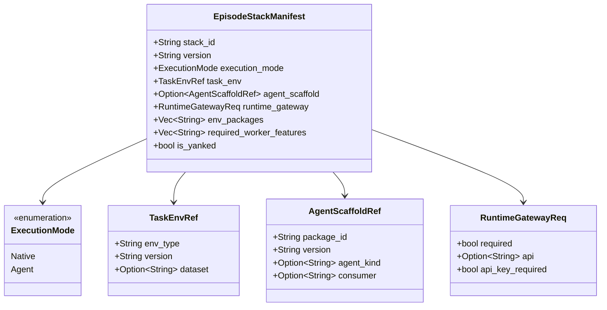

# Episode Stack 一等公民化与 Rubric 判分规则本体分发

> 版本：v1.0（2026-07-28）
> 适用范围：`uenv-hub`（types / core / server / client 四 crate）+ `uenv-bridge/scripts` 金标规则包
> 上游依据：`演示文稿1.pptx`（环境粒度收敛、Agent 支持、五类 Benchmark 现状）
> 前序文档：[环境身份与 Rubric 契约](./260728-hub-env-identity-and-rubric.md)、[标准化环境转换与离线预编译规范](./260727-标准化环境转换与离线预编译规范.md)、[标准化环境全流程与五类 Benchmark 联调报告](./260720-标准化环境全流程与五类Benchmark联调报告.md)
> 门禁版本：`uenv-conformance/3`（本轮新增 C13）

---

## 1. 本轮解决的两个「说得出、验不了」

上一轮（`260728-hub-env-identity-and-rubric.md`）把环境身份与 rubric **契约**登记进了 Hub。落地后复盘 PPT 的架构图，还剩两处 Hub 侧只能"描述"、无法"校验"的地方。二者的共同形状是：Hub 存了一个名字，而真正决定行为的东西不在 Hub 手上。

### 1.1 回合栈（Episode Stack）只存在于人的约定里

上一轮文档已经写明"窄环境（Task Environment）与回合栈（Episode Stack = Task Environment + Agent Scaffold + Runtime Gateway）要分开"，但 Hub 侧只登记了前者。后者的组合关系落在配置文件与联调文档里，于是：

- `uenv-agent-openhands` 声明 `required_env_types: ["swe"]`，而 `swe` **根本不是注册表里的环境**（只以 `swe-bench-verified` EnvPackage 形态存在）。这句声明指向了一个 Hub 无法解析的名字，等于没有约束力。
- 把驱动 `swe` 的 scaffold 配到 `code` 环境上，Hub 不会拒绝；错误在 dispatch 时以运行时报错出现，而每个组件单看都"配置正确"。
- Agent 模式下漏配 Runtime Gateway，是本轮 SWE-bench 缺陷的确切形状：scaffold 与环境在不同主机上，命令没有被路由就在 Agent 机本地执行，**没有任何一道任务能过**，但三个组件的清单都挑不出错。
- 一次训练 run 要记三个坐标（env、scaffold、package），三处版本各自浮动，事后无法回答"这次到底跑的是什么"。

### 1.2 判分规则本体不经 Hub 分发

`RubricSpec` 里 `backend = "verifiers+math_verify"` 说明用了哪个库，**没有**说明抽取规则；而验证型环境的分数几乎完全由抽取规则决定。把 GSM8K 的官方 `####` 抽取换成 `MathRubric` 默认的 boxed-only parser，`backend` 字符串一字不变，而每一道 GSM8K 从"基本全对"变成"全判 0"。

于是上一轮的对齐率 0.9655 是一个**无法被第三方复算**的数字：语料与报告的字节都由 Hub 托管了（C12 检查它们的 digest），唯独"用哪套规则量出来的"这件事只有一个库名。规则本体当时内嵌在 `verify_qa_rubric_alignment.py` 里，Hub 托管不到它。

---

## 2. Episode Stack 建模

### 2.1 数据模型



落表见 `uenv-hub/migrations/0004_episode_stacks.sql`（`episode_stacks` + `episode_stack_versions`）。

一个刻意的取舍：**组件引用按声明原样存**（`latest`、`^0.4`），解析发生在读取时。理由是浮动约束的语义就是"跟随"——新发布一个通过 rubric 闸门的环境版本，栈不必重新发布即可用上；而 `latest` 的解析本身已经排除了被闸门拦下的版本，所以"跟随"不会把不合规的判分口径带进来。反过来，如果发布时就固化，栈会静悄悄地停留在旧判分口径上，而这正是 rubric 闸门要防的事。

### 2.2 两类校验，分工明确

| 层次 | 位置 | 性质 | 抓什么 |
|------|------|------|--------|
| 结构 | `domain::stack::validate` | 纯函数，无 I/O | 请求自相矛盾：`agent` 模式无 scaffold、`native` 模式却声明了 scaffold、`env_packages` 未钉版本 |
| 引用 | `domain::stack::cross_check` | 对照 Hub 已有内容 | 配对错误：scaffold 不驱动该环境、dataset 不被环境的 `config_schema` 接受、gateway 绑定型环境在 agent 模式漏配 gateway、consumer 角色包未发布 |

第二类是这张表存在的全部理由——§1.1 的四种错误里有三种只有 Hub 能判，因为 scaffold 的 `required_env_types`、环境的 `config_schema`、gateway 需求分散在三份 manifest 里。

关于 gateway 绑定：`GATEWAY_BOUND_ENV_TYPES = ["swe", "swebenchpro", "swebench"]` 是**按 env_type 白名单**而非靠 scaffold 自报，因为"scaffold 与环境不同机"是环境侧的事实，让 scaffold 自己声明就回到了"声明与现实可以不一致"的老问题。

关于闸门被拦版本的两种态度：栈写 `latest` 时，当前解析到被拦版本只给 warning（`latest` 会随新版本移动，今天的解析结果不是栈的选择）；栈钉死一个被拦版本则是 error（那是发布者的明确选择）。

### 2.3 解析：一次请求给出可启动的全部信息

`GET /api/v1/episode-stacks/{stack_id}/versions/{version}/resolve` 返回 `ResolvedEpisodeStack`：每个组件的 `requested → resolved`、EnvPackage 的 `SyncPlan`、任务环境的完整 manifest、以及 `stack_digest`。

`stack_digest` 取自**解析后**的组件三元组（role, id, resolved, digest）排序后哈希，而不是取自栈声明。原因很直接：两次跑同一个写着 `latest` 的栈，只有当 `latest` 指的是同一个东西时才算同一个实验，而这个值恰好能说清这件事。

解析时会**重跑**引用校验，结果作为 `notes` 而非 error 返回：`latest` 会移动，scaffold 也可能被改成为另一个 consumer 发布，此时栈应当仍可启动，但漂移必须被说出来。

### 2.4 `swe` 补登记为任务环境

`seed_envs` 新增 `swe@0.1.0`（`lifecycle=canonical`，`compat_aliases=["swebench"]`，`supported_backends=["container"]`，无 process entrypoint）。`config_schema.dataset` 枚举 `swe-bench-verified` / `swe-bench-pro`，与 EnvPackage id 及 Worker 的 `swe.benchmark_variant` overlay 对齐；Action/Observation/State 沿用 SWE EnvPackage 的 interface，只去掉 `benchmark_variant` 的 per-variant `const`（注册表条目描述能力类，变体是配置值）。

### 2.5 seed 的两个参考栈

`seed_episode_stacks` 在包 seed 之后运行，覆盖执行模式这条轴：

| stack_id | mode | task_env | scaffold | gateway | env_packages |
|---|---|---|---|---|---|
| `swe-bench-verified-openhands@1.0.0` | agent | `swe@latest` / `swe-bench-verified` | `uenv-agent-openhands@latest`（openhands / openhands-agent） | required, `runtime/v1`, api_key | `swe-bench-verified@1.0.0` |
| `qa-gsm8k-native@1.0.0` | native | `qa@latest` / `gsm8k` | — | — | — |

seed 走的是与 API 完全相同的 `validate` + `cross_check`：一个连发布接口都会拒绝的栈，不该由 seed 塞进库里。组件缺失时跳过并 warn（部分 checkout 仍能启动），而不是失败。

---

## 3. Rubric 判分规则本体分发

### 3.1 规则包独立成文件

金标规则从 `verify_qa_rubric_alignment.py` 抽出为 `uenv-bridge/scripts/qa_rubric.py`，对齐脚本改为 `import` 而非各存一份。二者必须是引用关系而非复制关系：复制会各自演化，于是"报告声明的口径"与"Hub 分发的口径"悄悄分叉，而这种分叉在 reward 对不上之前是不可见的。

对齐脚本随之新增两件事：`--rubric-dir`（规则包从 Hub 同步到别处时指向它），以及在 `metrics.json` 里写入 `rubric_module_digest` —— 报告自带"我是用哪份规则字节量出来的"。

### 3.2 `RubricSpec.reference_scorer`

```rust
pub struct RubricScorerRef {
    pub package_ref: String,        // uenv-qa-rubric@1.0.0
    pub artifact: String,           // qa_rubric.py
    pub digest: String,             // sha256:…
    pub entrypoint: Option<String>, // qa_rubric:score
    pub rubric_classes: Vec<String>,
    pub requires: Vec<String>,      // verifiers / math_verify
}
```

`requires` 不是装饰：内网离线消费方需要知道该 vendor 哪些 wheel 才能执行这套规则。

`qa` 因此多出一个版本：`qa@0.3.0` 保持原样（`reference_scorer = None`，C13 对它 warn，这是**设计如此**），新增 `qa@0.3.1` 把规则钉住。用新版本而非原地改：已完成的训练 run 引用的是已发布的 manifest，原地改写会悄悄改变已收集 reward 的含义。

`seed_qa_rubric_scorer` 发布 `uenv-qa-rubric@1.0.0`，制品为 `qa_rubric.py`（kind `rubric_scorer`）+ `verify_qa_rubric_alignment.py`（kind `eval_script`）。对齐 harness 与规则一起发：有了两个文件，消费方能**复算**出同样的数字，而不是读一套自己无法执行的规则。consumer 角色新增 `rubric-auditor`（Worker 用 Rust 生产判分器打分，从不需要这套 Python wheel；只有拿生产结果去对金标的人才需要）。

### 3.3 门禁 C13

> **C13 — rubric gold-standard rule package is Hub-distributable**

C12 检查的是**测量**（生产与参照的一致程度、在哪份语料上）；C13 检查的是**参照本身**能不能被取到。

| 情形 | 结论 | 理由 |
|---|---|---|
| 无 `[rubric]` | Skip | 执行型环境没有规则可对齐 |
| 无 `reference_scorer` | **Warn** | 对齐率仍是真的，只是无法被独立复算 |
| `package_ref` 非 `id@version` / `digest` 非 `sha256:<64 hex>` | **Fail** | 无法解析的坐标永远校验不了 |
| 有坐标但无 `entrypoint` | Warn | 规则能读、不能跑 |
| 有坐标但无 `requires` | Warn | 离线消费方不知道要 vendor 哪些 wheel |
| 齐备 | Pass | detail 里带 `package_ref :: artifact pinned by digest` |

门禁版本升为 `uenv-conformance/3`（`/2` 引入 C12，`/3` 引入 C13，C01–C11 语义不变），旧报告因此仍可按产生它的规则集来读。

### 3.4 CLI

```bash
# 发布规则本体 + 证据 + 复算 harness
uenv env rubric publish uenv-qa-rubric --version 1.0.0 \
    --corpus temp/alignment/qa_rubric/qa_rubric_corpus.jsonl \
    --metrics temp/alignment/qa_rubric/metrics.json \
    --scorer uenv-bridge/scripts/qa_rubric.py \
    --aligner uenv-bridge/scripts/verify_qa_rubric_alignment.py

# 把规则钉进 manifest.toml（digest 由本地文件算出，不手填）
uenv env rubric import --metrics …/metrics.json --corpus …/corpus.jsonl \
    --scorer-ref uenv-qa-rubric@1.0.0 --scorer uenv-bridge/scripts/qa_rubric.py \
    --scorer-class ReferenceScorer --scorer-requires verifiers --scorer-requires math_verify

# 消费方侧的 C13 校验：按坐标取回、哈希、比对
uenv env rubric fetch-scorer qa --version latest --target-dir /opt/uenv/rubric
```

`import` 会拿 `metrics.json` 里的 `rubric_module_digest` 与 `--scorer` 的本地哈希**交叉比对**，不一致直接拒绝——那意味着 manifest 将声明一个用别的规则量出来的对齐率，正是本节要防的漂移。`fetch-scorer` 遇到 digest 不符报 error 而非 warning：Hub 上的规则不是量出该对齐率的规则时，任何由它派生的 reward 都不可信。

---

## 4. API 与命令一览

| 端点 | 角色 | 说明 |
|---|---|---|
| `GET /api/v1/episode-stacks` | 任意 | 分页列出（每个栈的 latest） |
| `GET /api/v1/episode-stacks/{id}/versions` | 任意 | 全部版本，新→旧 |
| `POST /api/v1/episode-stacks/{id}/versions` | Publisher | 发布；结构+引用校验，warning 以 `notes` 返回 |
| `GET /api/v1/episode-stacks/{id}/versions/{v}` | 任意 | 存储的声明（组件保持声明形态） |
| `GET /api/v1/episode-stacks/{id}/versions/{v}/resolve` | 任意 | 启动计划（全部钉版本 + sync plan + `stack_digest`） |
| `POST /api/v1/episode-stacks/{id}/versions/{v}/yank` | Publisher | 撤回并重算 latest |

CLI：`uenv stack list | show | resolve | publish`。

---

## 5. 与 PPT 架构图的对应

| PPT 架构图元素 | Hub 侧落点 |
|---|---|
| Task Environment（窄环境） | `envs` / `env_versions` 注册表；本轮补齐 `swe@0.1.0` |
| Agent Scaffold | EnvPackage + `agent_defaults.agent_kind`；`GET /agent-bridges` 目录 |
| Runtime Gateway 会话 | `RuntimeGatewayReq{required, api, api_key_required}`；gateway 绑定型环境在 agent 模式下强制 |
| Episode Stack（三者合体） | `episode_stacks` / `episode_stack_versions` + `/resolve` |
| 判分（Rubric）与金标对齐 | `RubricSpec.alignment`（C12）+ `RubricSpec.reference_scorer`（C13） |
| 离线消费（零外拉） | `SyncPlan` + `bundle_digest`；规则包 `requires` 声明需 vendor 的 wheel |

真机验证过程、逐条命令与原始输出见本轮联调报告。

---

## 6. 测试

| 范围 | 用例 |
|---|---|
| `domain::stack` 单测 | agent 无 scaffold / native 带 scaffold / 包未钉版本 / scaffold 与环境不匹配 / agent_kind 不符 / consumer 未发布 / dataset 不被接受 / gateway 绑定漏配 / 被拦版本 exact vs latest / deprecated 环境提示后继者 / `stack_digest` 顺序无关且版本敏感 |
| `domain::conformance` C13 单测 | 无 rubric skip / 仅库名 warn / 齐备 pass / 无 entrypoint 或无 requires warn / digest 不可解析 fail |
| server e2e | 发布→列表→解析（`latest` 被钉死、scaffold digest 与 `bundle_digest` 一致、`stack_digest` 生成）；五类不合法组合被拒且未落库；`swe` 已注册且 Action 契约含 `exec` |
| client 单测 | `--scorer-ref`/`--scorer` 钉住 digest；半配置被拒；报告 digest 与本地模块不一致被拒 |

`cargo test --workspace` 在 `uenv` 与 `uenv/uenv-hub` 两个 workspace 均全绿。
