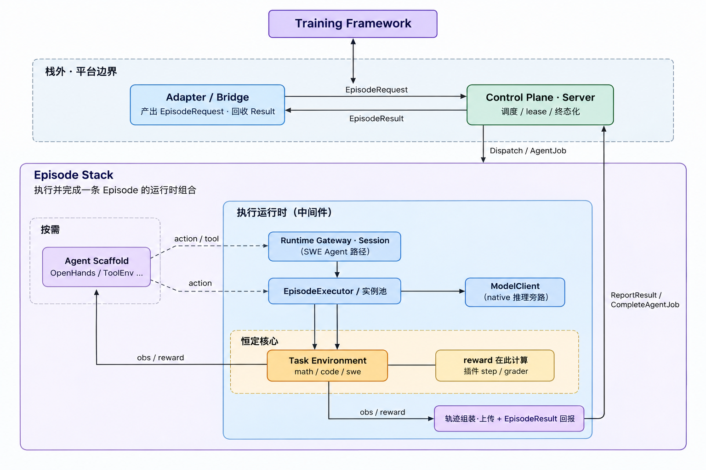

# 260802\-真机部署联调报告

- 分支：`feature/worker-pool-260728_HubEpisodeStackRubric`

- 联调机：`121.89.82.128`，16C / 61G / 504G，Ubuntu 24\.04\.4，机上初始无 uenv 服务

- 端口：Hub 18088 / Server gRPC 18099 / Trajectory 18077 / admin 18092 / Worker 38888 / obs 38777 / Runtime Gateway 38999


## 0\. 全流程结果

|\#|步骤|结果|
|---|---|---|
|1|系统依赖 \+ Rust 工具链从零安装|rustc 1\.97\.1|
|2|拉取被测分支|HEAD = `6bc65947bfa1`|
|3|全量 release 编译（主 \+ Hub 两个 workspace）|1m06s \+ 1m04s，6 个二进制|
|4|Hub 起服：4 个迁移 \+ 全量 seed \+ Token|6 环境 / 6 EnvPackage / 2 EpisodeStack|
|5|环境创建：镜像 inspect \+ 契约 → manifest|`swe@0.2.0`|
|6|打包门禁 C01–C13|13 项 0 FAIL|
|7|环境发布|`swe@0.2.0` 落库 \+ 审计|
|8|离线打包：`docker save` → `publish-image`|927MB tar 入库 0\.95s|
|9|零外拉消费：删本地镜像 → `sync --docker-load`|digest 一致恢复|
|10|Server \+ Worker 起服与注册|注册成功|
|11|SWE\-bench Episode（gold）|`resolved=true reward=1` 6/6 PASS|
|12|反向对照（无 gold）|`resolved=false reward=0`|
|13|gRPC 派发 Server→Worker|`episode_complete reward=1`|
|14|Runtime Gateway 会话（Agent 路径）|`reward=1.0` 6/6 PASS|
|15|Episode Stack 发布 \+ resolve|版本与 digest 全钉住|
|16|Episode Stack 不自洽拦截|3 类反例全拒|
|17|Rubric 金标经 Hub 分发 \+ 对齐|0\.9655，过判 0，digest 三处一致|


## 1\. 工具链与依赖

```Bash
apt-get update -qq && apt-get install -y -qq build-essential pkg-config libssl-dev \
  protobuf-compiler git curl sqlite3 jq
export RUSTUP_DIST_SERVER=https://mirrors.tuna.tsinghua.edu.cn/rustup
export RUSTUP_UPDATE_ROOT=https://mirrors.tuna.tsinghua.edu.cn/rustup/rustup
curl -fsSL -o /tmp/rustup-init https://mirrors.aliyun.com/rustup/rustup/dist/x86_64-unknown-linux-gnu/rustup-init
chmod +x /tmp/rustup-init && /tmp/rustup-init -y --no-modify-path --default-toolchain stable --profile minimal
cat > /root/.cargo/config.toml <<'CFG'
[source.crates-io]
replace-with = "ustc"
[source.ustc]
registry = "sparse+https://mirrors.ustc.edu.cn/crates.io-index/"
[net]
git-fetch-with-cli = true
CFG
```

```Plaintext
Ubuntu 24.04.4 LTS
Linux iZ0jligr4c4w12i73v5kdgZ 6.8.0-124-generic x86_64
libprotoc 3.21.12
Rust is installed now. Great!
rustc 1.97.1 (8bab26f4f 2026-07-14)
cargo 1.97.1 (c980f4866 2026-06-30)
Docker version 29.6.1
```


## 2\. 拉取分支

```Bash
git clone --branch feature/worker-pool-260728_HubEpisodeStackRubric --single-branch \
  http://8.130.179.41:3000/pku-team/uenv.git /root/uenv
```

```Plaintext
$ cd /root/uenv && git log --oneline -3 && git rev-parse HEAD
6bc6594 Episode Stack 相关建模与 Rubric 判分规则本体经 Hub 分发，全面联调
1017281 Merge branch 'frontend_add' into feature/worker-pool-260622
1e20c83 feat(hub): 环境身份生命周期与 Rubric 评分契约落地，含发布闸门、消费者分发与 AgentBridge 目录
6bc65947bfa16c2b0f65b2c5095c6612a7066dbf
```


## 3\. 全量 release 编译

```Bash
cd /root/uenv        && time cargo build --release --workspace
cd /root/uenv/uenv-hub && time cargo build --release --workspace
```

```Plaintext
Compiling uenv-common v0.1.0 (/root/uenv/uenv-common)
   Compiling uenv-worker v0.1.0 (/root/uenv/uenv-worker)
   Compiling uenv-server v0.1.0 (/root/uenv/uenv-server)
   Compiling uenv-adapter-core v0.1.0 (/root/uenv/uenv-bridge/core)
   Compiling uenv-code-env v0.1.0 (/root/uenv/plugins/code)
    Finished `release` profile [optimized] target(s) in 1m 06s
real        1m6.907s

   Compiling uenv-hub-types v0.1.0 (/root/uenv/uenv-hub/uenv-hub-types)
   Compiling uenv-hub-core v0.1.0 (/root/uenv/uenv-hub/uenv-hub-core)
   Compiling uenv-hub-client v0.1.0 (/root/uenv/uenv-hub/uenv-hub-client)
   Compiling uenv-hub-server v0.1.0 (/root/uenv/uenv-hub/uenv-hub-server)
    Finished `release` profile [optimized] target(s) in 1m 04s
real        1m4.476s
```

```Plaintext
-rwxr-xr-x 2 root root 16149016 Jul 28 21:06 target/release/uenv-adapter-core
-rwxr-xr-x 2 root root  5088816 Jul 28 21:06 target/release/uenv-code-plugin
-rwxr-xr-x 2 root root  4939512 Jul 28 21:06 target/release/uenv-math-plugin
-rwxr-xr-x 2 root root 14727288 Jul 28 21:06 target/release/uenv-worker
-rwxr-xr-x 2 root root 14200688 Jul 28 21:07 uenv-hub/target/release/uenv
-rwxr-xr-x 2 root root 17464864 Jul 28 21:07 uenv-hub/target/release/uenv-hub-server
```

生产 Server 入口是 `uenv-adapter-core`（内嵌 `uenv-server` lib），与 `deploy/systemd/uenv-server.service` 一致。


## 4\. 起 Hub

```Bash
cd /root/uenv/uenv-hub
echo "uenvh_$(openssl rand -hex 16)" > data/.admin_token && chmod 600 data/.admin_token
export UENV_HUB_SERVER__HOST=0.0.0.0 UENV_HUB_SERVER__PORT=18088 \
  UENV_HUB_DATABASE__URL="sqlite:///root/uenv/uenv-hub/data/hub.db" \
  UENV_HUB_PACKAGES__ARTIFACT_DIR=/root/uenv/uenv-hub/data/artifacts \
  UENV_HUB_PACKAGES__CATALOG_SEED_DIR=/root/uenv/config/swe \
  UENV_HUB_SWE_CATALOG_DIR=/root/uenv/config/swe \
  UENV_HUB_AUTH__BOOTSTRAP_ADMIN_TOKEN="$(cat data/.admin_token)"
nohup ./target/release/uenv-hub-server --config config/hub.prod.toml > /root/hub.log 2>&1 &
```

```Plaintext
INFO uenv_hub_core::seed: seeded env manifest env_type="qa" version=0.2.0
INFO uenv_hub_core::seed: seeded env manifest env_type="qa" version=0.3.0
INFO uenv_hub_core::seed: seeded env manifest env_type="math" version=0.2.0
INFO uenv_hub_core::seed: seeded env manifest env_type="code" version=0.2.0
INFO uenv_hub_core::seed: seeded env manifest env_type="swe" version=0.1.0
INFO uenv_hub_core::seed: seeded env manifest env_type="agent" version=0.1.0
INFO uenv_hub_core::seed: seeded EnvPackage package_id="swe-bench-verified" version="1.0.0" variant="verified"
INFO uenv_hub_core::seed: seeded EnvPackage package_id="swe-bench-pro" version="0.2.0" variant="pro"
INFO uenv_hub_core::seed: seeded AgentBridgePackage package_id="uenv-agent-openhands" version="1.0.1"
INFO uenv_hub_core::seed: seeded AgentBridgePackage package_id="uenv-agent-toolenv" version="1.0.0"
INFO uenv_hub_core::seed: seeded QA rubric gold-standard package package_id="uenv-qa-rubric" version="1.0.0"
INFO uenv_hub_core::seed: seeded env manifest env_type="qa" version=0.3.1
INFO uenv_hub_core::seed: seeded EpisodeStack stack_id="swe-bench-verified-openhands" version=1.0.0
INFO uenv_hub_core::seed: seeded EpisodeStack stack_id="qa-gsm8k-native" version=1.0.0
INFO uenv_hub_server: bootstrapped admin token from config
INFO uenv_hub_server: uenv-hub-server listening addr=0.0.0.0:18088
```

```Plaintext
$ curl -sS http://127.0.0.1:18088/healthz
{"status":"ok","db":"up"}
$ sqlite3 data/hub.db "select version,description,success from _sqlx_migrations;"
1|init|1
2|env packages|1
3|lifecycle and rubric|1
4|episode stacks|1
$ sqlite3 data/hub.db ".tables"
_sqlx_migrations        env_package_artifacts   env_versions
api_tokens              env_package_versions    envs
audit_log               env_packages            episode_stack_versions
env_configs             env_tags                episode_stacks
env_images              env_templates
$ ss -lntp | grep 18088
LISTEN 0 128 0.0.0.0:18088 users:(("uenv-hub-server",pid=257339,fd=14))
```

`episode_stacks` / `episode_stack_versions` 两张表与迁移 `0004` 是本分支新增的 Episode Stack 建模。


## 5\. CLI 登录与清点

```Bash
export PATH=/root/uenv/uenv-hub/target/release:/root/uenv/target/release:$PATH
export UENV_HUB_ENDPOINT=http://127.0.0.1:18088
export UENV_HUB_TOKEN=$(cat /root/uenv/uenv-hub/data/.admin_token)
uenv hub login --endpoint $UENV_HUB_ENDPOINT --token $UENV_HUB_TOKEN
```

```Plaintext
saved credentials for http://127.0.0.1:18088
$ uenv hub status
endpoint: http://127.0.0.1:18088
token:    configured
status:   reachable (5 environments)
$ uenv env list
5 environment(s) (page 1/1):
  agent                default    latest=0.1.0
  swe                  default    latest=0.1.0
  code                 default    latest=0.2.0
  math                 default    latest=0.2.0
  qa                   default    latest=0.3.1
$ uenv stack list
2 episode stack(s):
  swe-bench-verified-openhands       1.0.0      mode=agent  env=swe          scaffold=uenv-agent-openhands   gateway=required
  qa-gsm8k-native                    1.0.0      mode=native env=qa           scaffold=-                      gateway=no
```

```Plaintext
$ uenv stack resolve swe-bench-verified-openhands --json
"components": [
  { "role": "task_env",       "id": "swe",                  "requested": "latest", "resolved": "0.1.0",
    "url": "/api/v1/envs/swe/versions/0.1.0" },
  { "role": "agent_scaffold", "id": "uenv-agent-openhands",  "requested": "latest", "resolved": "1.0.1",
    "digest": "sha256:f5be4ae09a23e1765ba3c9adcea607307ac4b071d5a59489efd8bbcddb840a93",
    "url": "/api/v1/packages/uenv-agent-openhands/versions/1.0.1" },
  { "role": "env_package",    "id": "swe-bench-verified",    "requested": "1.0.0", "resolved": "1.0.0",
    "digest": "sha256:0f02c0411f5c9b02e04e96da4f23b8e72e12f09cd2c6b0905b74448f8966b45a",
    "url": "/api/v1/packages/swe-bench-verified/versions/1.0.0/sync-plan" }
],
"stack_digest": "sha256:55bb5092b8d4b00e5de63f23323b6004a5673b383076bb03dc8254d3a139fdb2"
```


## 6\. 环境创建：镜像 \+ 契约 → 标准化 manifest

测试对象 `psf__requests-1142`（SWE\-bench Verified）。镜像在联网侧一次性预取，之后消费侧零外拉。

```Bash
docker pull dockerproxy.net/swebench/sweb.eval.x86_64.psf_1776_requests-1142:latest
docker tag  dockerproxy.net/swebench/sweb.eval.x86_64.psf_1776_requests-1142:latest \
            swebench/sweb.eval.x86_64.psf_1776_requests-1142:latest

mkdir -p /root/e2e/swe-verified-0728/examples && cd /root/e2e/swe-verified-0728
docker inspect swebench/sweb.eval.x86_64.psf_1776_requests-1142:latest > inspect.json
curl -sS -H "Authorization: Bearer $UENV_HUB_TOKEN" \
  $UENV_HUB_ENDPOINT/api/v1/envs/swe/versions/0.1.0 | jq ".interface" > interface.json
uenv env import-docker /root/e2e/swe-verified-0728 --inspect inspect.json \
  --interface interface.json --env-type swe --version 0.2.0 --author ruixin --out manifest.toml
```

```Plaintext
Image metadata: inspect.json [inspect array]
  ref=swebench/sweb.eval.x86_64.psf_1776_requests-1142@sha256:9b0b13a4a762e809a60424f8fd9ba40b45f87874de87479a771e4e673f937d59 os/arch=linux/amd64 size=927.4 MiB ports=[]
Contract: interface.json (explicit schema)
Converted -> env_type=swe version=0.2.0
  interface.action: 5 field(s) ["command", "content", "patch", "path", "type"]
  interface.observation: 7 field(s) ["exit_code", "issue_text", "read_content", "stderr", "stdout", "truncated", "write_ok"]
  interface.state: 5 field(s) ["base_commit", "benchmark_variant", "instance_id", "resolved", "step_count"]
  note: entrypoint derived from image config (Entrypoint+Cmd): /bin/bash
  note: digest taken from `RepoDigests` (image manifest digest)
wrote manifest.toml
Next: uenv env test --manifest manifest.toml
```

补齐内网化与可运维字段后的 manifest 关键段：

```Plaintext
# Generated by container-import/1 from image inspect (inspect.json).
author = "ruixin"
env_type = "swe"
namespace = "default"
tags = ["container-import", "image-inspect"]

[image]
arch = "amd64"
digest = "sha256:9b0b13a4a762e809a60424f8fd9ba40b45f87874de87479a771e4e673f937d59"
size_bytes = 972436091
url = "swebench/sweb.eval.x86_64.psf_1776_requests-1142:latest"

[version]
health_check_path = "/health"
```

同时准备离线证据与示例：

```Bash
docker save -o /root/e2e/stage/sweb-requests-1142.tar swebench/sweb.eval.x86_64.psf_1776_requests-1142:latest
ln /root/e2e/stage/sweb-requests-1142.tar offline/images/sweb-requests-1142.tar   # C11 离线证据
# examples/verified-exec-submit.json：exec 跑 pytest 后 submit，用于 C05
```


## 7\. 打包测试

```Bash
uenv env validate --manifest manifest.toml
uenv env test --manifest manifest.toml --project . --json evidence.json
```

```Plaintext
manifest is valid

conformance gate uenv-conformance/3 — swe@0.2.0
  [PASS] C01 manifest structural validity — no structural errors (same rules as the server publish path)
  [PASS] C02 OpenEnv contract completeness (action/observation/state) — all three JSON Schemas declared
  [PASS] C03 interface schemas compile — action/observation/state are valid JSON Schema documents
  [SKIP] C04 contract matches implementation (models.py) — models.py not supplied; drift cannot be checked
  [PASS] C05 examples present and conform to the action schema — 1 example(s) validated against interface.action
  [PASS] C06 zero egress: no public container registry references — known-public denylist: every image reference is intranet-reachable or Hub-hosted
  [PASS] C07 runtime image declared and digest-pinned — swebench/sweb.eval.x86_64.psf_1776_requests-1142:latest pinned by sha256:9b0b13a4a762e809a60424f8fd9ba40b45f87874de87479a771e4e673f937d59
  [PASS] C08 config_schema / default_config consistency — config_schema is a valid schema and default_config satisfies it
  [PASS] C09 environment is launchable (entrypoint or image) — version.entrypoint declared
  [PASS] C10 health check path declared — health_check_path=/health
  [WARN] C11 offline precompilation prepared (wheels + bytecode) — wheelhouse=0 wheel(s), precompiled=0 .pyc / 0 .py source(s), image_tar=staged
  [SKIP] C12 rubric contract & gold-standard alignment — no [rubric] declared; applies to rule-scored environments (e.g. qa) only
  [SKIP] C13 rubric gold-standard rule package is Hub-distributable — no [rubric] declared; applies to rule-scored environments (e.g. qa) only
summary: 13 check(s), 0 failed, 1 warned
evidence written to evidence.json
gate passed
exit=0

$ jq "{gate_version, passed, failed, warned}" evidence.json
{ "gate_version": "uenv-conformance/3", "passed": true, "failed": 0, "warned": 1 }
```

C13 是本分支新增门禁，`gate_version` 随之升到 `uenv-conformance/3`。C11 对纯容器型任务环境是结构性 WARN（镜像内无需预编译的 Python 源）。


## 8\. 环境发布

```Bash
uenv env publish --manifest manifest.toml
```

```Plaintext
published swe@0.2.0 -> /api/v1/envs/swe/versions/0.2.0
$ uenv env versions swe
  0.2.0
  0.1.0
$ curl -sS … /api/v1/envs/swe/versions/0.2.0 | jq "{version, latest_eligible, is_yanked, supported_backends}"
{ "version": "0.2.0", "latest_eligible": true, "is_yanked": false,
  "supported_backends": [ "docker", "podman" ] }
$ uenv env labels --manifest manifest.toml --format dockerfile
LABEL io.uenv.env_type="swe"
LABEL io.uenv.version="0.2.0"
LABEL io.uenv.health_check_path="/health"
LABEL io.uenv.entrypoint="/bin/bash"
LABEL io.uenv.interface.action="{\"$schema\":\"http://json-schema.org/draft-07/schema#\",…\"title\":\"SweAction\"…}"
LABEL io.uenv.interface.observation="{…\"title\":\"SweObservation\"…}"
LABEL io.uenv.interface.state="{…\"title\":\"SweState\"…}"
```


## 9\. 离线打包：镜像入 Hub

seed 来的 `swe-bench-verified@1.0.0` 只有元数据：

```Plaintext
$ curl -sS … /api/v1/packages/swe-bench-verified/versions/1.0.0/sync-plan | jq "[.files[]|{name,kind,size_bytes,sync_mode}]"
[ { "name": "catalog.json",         "kind": "catalog",   "size_bytes": 35913, "sync_mode": "inline" },
  { "name": "images.manifest.json", "kind": "images",    "size_bytes": 1705,  "sync_mode": "inline" },
  { "name": "eval_spec.json",       "kind": "eval_spec", "size_bytes": 77,    "sync_mode": "inline" },
  { "name": "worker.overlay.yaml",  "kind": "overlay",   "size_bytes": 293,   "sync_mode": "inline" } ]
```

把 927MB 镜像 tar 作为独立包流式入库：

```Bash
time uenv env publish-image swe-bench-verified-images --version 1.0.0 \
  --tar /root/e2e/stage/sweb-requests-1142.tar --publisher ruixin --consumer worker
```

```Plaintext
published swe-bench-verified-images@1.0.0 with 1 image tarball(s) -> /api/v1/packages/swe-bench-verified-images/versions/1.0.0
Workers can now: uenv env sync swe-bench-verified-images --docker-load

real        0m0.950s
user        0m0.002s
sys        0m0.003s
```


## 10\. 零外拉消费：先删本地镜像，再从 Hub 恢复

```Bash
docker rmi swebench/sweb.eval.x86_64.psf_1776_requests-1142:latest \
           dockerproxy.net/swebench/sweb.eval.x86_64.psf_1776_requests-1142:latest
docker images | grep requests-1142 || echo NO_LOCAL_IMAGE
```

```Plaintext
Untagged: swebench/sweb.eval.x86_64.psf_1776_requests-1142:latest
Untagged: dockerproxy.net/swebench/sweb.eval.x86_64.psf_1776_requests-1142:latest
Deleted: sha256:9b0b13a4a762e809a60424f8fd9ba40b45f87874de87479a771e4e673f937d59
NO_LOCAL_IMAGE
```

```Bash
uenv env sync swe-bench-verified        --version 1.0.0 --target-dir /var/lib/uenv --consumer worker
uenv env sync swe-bench-verified-images --version 1.0.0 --target-dir /var/lib/uenv --docker-load
```

```Plaintext
package swe-bench-verified@1.0.0
  platform: uenv_worker_min=0.1.0 features=["runtime_gateway", "swe_instance_pool", "trajectory_v2_2"]
  target:   /var/lib/uenv/envs/swe-bench-verified/1.0.0
  artifacts (4):
    - catalog.json           kind=catalog    mode=inline   sha256:7e51ed1291e64f0f493b16e7e6ee51b86037887169e7229f4e71acff2943652e -> catalog.json
    - images.manifest.json   kind=images     mode=inline   sha256:19bceb71828d2d6a46d4233b149351c15a3a00ffd8f190d72b5b5d19026fa0f9 -> images.manifest.json
    - eval_spec.json         kind=eval_spec  mode=inline   sha256:12b6e3250b86750562ab632580957957e282f3854bc907eca4255984d7e8e629 -> eval_spec.json
    - worker.overlay.yaml    kind=overlay    mode=inline   sha256:f958adaf10bdea90eb98079da33b475830e47aa1b2f73575357be648d61a9a5b -> worker.overlay.yaml
  bundle_digest: sha256:0f02c0411f5c9b02e04e96da4f23b8e72e12f09cd2c6b0905b74448f8966b45a
  wrote /var/lib/uenv/envs/swe-bench-verified/1.0.0/catalog.json (35913 bytes)
  wrote /var/lib/uenv/envs/swe-bench-verified/1.0.0/images.manifest.json (1705 bytes)
  wrote /var/lib/uenv/envs/swe-bench-verified/1.0.0/eval_spec.json (77 bytes)
  wrote /var/lib/uenv/envs/swe-bench-verified/1.0.0/worker.overlay.yaml (293 bytes)
synced swe-bench-verified@1.0.0 -> /var/lib/uenv/envs/swe-bench-verified/1.0.0

package swe-bench-verified-images@1.0.0
  artifacts (1):
    - sweb-requests-1142.tar kind=image_tar  mode=inline   sha256:80419af84ca02e8b2577b07268b05ab56c82947bff827a2e3116808e1db77a52 -> images/sweb-requests-1142.tar
  bundle_digest: sha256:cbdbe0ab98dce8c197e076bed0ccef542c3061d33970c34640fdbd880177bae6
  wrote /var/lib/uenv/envs/swe-bench-verified-images/1.0.0/images/sweb-requests-1142.tar (972456448 bytes)
  docker load -i /var/lib/uenv/envs/swe-bench-verified-images/1.0.0/images/sweb-requests-1142.tar
Loaded image: swebench/sweb.eval.x86_64.psf_1776_requests-1142:latest
  loaded 1 image tarball(s) via docker
synced swe-bench-verified-images@1.0.0 -> /var/lib/uenv/envs/swe-bench-verified-images/1.0.0

real        0m18.127s
```

恢复后的镜像 ID 与 manifest 钉的 digest 一致：

```Plaintext
$ docker images | grep requests-1142
swebench/sweb.eval.x86_64.psf_1776_requests-1142:latest   9b0b13a4a762   3.58GB   972MB
$ cat /var/lib/uenv/envs/swe-bench-verified/1.0.0/.synced
{ "bundle_digest": "sha256:0f02c0411f5c9b02e04e96da4f23b8e72e12f09cd2c6b0905b74448f8966b45a",
  "package_id": "swe-bench-verified", "synced_at": 1785244937, "version": "1.0.0" }
```


## 11\. 起 Server（adapter\-core）与 Worker

```Bash
sed -e 's#db_path: /home/uenv/server-state/server-state.db#db_path: /root/e2e/server-state/server-state.db#' \
    -e 's#^admin_http_port: 50052#admin_http_port: 18092#' config/server.yaml > /root/e2e/server.yaml

export UENV_ADDR=0.0.0.0:18099 UENV_CONFIG_PATH=/root/e2e/server.yaml \
       UENV_TRAJECTORY_ENABLED=1 UENV_TRAJECTORY_HTTP_LISTEN=0.0.0.0:18077 \
       UENV_TRAJECTORY_DATA_DIR=/var/lib/uenv/trajectories UENV_TRAJECTORY_TOKEN=uenv-trj-e2e-0728
nohup ./target/release/uenv-adapter-core > /root/e2e/run/adapter-core.log 2>&1 &
```

```Plaintext
INFO uenv_adapter_core: uenv_listening addr=0.0.0.0:18099
INFO uenv_adapter_core: uenv_adapter_core_startup addr=0.0.0.0:18099 backend=server binary_path=/root/uenv/target/release/uenv-adapter-core package_version="0.1.0" build_git_sha="6bc65947bfa1" build_time="2026-07-28T13:05:49Z"
INFO uenv_adapter_core: server_config_loaded config_path=/root/e2e/server.yaml scheduler_heartbeat_interval_ms=5000 scheduler_heartbeat_timeout_secs=30 admin_http_port=18092 admin_http_bind=127.0.0.1
INFO uenv_server: persistence_initialized db_path=/root/e2e/server-state/server-state.db schema_version=1
INFO uenv_server: persistence_recovery_completed recovered_episodes=0
INFO uenv_server::trajectory: trajectory_http_listening listen=0.0.0.0:18077
INFO uenv_server::admin_http: admin_http_listening addr=127.0.0.1:18092
INFO uenv_server::obs: obs_http_listening listen=0.0.0.0:50053
```

`build_git_sha="6bc65947bfa1"` 与 HEAD 一致，跑的就是本次提交的二进制。

```Bash
export UENV_SERVER_ENDPOINT=127.0.0.1:18099 UENV_WORKER_ID=worker-e2e-0728 \
  UENV_WORKER_LISTEN=0.0.0.0:38888 UENV_WORKER_ADVERTISE_ENDPOINT=127.0.0.1:38888 \
  UENV_ENV_TYPES=swe UENV_HUB_ENDPOINT=http://127.0.0.1:18088 \
  UENV_HUB_TOKEN=$(cat /root/uenv/uenv-hub/data/.admin_token) \
  UENV_SWE_ENV_PACKAGE=/var/lib/uenv/envs/swe-bench-verified/1.0.0 \
  UENV_SWE_IMAGE_PULL_POLICY=local_only \
  UENV_MATH_PLUGIN_BIN=/root/uenv/target/release/uenv-math-plugin \
  UENV_CODE_PLUGIN_BIN=/root/uenv/target/release/uenv-code-plugin
nohup ./target/release/uenv-worker --config config/uenv-worker.swe-local.yaml serve > swe-worker.log 2>&1 &
```

```Plaintext
INFO uenv_worker::hub::env_resolver: env_type=swe version=0.2.0 msg="hub_manifest_registered"
INFO uenv_worker::runtime: env_type=swe version=0.2.0 backends=docker,podman msg="hub_manifest_pulled"
INFO uenv_worker::runtime: plugin_dir=./plugins loaded_envs=code,math,qa,swe msg="plugin_host_loaded"
INFO uenv_worker::runtime: listen=0.0.0.0:38888 register_endpoint=127.0.0.1:38888 server_endpoint=127.0.0.1:18099 msg="worker_start"
INFO uenv_worker::control_plane::client: endpoint=127.0.0.1:18099 msg="control_plane_mode_remote"
INFO uenv_worker::control_plane::client: worker_id=worker-e2e-0728 server_epoch=1785245000017 msg="register"
INFO uenv_worker::runtime: package_id=swe-bench-verified version=1.0.0 variant="verified" image_pull_policy=Some(LocalOnly) images=10 count=10 path=/var/lib/uenv/envs/swe-bench-verified/1.0.0/catalog.json msg="swe_catalog_loaded_from_env_package"
INFO uenv_worker::runtime_gateway: gateway_addr=0.0.0.0:38999 gateway_public_url=http://127.0.0.1:38999 catalog=10 auth=none msg="runtime_gateway_start"
INFO uenv_worker::runtime: listen=0.0.0.0:38888 http2_keepalive_interval_secs=30 max_message_bytes=16777216 msg="grpc_server_start"
INFO uenv_worker::runtime: observability_addr=0.0.0.0:38777 msg="observability_server_start"
INFO uenv_worker::control_plane::client: worker_id=worker-e2e-0728 server_epoch=1785245000017 msg="heartbeat"
```

Worker 从 Hub 拉到的正是本次新发布的 `swe@0.2.0`。Server 侧：

```Plaintext
INFO uenv_server::scheduler: worker registered worker_id=worker-e2e-0728 endpoint=127.0.0.1:38888
INFO uenv_server::control_plane: control_plane_register worker_id=worker-e2e-0728 endpoint=127.0.0.1:38888 accepted=true load=0 max_load=4
INFO uenv_server::control_plane: heartbeat_received worker_id=worker-e2e-0728 load=0 max_load=4 lag_ms=0
```

```Plaintext
$ ss -lntp | grep -E "18099|18077|18092|38888|38777|38999"
LISTEN 0 128   0.0.0.0:18099  users:(("uenv-adapter-co",pid=260319,fd=21))
LISTEN 0 128   0.0.0.0:18077  users:(("uenv-adapter-co",pid=260319,fd=17))
LISTEN 0 128 127.0.0.1:18092  users:(("uenv-adapter-co",pid=260319,fd=19))
LISTEN 0 128   0.0.0.0:38888  users:(("uenv-worker",pid=260455,fd=12))
LISTEN 0 128   0.0.0.0:38777  users:(("uenv-worker",pid=260455,fd=10))
LISTEN 0 128   0.0.0.0:38999  users:(("uenv-worker",pid=260455,fd=11))
$ curl -sS http://127.0.0.1:38777/health
ok
$ curl -sS http://127.0.0.1:18092/admin/workers
{"accepting":true,"active_episodes":0,"pending_results":0,"persistence":{"database_bytes":4096,"healthy":true,"last_error":null,"schema_version":1,"wal_bytes":131872,"writer_queue_depth":0},"queue_permits":4,"ready":true,"server_epoch":1785245000017,"total_capacity":4,"worker_count":1,"workers":[{"capacity":4,"endpoint":"127.0.0.1:38888","episodes":[],"last_heartbeat_secs":4,"last_report_secs":4,"load":0,"status":"ready","worker_id":"worker-e2e-0728"}]}
```


## 12\. SWE\-bench 评测

用例来自 Hub 同步下来的 catalog：

```Plaintext
$ jq -r "keys[0:12]" /var/lib/uenv/envs/swe-bench-verified/1.0.0/catalog.json
[ "astropy__astropy-7166", "astropy__astropy-7671", "psf__requests-1142", "pydata__xarray-3677",
  "pylint-dev__pylint-4661", "pytest-dev__pytest-5809", "scikit-learn__scikit-learn-14053",
  "scikit-learn__scikit-learn-14141", "sphinx-doc__sphinx-8595", "sympy__sympy-20916" ]
$ jq -r '."psf__requests-1142"|{instance_id, repo, base_commit}' /var/lib/uenv/envs/swe-bench-verified/1.0.0/catalog.json
{ "instance_id": "psf__requests-1142", "repo": "psf/requests",
  "base_commit": "22623bd8c265b78b161542663ee980738441c307" }
```

### 12\.1 正例（gold patch）

```Bash
UENV_SWE_IMAGE_PULL_POLICY=local_only ./target/release/uenv-worker \
  --config config/uenv-worker.swe-local.yaml swe-run \
  --instances-file /var/lib/uenv/envs/swe-bench-verified/1.0.0/catalog.json \
  --instance psf__requests-1142 --gold true --episode-id e2e-0728-requests-1142
```

```Plaintext
==== SWE-bench episode result ====
instance_id : psf__requests-1142
use_gold    : true
resolved    : true
reward      : 1
duration_ms : 629
tests:
  [PASS] test_requests.py::RequestsTestCase::test_no_content_length
  [PASS] test_requests.py::RequestsTestCase::test_basic_building
  [PASS] test_requests.py::RequestsTestCase::test_entry_points
  [PASS] test_requests.py::RequestsTestCase::test_invalid_url
  [PASS] test_requests.py::RequestsTestCase::test_params_are_added_before_fragment
  [PASS] test_requests.py::RequestsTestCase::test_path_is_not_double_encoded
```

```Plaintext
INFO uenv_worker::swe::session: episode_id=e2e-0728-requests-1142 instance_id=psf__requests-1142 container=uenv-swe-psf--requests-1142-260817-1785245081925957525 image=swebench/sweb.eval.x86_64.psf_1776_requests-1142:latest provision_image=swebench/sweb.eval.x86_64.psf_1776_requests-1142:latest image_state=Present seccomp=default network=bridge issue_chars=381 msg="swe_session_provisioned"
```

`image_state=Present` \+ `local_only`：容器用的就是第 10 步 `docker load` 进来的镜像，执行期不外拉。

### 12\.2 反向对照（无 gold patch）

```Plaintext
$ … swe-run … --gold false --episode-id e2e-0728-requests-1142-nogold
==== SWE-bench episode result ====
instance_id : psf__requests-1142
use_gold    : false
resolved    : false
reward      : 0
duration_ms : 630
tests:
  [FAIL] test_requests.py::RequestsTestCase::test_no_content_length
  [PASS] test_requests.py::RequestsTestCase::test_basic_building
  [PASS] test_requests.py::RequestsTestCase::test_entry_points
  [PASS] test_requests.py::RequestsTestCase::test_invalid_url
  [PASS] test_requests.py::RequestsTestCase::test_params_are_added_before_fragment
  [PASS] test_requests.py::RequestsTestCase::test_path_is_not_double_encoded
```

失败的恰是该实例的 FAIL\_TO\_PASS 用例，其余 PASS\_TO\_PASS 全绿——判分来自真实 pytest。

### 12\.3 gRPC 派发（Server → Worker）

```Plaintext
$ ./target/release/uenv-worker swe-dispatch --endpoint 127.0.0.1:38888 \
    --instance psf__requests-1142 --gold true --episode-id e2e-0728-dispatch-001
dispatching env_type=swe instance=psf__requests-1142 gold=true -> http://127.0.0.1:38888
  [stream] phase=running step=0/1 reward=0
  [stream] phase=episode_complete step=1/1 reward=1
           info.benchmark_variant = verified
           info.git_diff_bytes = 1480
           info.instance_id = psf__requests-1142
           info.resolved = true
           info.tests_passed = 6
           info.tests_total = 6
           info.use_gold_patch = true
==== DispatchEpisode 完成：reward = 1 ====
```


## 13\. Runtime Gateway：Agent 路径会话

```Plaintext
$ curl -sS http://127.0.0.1:38999/runtime/v1/health
ok
$ curl -sS -X POST -H "Content-Type: application/json" \
    -d '{"instance_id":"psf__requests-1142"}' http://127.0.0.1:38999/runtime/v1/sessions
{ "session_id": "sess-psf--requests-1142-4", "instance_id": "psf__requests-1142" }

$ curl -sS -X POST … /exec -d '{"command":"pwd && git -C /testbed rev-parse --short HEAD && python -c \"import requests,sys;print(requests.__version__, sys.version.split()[0])\""}'
{
  "stdout": "/testbed\n22623bd\n1.1.0 3.9.20\n",
  "stderr": "/testbed/requests/models.py:560: SyntaxWarning: \"is\" with a literal. Did you mean \"==\"?\n  if self.status_code is 0:\n",
  "exit_code": 0,
  "truncated": false
}
```

`22623bd` 与 catalog 的 `base_commit` 一致，会话确实落在评测镜像里。Agent 写文件 → 打补丁 → 判分：

```Bash
jq -n --rawfile p /root/e2e/run/gold.patch '{path:"/tmp/gold.patch", content:$p}' > write2.json
curl -sS -X POST -H "Content-Type: application/json" -d @write2.json … /write
curl -sS -X POST … /exec -d '{"command":"cd /testbed && git apply -v /tmp/gold.patch && git diff --stat"}'
curl -sS -X POST … /submit -d '{}'
```

```Plaintext
{"ok":true}
{
  "stdout": " requests/models.py | 3 ++-\n 1 file changed, 2 insertions(+), 1 deletion(-)\n",
  "stderr": "Checking patch requests/models.py...\nApplied patch requests/models.py cleanly.\n",
  "exit_code": 0,
  "truncated": false
}
{
  "instance_id": "psf__requests-1142",
  "resolved": true,
  "reward": 1.0,
  "tests_passed": 6,
  "tests_total": 6,
  "per_test": [
    { "node_id": "test_requests.py::RequestsTestCase::test_no_content_length", "passed": true },
    { "node_id": "test_requests.py::RequestsTestCase::test_basic_building", "passed": true },
    { "node_id": "test_requests.py::RequestsTestCase::test_entry_points", "passed": true },
    { "node_id": "test_requests.py::RequestsTestCase::test_invalid_url", "passed": true },
    { "node_id": "test_requests.py::RequestsTestCase::test_params_are_added_before_fragment", "passed": true },
    { "node_id": "test_requests.py::RequestsTestCase::test_path_is_not_double_encoded", "passed": true }
  ]
}
$ curl -sS -X DELETE … -w " http=%{http_code}\n"
{"released":true} http=200
```

同一实例，未改代码 submit 得 `reward 0.0 / resolved false`，改对后 `1.0 / true`，Agent 路径判分闭环。


## 14\. Episode Stack 发布与校验

用真机新发的 `swe@0.2.0` \+ Hub 托管镜像包发一个栈：

```Bash
uenv stack publish swe-verified-0728-openhands --version 1.0.0 --mode agent \
  --env swe --env-version 0.2.0 --dataset swe-bench-verified \
  --scaffold uenv-agent-openhands --scaffold-version 1.0.1 --agent-kind openhands \
  --consumer openhands-agent --gateway --gateway-api runtime/v1 --gateway-api-key \
  --package swe-bench-verified@1.0.0 --package swe-bench-verified-images@1.0.0 \
  --feature runtime_gateway --feature swe_instance_pool --publisher ruixin \
  --description '0728 真机联调栈：swe@0.2.0(镜像 digest 固定) x OpenHands x Runtime Gateway' \
  --changelog '首版：EnvPackage 含 Hub 托管 image_tar'
```

```Plaintext
published episode stack swe-verified-0728-openhands@1.0.0 -> /api/v1/episode-stacks/swe-verified-0728-openhands/versions/1.0.0
resolve it with: uenv stack resolve swe-verified-0728-openhands --version 1.0.0
```

不自洽的栈定义在发布期被拒（CLI 回显具体不自洽项）：

```Plaintext
$ uenv stack publish bad-stack-no-scaffold2 --version 1.0.0 --mode agent --env swe --dataset swe-bench-verified
error: API error [SchemaValidationFailed] schema validation failed
  - agent_scaffold: execution_mode is 'agent' but no scaffold is declared; there is then nothing to produce actions
exit=1

$ uenv stack publish bad-stack-bad-dataset2 --version 1.0.0 --mode agent --env swe --env-version 0.2.0 \
    --dataset gsm8k --scaffold uenv-agent-openhands --agent-kind openhands --gateway
error: API error [SchemaValidationFailed] schema validation failed
  - task_env.dataset: 'gsm8k' is not accepted by swe@0.2.1's config_schema (accepts: swe-bench-verified, swe-bench-pro)
exit=1

$ uenv stack publish bad-stack-missing-env --version 1.0.0 --mode native --env swe --env-version 9.9.9 --dataset swe-bench-verified
error: API error [NotFound] stack references Task Environment 'swe' matching '9.9.9', which this Hub does not publish: version not found: swe matching 9.9.9
exit=1
```


## 15\. Rubric 规则经 Hub 分发与对齐

```Plaintext
$ uenv env rubric show qa --version 0.3.1
{
  "schema_version": "1",
  "backend": "verifiers+math_verify",
  "production_scorer": "uenv-math-plugin/score_action",
  "reference_scorer": {
    "package_ref": "uenv-qa-rubric@1.0.0",
    "artifact": "qa_rubric.py",
    "digest": "sha256:c8cd85df0c2af65f9d33363ddaaba965db71981a0f8c091ef6f6cf72ca25ee9e",
    "entrypoint": "qa_rubric:score",
    "rubric_classes": [ "ReferenceScorer" ],
    "requires": [ "verifiers", "math_verify" ]
  },
  "alignment": {
    "corpus_id": "qa_rubric_corpus@2026-07-25",
    "metrics": { "total": 58, "agreed": 56, "agreement_rate": 0.9655172413793104,
                 "over_credit_count": 0, "under_credit_count": 2 }
  },
  "datasets": { "gsm8k": {...}, "olymmath": {...}, "olymmath-easy": {...},
                "olymmath-hard": {...}, "pubmedqa": {...}, "scitab": {...} },
  "known_gaps": [
    { "id": "natural_language_without_hash", "severity": "too_strict", "notes": "…" },
    { "id": "long_lhs_assignment_rejected", "severity": "intentional", "notes": "…" }
  ]
}

$ uenv env rubric fetch-scorer qa --version 0.3.1 --target-dir /tmp/rubric-fetch
qa@0.3.1: verified 8782 bytes of uenv-qa-rubric@1.0.0::qa_rubric.py -> /tmp/rubric-fetch/qa_rubric.py
entrypoint: qa_rubric:score
requires: verifiers, math_verify
```

```Bash
python3 -m venv /root/e2e/rubric-venv
./rubric-venv/bin/pip install -q -i https://mirrors.aliyun.com/pypi/simple/ verifiers math_verify
cargo run -q --release -p uenv-math-env --example score_corpus -- data/alignment/qa_rubric_corpus.jsonl
/root/e2e/rubric-venv/bin/python uenv-bridge/scripts/verify_qa_rubric_alignment.py \
  --uenv-scores /tmp/uenv_scores.jsonl --rubric-dir /tmp/rubric-fetch --output-dir /root/e2e/alignment
```

```Plaintext
math-verify               0.9.0
verifiers                 0.2.1
58 /tmp/uenv_scores.jsonl
{"action":"Natalia sold 48 clips in April and 24 in May.\n#### 72","case_id":"gsm8k-001","dataset":"gsm8k","target":"72","uenv_reward":1.0}
{"action":"Let me compute step by step.\n#### 19","case_id":"gsm8k-002","dataset":"gsm8k","target":"20","uenv_reward":0.0}

      "agreed": 15, "total": 16, "agreement_rate": 0.9375            # gsm8k
    "olymmath-easy": { "agreed": 16, "total": 17, "agreement_rate": 0.9411764705882353 },
    "olymmath-hard": { "agreed": 3,  "total": 3,  "agreement_rate": 1.0 },
    "pubmedqa":      { "agreed": 11, "total": 11, "agreement_rate": 1.0 },
    "scitab":        { "agreed": 11, "total": 11, "agreement_rate": 1.0 }
DISAGREE gsm8k-009 [gsm8k] uenv=0.0 ref=1.0 action='The answer is 72 dollars.' target='72' note=自然语言无标记（预期口径差异点）
DISAGREE regress-olymmath-longlhs [olymmath-easy] uenv=0.0 ref=1.0 action='\boxed{abcd=5}' target='5' note=长左侧不得当赋值前缀吞掉
report: /root/e2e/alignment/report.md
agreement_rate=0.9655 (threshold=0.95) over_credit=0 (max=0) under_credit=2 ok=True
```

digest 三处一致（Hub 契约 = 落地文件 = 报告记录）：

```Plaintext
$ jq "{rubric_module_digest, total, agreed, agreement_rate, over_credit_count, under_credit_count, verifiers_version, math_verify_version}" /root/e2e/alignment/metrics.json
{ "rubric_module_digest": "sha256:c8cd85df0c2af65f9d33363ddaaba965db71981a0f8c091ef6f6cf72ca25ee9e",
  "total": 58, "agreed": 56, "agreement_rate": 0.9655172413793104,
  "over_credit_count": 0, "under_credit_count": 2,
  "verifiers_version": "0.2.1", "math_verify_version": "0.9.0" }
$ sha256sum /tmp/rubric-fetch/qa_rubric.py
c8cd85df0c2af65f9d33363ddaaba965db71981a0f8c091ef6f6cf72ca25ee9e  /tmp/rubric-fetch/qa_rubric.py
$ uenv env rubric show qa --version 0.3.1 | jq -r .reference_scorer.digest
sha256:c8cd85df0c2af65f9d33363ddaaba965db71981a0f8c091ef6f6cf72ca25ee9e
```

两条 DISAGREE 都是 `known_gaps` 已声明的欠判方向，`over_credit=0`，符合"生产判分只允许比金标严"的约束。


## 16\. 收尾状态

```Plaintext
$ uenv env list
5 environment(s) (page 1/1):
  swe                  default    latest=0.2.1
  agent                default    latest=0.1.0
  code                 default    latest=0.2.0
  math                 default    latest=0.2.0
  qa                   default    latest=0.3.1
$ uenv stack list
3 episode stack(s):
  swe-verified-0728-openhands        1.0.0      mode=agent  env=swe          scaffold=uenv-agent-openhands   gateway=required
  swe-bench-verified-openhands       1.0.0      mode=agent  env=swe          scaffold=uenv-agent-openhands   gateway=required
  qa-gsm8k-native                    1.0.0      mode=native env=qa           scaffold=-                      gateway=no
$ curl -sS … /api/v1/packages | jq -r '.items[]|"\(.package_id)@\(.latest_version)"'
swe-bench-verified-images@1.0.0
uenv-qa-rubric@1.0.0
uenv-agent-toolenv@1.0.0
uenv-agent-openhands@1.0.1
swe-bench-pro@0.2.0
swe-bench-verified@1.0.0
$ sqlite3 -header -column data/hub.db "select id,action,resource_type,resource_id,actor from audit_log order by id desc limit 12;"
id  action   resource_type  resource_id                        actor
--  -------  -------------  ---------------------------------  ---------------
6   PUBLISH  version        swe@0.2.1                          bootstrap-admin
5   UPDATE   env            swe                                bootstrap-admin
4   PUBLISH  episode_stack  swe-verified-0728-openhands@1.0.0  bootstrap-admin
3   PUBLISH  package        swe-bench-verified-images@1.0.0    bootstrap-admin
2   PUBLISH  version        swe@0.2.0                          bootstrap-admin
1   UPDATE   env            swe                                bootstrap-admin
$ find /var/lib/uenv/trajectories -maxdepth 3
/var/lib/uenv/trajectories/trajectory.db
/var/lib/uenv/trajectories/trajectory.db-wal
/var/lib/uenv/trajectories/trajectory.db-shm
/var/lib/uenv/trajectories/bodies
/var/lib/uenv/trajectories/quarantine
/var/lib/uenv/trajectories/tmp
$ df -h / | tail -1
/dev/nvme0n1p3  504G   27G  457G   6% /
$ pgrep -af "uenv-hub-server|adapter-core|uenv-worker"
257339 ./target/release/uenv-hub-server --config config/hub.prod.toml
260319 ./target/release/uenv-adapter-core
260455 ./target/release/uenv-worker --config config/uenv-worker.swe-local.yaml serve
```


## 17\. 与李硕祺架构图对照

### 图一：四层架构


|图中元素|真机对应|证据|
|---|---|---|
|Layer 4 `uenv-bridge` \+ `adapter-core`|`uenv-adapter-core`（内嵌 `uenv-server`）:18099|§11 `uenv_adapter_core_startup … backend=server`|
|Layer 3 `scheduler` / `control_plane`|同进程调度与控制面|§11 `worker registered`、`heartbeat_received lag_ms=0`|
|Layer 3 `trajectory 存储`|:18077 \+ `trajectory.db`|§11、§16|
|`DispatchEpisode Server→Worker`|gRPC 流式派发|§12\.3 `episode_complete … reward=1`|
|Layer 2 `uenv-worker` / `EpisodeExecutor`|Worker :38888、obs :38777|§11 `grpc_server_start`|
|Layer 2 `SweInstancePool` / `Workspace`|SWE 会话容器 \+ `/testbed`|§12\.1 `swe_session_provisioned`|
|Layer 2 `Runtime Gateway /runtime/v1`|:38999，catalog=10|§11 `runtime_gateway_start`、§13|
|`Agent Scaffold（策略侧）`|`uenv-agent-openhands@1.0.1` 经 Gateway 下发命令|§13、§14|
|`plugins/swe · Docker + pytest`|`loaded_envs=code,math,qa,swe`|§11、§12|
|`plugins/math · Verifier 多 dataset`|`uenv-math-plugin` 生产判分|§15|
|Layer 1 `uenv-hub · EnvPackage 元数据/镜像`|Hub :18088，`swe@0.2.x` \+ 2 EnvPackage \+ 镜像 tar|§4、§8、§9|
|`启动前 sync`（非热路径）|`env sync --docker-load`，执行期只读本地|§10、§12\.1 `image_state=Present` \+ `local_only`|

图上"Layer 1 非热路径"在真机可验证：删掉本地镜像后仅靠 Hub 同步即可跑通，Episode 执行期不访问 Hub。


### 图二：Episode Stack 边界



|图中元素|真机对应|证据|
|---|---|---|
|栈外·平台边界：Adapter/Bridge ↔ Control Plane|adapter\-core 的 EpisodeRequest/Result 与调度|§11、§12\.3|
|**Episode Stack**（跑完一条 Episode 的运行时组合）|Hub 一等实体，真机发布 `swe-verified-0728-openhands@1.0.0`|§4 迁移 0004、§14|
|`Agent Scaffold（按需）`|`mode=agent` 必须声明 scaffold，否则拒发|§14 反例1|
|`Runtime Gateway · Session（SWE Agent 路径）`|create/exec/write/submit/destroy 全通|§13|
|`EpisodeExecutor / 实例池`（native 路径）|`qa-gsm8k-native` 栈 `mode=native gateway=no`|§5|
|`恒定核心：Task Environment（math/code/swe）`|`swe` 已是一等任务环境，可被栈引用|§5、§8|
|`reward 在此计算（插件 step / grader）`|SWE 由 pytest 得出，QA 由 math 插件判分|§12、§15|
|`轨迹组装·上传 + EpisodeResult 回报`|trajectory 落盘 \+ `ReportResult`|§11、§16|
|组合关系必须可被机器校验|发布期结构\+交叉校验，resolve 钉版本与 digest|§5、§14|

PPT 提出的两点——细粒度区分狭义环境与 episode 栈、Rubric 金标交由 Hub 注册——分别落成 `episode_stacks` 实体（发布期校验 \+ 解析期钉版本）与 `RubricSpec.reference_scorer` \+ C13 门禁 \+ `rubric fetch-scorer`，均在真机逐条验证。
