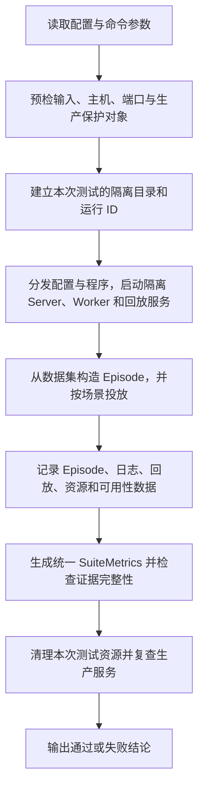

# UEnv 大规模测试设计说明

> 代码校对基准：`audreyyan1015/uenv` 主分支提交 `be0fd95`（2026-07-28），以
> `uenv-server/stress_test_refactored/uenv_stress/config/` 下的当前配置和对应执行代码为准。

## 1. 这套代码解决什么问题

这套代码用于验证 UEnv 在大量并发任务和长时间运行条件下的系统能力，主要回答以下问题：

- Server 能否管理大量真实 Worker，并正确完成任务分配；
- Code、Math 和 SWE/OpenHands 三类执行链路能否在高压力下稳定工作；
- 当前规模配置的 `sync` 模式和稳定性配置的 `fully_async` 模式能否正确提交、执行和返回结果；
- 长时间运行时，吞吐、时延、可用性和资源占用是否稳定；
- Worker 退出、网络中断和节点隔离后，系统能否自动恢复；
- 每个任务是否都有完整、可追踪、可复核的结果记录；
- 测试结束后，测试进程、容器和端口是否清理完成，生产服务是否保持不变。

## 2. 测试对象与覆盖范围

规模测试关注系统在固定任务积压下的横向扩展与调度能力。它一次启动大量真实 Worker，使用真实插件和冻结轨迹，检查任务能否被全部接收、分配、执行并回收，并统计 Worker 覆盖、吞吐、时延、资源和清理证据。当前配置以 `sync` 模式为主，不以持续运行时长作为核心判定。

稳定性测试关注系统在持续目标速率下是否长期保持可用和一致。它将五类任务按比例混合投放，经历基线、72 小时长稳、十倍压力、容量、突发和故障阶段，持续观察失败率、可用率、资源增长、吞吐保持及自动恢复。其判定依赖跨阶段指纹一致和完整账本，而不是单次峰值。

整套测试固定覆盖五个数据集：DSCodeBench、SWE-bench Pro、OlymMATH、SciTab、PubMedQA。

### 2.1 规模测试

当前正式规模配置只执行 `sync`，并按“Math 规则任务 → DSCodeBench → SWE-bench Pro”的顺序运行。三类场景的设置如下：

| 场景 | 真实执行链路 | Worker 与执行并发 | 当前任务量 | 批处理与超时 |
| --- | --- | --- | ---: | --- |
| DSCodeBench | UEnv Worker + Code 插件 | 共 1024 个 Worker，两台 Worker 主机各 512 个；单 Worker 容量 1 | 10240 Episode | 256 Episode/批，共 40 批；批超时 10800 秒 |
| OlymMATH / SciTab / PubMedQA | 共用一组 UEnv Worker + Math 插件，三个数据集分别统计 | 共 1024 个 Worker，两台 Worker 主机各 512 个；单 Worker 容量 1 | 每个数据集 10240 Episode | 每数据集 256 Episode/批，共 40 批；批超时 10800 秒 |
| SWE-bench Pro | UEnv SWE Worker + OpenHands + AgentControlService + Runtime Gateway + 容器 | 共 64 个注册 Worker，两台 Worker 主机各 32 个；每台另启动 8 个 OpenHands Agent，每个 Agent 最多并发 2 个容器任务 | 2560 Episode | 128 Episode/批；批超时 21600 秒；Server 的 Episode 超时 14400 秒 |

每台机器的 Worker 数不是另一组手工配置值，而是运行器根据当前 Worker 主机列表按 Worker 编号轮询分配：编号为 `i` 的 Worker 放到第 `i % 主机数` 台机器。当前清单固定为两台 Worker 主机，且 1024 和 64 都能被 2 整除，因此形成严格均分：

| Worker 主机 | Worker 注册内网地址 | Code 场景 | Math 场景 | SWE 场景 | SWE OpenHands 执行并发 |
| --- | --- | ---: | ---: | ---: | ---: |
| `8.130.65.20` | `192.168.0.139` | 512 Worker | 512 Worker | 32 Worker | 8 Agent × 2 = 16 个容器任务 |
| `8.145.51.129` | `192.168.0.138` | 512 Worker | 512 Worker | 32 Worker | 8 Agent × 2 = 16 个容器任务 |
| **合计** | — | **1024 Worker** | **1024 Worker** | **64 Worker** | **32 个容器任务** |

Code、Math 和 SWE 是依次执行的独立规模场景，不会在同一时刻把三组 Worker 数叠加。三个 Math 数据集也复用同一组 1024 个 Math Worker，按数据集分别提交和统计，并不是每个数据集各启动 1024 个 Worker。SWE 的 64 个注册 Worker 单 Worker 容量均为 1，因此 UEnv 侧最多同时承接 64 个 Episode；OpenHands 的最大容器并发是两台机器合计 32，二者是不同层级的并发指标。

DSCodeBench 和三个 Math 任务的总量都等于 10 个 Worker 容量波次；SWE-bench Pro 的 2560 个 Episode 则高于 64 Worker × 容量 1 × 10 波次的最低要求。代码仍支持 `one_step_off_policy` 和 `fully_async`，但它们不在当前正式规模配置中；可选的 `worker_scale` 梯度场景也处于关闭状态。

### 2.2 稳定性测试

稳定性测试不在配置中固定 Worker 数，而是按“目标到达率 × Episode P95 处理时长”估算同时在途的 Episode 数，再增加 20% 容量余量，并与 fleet manifest 中各 Worker 声明容量的总和进行准入校验。基线和 72 小时长稳阶段当前要求测试集群至少具备同时承接 9317 个 Episode 的能力；容量不足时直接拒绝正式执行。十倍压力阶段允许显式记录“有意过载”，但不能把过载结果冒充容量充足的稳定性结论。

当前配置把五个任务各分配 20% 的混合负载。每个任务的基线/长稳目标速率按以下公式得到：

`目标速率 = 单任务独立基准速率 × 20%`

其中，单任务独立基准速率是配置中预先写入的“100×A100 吞吐估算值”，不是运行时根据回放时延重新计算的值。当前仓库没有保留原始测量脚本；本报告依据已有实测记录恢复了可审计的换算过程，详见“附录 A：稳定性提交频率推导”。代码负责校验最终写入配置的独占速率、任务占比和目标速率是否一致。

| 数据集 | 单任务独立基准速率（Episode/s） | 基线/长稳目标速率（Episode/s） | 每 64 条的计划间隔（秒） | P95 时长（秒） | 估算所需并发 Episode 数 |
| --- | ---: | ---: | ---: | ---: | ---: |
| DSCodeBench | 31.6725 | 6.3345 | 10.1034 | 68.58 | 522 |
| SWE-bench Pro | 10.3595 | 2.0719 | 30.8895 | 52.01 | 130 |
| OlymMATH | 300.9 | 60.18 | 1.0635 | 83.79 | 6051 |
| SciTab | 740 | 148 | 0.4324 | 8.56 | 1521 |
| PubMedQA | 740 | 148 | 0.4324 | 6.15 | 1093 |
| **合计** | **1822.932** | **364.5864** | — | — | **9317** |

运行模式为 `fully_async`，到达方式为每批 64 个 Episode。对于目标速率为 `r` 的任务，第 `k` 个 Episode 的计划时间为 `floor(k / 64) × 64 / r`，因此同一批 64 个 Episode 同时进入提交队列，相邻两批的计划间隔为 `64 / r`。参考和长稳阶段使用上表目标速率；自检使用单任务独立基准速率；压力、容量和突发阶段分别使用目标速率的 10 倍、1.2 倍和 4 倍。

P95 时长不参与提交频率计算，只用于估算测试集群需要同时承接的 Episode 数：`ceil(1.2 × 目标速率 × P95 时长)`。该结果是带 20% 余量的并发容量估算，不等同于物理 Worker 进程数；实际可用容量按 fleet manifest 中所有 Worker 的 `capacity` 求和。

正式稳定性验收按以下阶段执行。每次入口运行一个阶段，最后由 `stability/report.py` 合并参考、长稳、压力、容量、突发和故障阶段的结果：

| 阶段 | 默认时长或次数 | 目的 |
| --- | ---: | --- |
| selfcheck | 10 分钟 | 逐任务检查基本链路 |
| reference | 4 小时 | 建立吞吐和资源基线 |
| stability | 72 小时 | 验证连续运行能力 |
| pressure | 30 分钟，基准速率 10 倍 | 验证高提交速率下的行为 |
| capacity | 30 分钟，基准速率 1.2 倍 | 验证容量余量 |
| burst | 60 秒，基准速率 4 倍 | 验证短时突发 |
| fault | 3 类故障各 5 次 | 验证自动恢复和结果一致性 |

## 3. 冻结轨迹回放

规模压测和稳定性验收不会在每次运行时重新调用外部大模型，而是使用提前采集并冻结的真实轨迹。

这样做有三个直接作用：

- 保证不同测试阶段使用相同的模型输出和等待时间；
- 避免外部模型的限流、价格、网络波动和版本变化影响系统指标；
- 让失败更容易复现和定位。

四个数据集（DSCodeBench、OlymMATH、SciTab、PubMedQA）各使用 100 组同一问题的豆包和 Qwen 轨迹，并按“豆包、Qwen”顺序交替选择；SWE-bench Pro 使用 50 条豆包/OpenHands 轨迹。每个 Episode 会绑定一条轨迹，多轮任务在该轨迹内部按顺序读取。

| 数据集 | 豆包条数 | Qwen 备份条数 | 同 `dataset_id` 可配对数 | 正式混合方式 |
| --- | ---: | ---: | ---: | --- |
| DSCodeBench | 100 | 1000 | 100 | 100 个题目，每题豆包/Qwen 各一条 |
| SWE-bench Pro | 50 | 0 | 不适用 | 50 条豆包单模型循环 |
| OlymMATH | 100 | 400 | 100 | 100 个题目，每题豆包/Qwen 各一条 |
| SciTab | 100 | 1224 | 100 | 100 个题目，每题豆包/Qwen 各一条 |
| PubMedQA | 100 | 1000 | 100 | 100 个题目，每题豆包/Qwen 各一条 |

- 豆包：`doubao-seed-2-1-pro-260628`
- Qwen：`qwen3-6.35b-a3b`（沿用语料中的原始审计值，不在代码中擅自改名）

回放等待时间由轨迹中的 `replay_wait_ms` 固定记录。正式运行要求轨迹、数据项、等待时间和校验和均有效；输入不完整时直接拒绝执行。

因此，这套测试能够证明 UEnv 的协议、调度、Worker、插件、OpenHands 和容器链路在大规模负载下的表现，但不能把回放结果解释为新的模型能力评测结果。

## 4. 代码结构

| 目录 | 主要职责 |
| --- | --- |
| `uenv_stress/cli/` | 对外命令入口，负责参数解析、预检、场景编排和最终状态判定 |
| `uenv_stress/config/` | Worker 主机、规模压测、稳定性验收和轨迹采集配置 |
| `uenv_stress/core/` | 公共运行时、Episode 记录、结果格式、资源统计、Worker 管理和生产保护 |
| `uenv_stress/workloads/` | 把五个数据集的原始记录转换为统一的 Episode 输入 |
| `uenv_stress/scale/` | DSCodeBench、SWE-bench Pro 和三个规则任务的规模压测实现 |
| `uenv_stress/stability/` | 轨迹回放服务、故障注入和稳定性报告 |
| `uenv_stress/tools/` | 数据准备、轨迹整理、格式转换和清单生成 |
| `uenv_stress/providers/ark/` | 真实模型代理与调用前检查 |
| `tests/` | 配置约束、目录隔离、观测结构、规模套件和稳定性逻辑测试 |

三个主要入口如下：

| 入口 | 作用 |
| --- | --- |
| `run_scale_suite.py` | 运行五数据集规模压测，或单独运行某个规模场景 |
| `run_formal_stability_suite.py` | 按指定阶段运行正式稳定性验收 |
| `run_trace_collection.py` | 采集 SWE-bench Pro 真实模型轨迹 |

其中，规模压测按任务类型拆成三个执行器：

- `dscodebench_pressure.py`：Code Worker 和 Code 插件链路；
- `swebench_pro_pressure.py`：SWE Worker、OpenHands 和容器链路；
- `rule_task_pressure.py`：OlymMATH、SciTab、PubMedQA 的 Math 插件链路。

这种拆分保留了不同任务的真实执行差异，同时复用统一的配置、Episode 格式、结果统计和安全保护逻辑。

## 5. 总体实现逻辑

### 5.1 配置和预检

入口首先读取 JSON 配置并执行严格校验，主要包括：

- 五个数据集是否齐全；
- Worker 数、当前启用的并行模式、批大小和容量波次是否达到要求；
- 数据集、轨迹、二进制文件和清单是否存在，哈希是否一致；
- 轨迹与数据项能否正确绑定；
- Worker 主机是否位于允许清单中；
- 端口是否空闲，是否与生产保护端口冲突；
- SWE-bench Pro 所需镜像和 OpenHands 环境是否已经准备完成；
- 稳定性运行所需磁盘空间和 fleet 容量是否足够；基线、长稳和故障阶段不允许绕过容量门限。

默认不带 `--execute` 时只执行预检并生成计划，不会真正启动压测。

### 5.2 隔离启动

每次运行生成唯一 `run_id`，所有临时配置、日志、PID、结果和容器都归属于该 `run_id`。

规模压测通过 SSH 连接一台隔离 Server 主机和两台 Worker 主机，将 Worker 按编号分配到不同主机。正式套件按 Math 规则任务、DSCodeBench、SWE-bench Pro 的顺序执行。随后按场景启动：

- 隔离 UEnv Server；
- 真实 UEnv Worker 进程；
- 对应的 Code、Math 或 SWE/OpenHands 执行链路；
- 本地轨迹回放服务；
- Worker fleet 监督器和资源采样程序。

fleet 监督器统一启动和监控大量 Worker，记录进程数、内存、文件描述符、线程数和 Worker 异常退出。

### 5.3 负载生成

`workloads/` 将不同数据集转换为统一的 Episode 输入，入口不直接处理各数据集的字段差异。

规模压测采用固定总量的 backlog：

- 按批次提交指定数量的 Episode；
- 当前三个场景均执行 `sync`；DSCodeBench 和每个 Math 数据集各提交 10240 个 Episode，SWE-bench Pro 提交 2560 个；
- 检查当前模式的总提交量、容量波次、Worker 覆盖和回放命中；
- SWE 的 64 个注册 Worker 与 OpenHands 容器并发分开计数：两台节点合计 16 个 Agent，每个 Agent 并发 2 个，最大容器并发为 32。

正式稳定性验收采用目标速率：

- 五个数据集混合提交，每个数据集分配 20% 的基准容量；
- 当前使用 `fully_async`，以 64 个 Episode 为一批到达；
- 每任务目标速率等于单任务独立基准速率的 20%，五任务基线/长稳总速率为 364.5864 Episode/s；
- 每批 64 个 Episode 同时到达，相邻批次的计划间隔等于 `64 / 该任务目标速率`；
- 压力、容量和突发阶段分别放大到基准速率的 10 倍、1.2 倍和 4 倍；
- 如果负载生成器落后计划超过 5 秒，运行直接失败，避免在实际压力不足时给出通过结论。

### 5.4 结果记录

每个已提交 Episode 都必须形成一条统一的 `EpisodeObservation`。正常结果、RPC 错误、缺失结果、超时、迟到结果和重复终态都保留在统计分母中。

规模压测将逐 Episode 记录写入 JSONL；稳定性验收将相同字段写入 SQLite，必要时可导出 CSV 和 JSONL。每个字段的具体含义如下：

#### 5.4.1 运行与场景身份

这组字段回答“记录属于哪次运行、哪个任务和哪种执行方式”。

| 字段 | 类型或单位 | 具体含义 |
| --- | --- | --- |
| `schema_version` | 整数 | `EpisodeObservation` 的结构版本。读取程序先检查版本，避免把字段含义不同的记录混在一起；当前值为 1 |
| `observation_type` | 字符串 | 记录类型，当前固定为 `episode`，用于与资源、可用性等其他观测类型区分 |
| `suite` | 枚举字符串 | 记录来自规模套件还是稳定性套件，典型值为 `scale` 或 `stability` |
| `run_id` | 字符串 | 本次运行的唯一标识；同一阶段产生的 Episode、日志、资源和清理记录依靠它关联 |
| `phase` | 字符串 | 稳定性阶段名称，如 `selfcheck`、`reference`、`stability`、`pressure`、`capacity`、`burst` 或 `fault`；规模测试可记录对应场景 |
| `task` | 字符串 | 执行器使用的规范任务名，用于按五类任务分别汇总 |
| `dataset` | 字符串 | Episode 所属数据集；通常与任务一一对应，但单独保留以支持任务和数据集不是同一维度的扩展 |
| `environment` | 字符串 | 使用的 UEnv 环境或插件类型，例如 `code`、`swe`、`math` |
| `parallel_mode` | 枚举字符串 | Episode 的执行模式，如 `sync`、`one_step_off_policy` 或 `fully_async` |
| `arrival_mode` | 枚举字符串 | 负载到达方式，如固定间隔、整批到达或泊松到达；当前正式稳定性使用整批到达 |

#### 5.4.2 Episode 身份与调度时间

这组字段用于唯一定位 Episode，并还原从计划、提交到终态的时间线。

| 字段 | 类型或单位 | 具体含义 |
| --- | --- | --- |
| `episode_id` | 字符串 | Episode 的唯一 ID。当前公共约束要求它与 `request_id` 相同 |
| `request_id` | 字符串 | 提交给 Adapter/Server 的请求 ID，是请求、结果和重复终态对账的主键 |
| `batch_id` | 字符串 | Episode 所属批次 ID，用于把同一次批量 RPC 中的请求和批次时延关联起来 |
| `sample_index` | 整数 | Episode 在当前批次中的样本下标 |
| `sequence` | 整数 | 当前任务内的全局投放顺序；用于生成计划时间、选择数据样本和轮询冻结轨迹 |
| `dataset_item_id` | 字符串 | 原始数据集样本或题目的标识，用于从结果追溯到输入 |
| `instance_id` | 字符串 | 任务实例标识，主要用于 SWE-bench Pro 的仓库/问题实例；不适用的任务可为空 |
| `planned_at` | 秒级时间戳 | Episode 进入本地计划账本的时间；稳定性生成器在该 Episode 到达计划点后写入此值 |
| `dispatch_started` | 布尔值 | 是否真正进入了提交过程。只有计划但未发出的 Episode 为 `false` |
| `dispatched_at` | 秒级时间戳 | Episode 实际开始提交的时间；与 `planned_at` 的差值可反映调度滞后 |
| `deadline` | 秒级时间戳 | Episode 的终态截止时间；提交后按 `dispatched_at + timeout_seconds` 确定 |
| `terminal_at` | 秒级时间戳 | 收到结果或完成缺失结果/RPC 错误对账的时间，不等同于一定成功 |
| `timeout_seconds` | 秒 | 该 Episode 允许等待终态的超时上限 |
| `end_to_end_ms` | 毫秒 | 从实际提交时间到终态时间的耗时；尚未实际提交时以计划时间为起点 |
| `batch_rpc_latency_ms` | 毫秒 | Episode 所在批量 RPC 的整体调用耗时，因此同一批 Episode 可以具有相同值 |

#### 5.4.3 终态、奖励与错误

这组字段说明 Episode 最终发生了什么，以及失败应归入哪一类。

| 字段 | 类型或单位 | 具体含义 |
| --- | --- | --- |
| `status` | 字符串 | Adapter 返回的原始状态；没有结果时由记录器写为 `rpc_error` 或 `missing_result` |
| `done` | 布尔值 | 环境是否声明 Episode 已完成；它是原始执行结果，不单独作为成功判定 |
| `reward` | 浮点数 | 任务或环境返回的奖励值；用于统计平均奖励，但不能替代系统成功/失败分类 |
| `termination_reason` | 字符串 | 环境给出的停止原因，例如正常完成、达到步数限制或环境错误 |
| `error_code` | 字符串 | 原始机器可读错误码；缺失终态时写入 `NO_TERMINAL_RESULT` |
| `error_message` | 字符串 | 原始可读错误信息，用于诊断具体失败原因 |
| `failure_class` | 枚举字符串 | 跨任务统一的失败分类。成功为 `none`；常见失败包括 `uenv_error`、`rpc_error`、`late_result`、`no_terminal_result`、`duplicate_terminal_result` 和 `test_config_error` |
| `terminal_count` | 整数 | 同一 `request_id` 收到的终态结果数量；正常为 1，0 表示没有终态，大于 1 表示重复终态 |

#### 5.4.4 Worker 归属

这组字段说明 Episode 由哪个 Worker、主机、租约和执行尝试处理，以及归属信息是否可信。

| 字段 | 类型或单位 | 具体含义 |
| --- | --- | --- |
| `worker_id` | 字符串 | 执行 Episode 的 Worker ID。当前 Adapter 结果没有返回该值，因此逐 Worker 统计改从隔离 Server 日志取得 |
| `worker_host` | 字符串 | 执行 Worker 所在主机；只有存在可信 Worker 归属时才能填写 |
| `dispatch_lease_id` | 字符串 | Server 为本次调度分配的租约 ID，用于追踪任务被哪个租约领取；当前 Adapter 结果未提供时为空 |
| `attempt_id` | 字符串 | 本次执行尝试的 ID，用于区分重试；当前链路未提供时为空 |
| `worker_attribution` | 字符串 | Worker 归属信息的来源或可信状态；当前默认值 `unavailable_in_adapter_result` 明确表示不能从 Adapter 结果归属 Worker |

#### 5.4.5 轨迹回放、执行证据与结果完整性

这组字段把 Episode 与冻结轨迹、实际执行量、rollout 版本和结果摘要关联起来。

| 字段 | 类型或单位 | 具体含义 |
| --- | --- | --- |
| `replay_strategy` | 字符串 | 冻结轨迹的选择策略，例如按 Episode 顺序轮询 |
| `trace_id` | 字符串 | 实际绑定的冻结轨迹 ID，用于确认请求使用了哪条真实轨迹 |
| `trace_slot` | 整数 | 轨迹在冻结语料中的槽位/下标；可用于验证轮询顺序 |
| `trace_corpus_size` | 整数 | 选择轨迹时可用的冻结轨迹总数，用于确认运行时语料规模与清单一致 |
| `actual_steps` | 整数 | Episode 实际执行的交互步数，不是配置中的最大步数 |
| `response_tokens` | Token 数 | 由 `SampleResult.response_ids` 长度得到的响应 Token 数，用于描述本次结果规模 |
| `training_trace_valid` | 布尔值 | 返回的训练轨迹是否满足运行器的有效性检查 |
| `training_trace_errors_json` | JSON 数组 | 训练轨迹无效时的具体错误列表；完全缺失 `SampleResult` 时记录 `no SampleResult` |
| `rollout_param_version` | 字符串 | 生成本次 rollout 时使用的参数版本，用于检查跨阶段参数是否漂移 |
| `rollout_policy_version` | 字符串 | 生成本次 rollout 时使用的策略版本，用于检查跨阶段策略是否一致 |
| `result_checksum` | SHA-256 字符串 | 对结果中的 `status`、`error_code` 和 `trajectory` 规范化后计算的摘要，用于识别结果内容变化 |
| `result_checksum_valid` | 布尔值 | 当前实现中表示结果包含非空 `trajectory` 且成功生成 64 位 SHA-256 摘要；正式有效吞吐只计入该值为真的成功结果 |
| `extensions_json` | JSON 对象 | 保存公共 Schema 未覆盖的场景特有上下文；扩展字段进入这里，而不是为每种任务修改表结构 |

正常结果、RPC 错误、缺失结果、超时、迟到结果和重复终态使用同一套字段，不能从记录中删除。当前 Adapter 返回结果中没有 Worker ID，因此 Episode 行中的 Worker 归属会明确标为不可用；逐 Worker 完成量从隔离 Server 日志中统计，不会根据全局结果推测 Worker 归属。

### 5.5 汇总与判定

`suite_metrics.py` 将 Episode、Server 日志、回放记录、资源采样和清理结果汇总为统一的 `suite-metrics.json`；正式稳定性验收再由 `stability/report.py` 比较 4 小时参考阶段、72 小时稳定性阶段和故障阶段。

#### 5.5.1 Episode 数量与结果完整性

这组指标完成计划、提交、终态、成功和失败的数量对账。

| 汇总指标 | 定义或公式 | 具体用途 |
| --- | --- | --- |
| `planned_episodes` | 当前统计范围内 `EpisodeObservation` 的总行数 | 表示计划进入本次统计的 Episode 数，是计划、提交和终态对账的起点 |
| `dispatched_episodes` | `dispatch_started = true` 的 Episode 数 | 表示真正进入提交过程的数量；成功率和失败率以它为分母 |
| `terminal_episodes` | 已记录 `terminal_at`，或状态已不再是 `planned/dispatched` 的 Episode 数 | 表示已经得到正常终态或完成异常对账的数量 |
| `successful_episodes` | `failure_class = none` 的终态 Episode 数 | 表示从系统执行角度成功的数量 |
| `failed_episodes` | `failure_class` 不是空值、`none` 或 `pending` 的终态 Episode 数 | 表示系统错误、配置错误、迟到、缺失或重复终态等失败数量 |
| `success_rate` | `successful_episodes / dispatched_episodes` | 衡量已提交 Episode 中系统成功的比例 |
| `failure_rate` | `failed_episodes / dispatched_episodes` | 衡量已提交 Episode 中进入统一失败分类的比例 |
| `failure_classes` | 按 `failure_class` 分组计数 | 展示失败由系统错误、RPC 错误、无终态、迟到、重复终态或配置错误中的哪一类造成 |
| `dispatch_started_unique` | 按 `request_id` 去重后的已提交 Episode 数 | 正式稳定性报告的权威分母，避免重复记录放大或缩小失败率 |
| `valid_unique` | `failure_class = none` 且 `result_checksum_valid = true` 的唯一请求数 | 表示同时满足执行成功和结果完整性要求的有效 Episode 数 |
| `system_failure_unique` | 唯一请求中属于 `uenv_error`、`late_result`、`no_terminal_result` 或 `duplicate_terminal_result` 的数量 | 只统计由 UEnv 链路造成的系统失败，不把模型质量或业务奖励混入系统稳定性 |
| `system_failure_rate` | `system_failure_unique / dispatch_started_unique` | 正式长稳门限为不超过 0.1% |
| `allowed_system_failures` | `floor(0.001 × dispatch_started_unique)` | 把 0.1% 门限转换为当前样本量下允许的最大整数失败数 |
| `test_config_error_unique` | `failure_class = test_config_error` 的唯一请求数 | 测试配置错误必须为 0；出现该错误说明测试本身无资格出具正式结论 |
| `duplicate_terminal_results` | 同一请求出现多行或 `terminal_count > 1` 的请求数 | 检查 Server/Adapter 是否为同一 Episode 产生重复终态 |

#### 5.5.2 提交速率、处理吞吐与时延

这组指标说明负载是否按计划发出、系统每秒处理多少 Episode，以及响应时间是否稳定。

| 汇总指标 | 定义或公式 | 具体用途 |
| --- | --- | --- |
| `planned_rate_eps` | 配置中该阶段的目标提交频率 | 作为稳定性计划值；规模 backlog 场景没有预设 EPS 时为不可用 |
| `actual_rate_eps` | `dispatched_episodes / measurement_seconds` | 表示实际平均提交频率，用于检查负载生成器是否达到计划 |
| `absolute_deviation_eps` | `actual_rate_eps - planned_rate_eps` | 表示实际速率比计划值每秒多或少多少 Episode |
| `relative_deviation` | `(actual_rate_eps - planned_rate_eps) / planned_rate_eps` | 用比例表示提交速率偏差，便于不同任务间比较 |
| `submission_eps` | `dispatched_episodes / measurement_seconds` | 已提交吞吐，回答“每秒实际发出多少 Episode” |
| `completion_eps` | `terminal_episodes / measurement_seconds` | 终态吞吐，回答“每秒完成正常或异常对账多少 Episode” |
| `successful_eps` | `successful_episodes / measurement_seconds` | 系统成功吞吐，回答“每秒有多少 Episode 以成功终态结束” |
| `throughput_eps` | 普通套件为 `successful_episodes / duration`；正式报告为 `valid_unique / duration` | 前者描述系统成功处理速率，后者进一步要求结果校验有效，作为正式有效吞吐 |

#### 5.5.3 奖励、执行步数与时延

这组指标描述 Episode 的执行复杂度、结果特征和响应时间分布。

| 汇总指标 | 定义或公式 | 具体用途 |
| --- | --- | --- |
| `average_reward` | 所有终态 Episode 的 `reward` 算术平均值 | 描述任务返回的平均奖励，只作结果特征，不作为系统稳定性成功条件 |
| `actual_steps.total` | 终态 Episode 的 `actual_steps` 之和 | 表示统计范围内累计执行步数 |
| `actual_steps.mean` | `actual_steps.total / terminal_episodes` | 表示一个终态 Episode 平均执行多少步 |
| `actual_steps.maximum` | 终态 Episode 中最大的 `actual_steps` | 用于发现异常长轨迹或达到步数上限的任务 |
| `end_to_end_latency_ms.count` | 有正值端到端时延的终态 Episode 数 | 明确时延统计实际覆盖多少 Episode |
| `end_to_end_latency_ms.minimum` | 端到端时延最小值 | 展示最快完成样本 |
| `end_to_end_latency_ms.mean` | 端到端时延算术平均值 | 展示整体平均响应时间 |
| `end_to_end_latency_ms.p95` | 95% Episode 不超过的端到端时延 | 展示尾部时延；72 小时 SQLite 快速汇总不排序计算该值，原始 Episode 行仍保留单条时延 |
| `end_to_end_latency_ms.maximum` | 端到端时延最大值 | 展示最慢完成或异常拖尾样本 |
| `end_to_end_latency_ms.standard_deviation` | 端到端时延的总体标准差 | 衡量时延绝对波动幅度 |
| `end_to_end_latency_ms.coefficient_of_variation` | `标准差 / 平均值` | 衡量相对波动程度，便于不同量级任务比较 |

#### 5.5.4 维度拆分与 Worker 覆盖

这组指标从数据集、执行模式和 Worker 三个维度检查覆盖范围与负载均衡。

| 汇总指标 | 定义或公式 | 具体用途或门限 |
| --- | --- | --- |
| `overall` | 对当前套件或阶段的全部 Episode 计算上述数量、成功率、吞吐和时延指标 | 给出整套测试的总体视图 |
| `by_dataset` | 按数据集分别计算相同指标 | 防止总体结果掩盖某个数据集的失败或吞吐退化 |
| `by_parallel_mode` | 按并行模式分别计算相同指标 | 比较不同执行模式；当前正式规模配置只有 `sync` |
| `by_dataset_parallel_mode` | 按“数据集 × 并行模式”组合计算相同指标 | 定位特定数据集在特定执行模式下的问题 |
| `by_worker` | 从隔离 Server 日志统计每个 Worker 启动和完成的 Episode 数、覆盖数据集和观测时段 | Adapter 不返回 Worker ID 时，仍能确认每个配置 Worker 是否真正承担任务 |
| `by_worker_dataset` | 按“Worker × 数据集”统计完成量 | 检查 Worker 是否只覆盖少数数据集或出现局部调度空洞 |
| `configured_workers` | 当前场景配置要求启动的 Worker 总数 | Worker 覆盖率的期望分母 |
| `observed_workers` | Server 日志中实际完成过 Episode 的 Worker 数 | 规模测试要求它与 `configured_workers` 相等 |
| Worker 完成量 `minimum/mean/p95/maximum` | 对所有配置 Worker 的完成 Episode 数计算最小值、均值、P95 和最大值；未完成任务的 Worker 按 0 计 | 展示调度覆盖和负载分布，最小值为 0 表示至少一个 Worker 未完成任务 |
| Worker 完成量 `standard_deviation` | 各 Worker 完成量的总体标准差 | 衡量 Worker 之间完成量的绝对离散程度 |
| Worker 完成量 `coefficient_of_variation` | `Worker 完成量标准差 / Worker 完成量均值` | 衡量相对负载倾斜，数值越大表示分配越不均 |

#### 5.5.5 轨迹回放

这组指标验证每个 Episode 是否按冻结策略命中正确轨迹、模型来源和等待时间。

| 汇总指标 | 定义或公式 | 具体用途或门限 |
| --- | --- | --- |
| 回放 `calls` | 回放服务收到的模型调用次数 | 确认冻结轨迹服务实际参与执行 |
| 回放 `hits` | 成功匹配到冻结轨迹和轮次的调用次数 | 与调用数一起判断回放是否完整 |
| 回放 `misses` | 没有匹配到冻结轨迹或轮次的调用次数 | 正式运行中出现未命中需要定位语料、绑定或轮次问题 |
| 回放 `hit_rate` | `hits / (hits + misses)` | 衡量回放调用命中比例 |
| 回放 `assigned_episodes` | 已绑定冻结轨迹的 Episode 数 | 与已提交 Episode 数对照，检查轨迹分配是否缺失 |
| 回放来源分布 | 按来源模型、模型族、延迟来源统计调用或轨迹数 | 验证豆包/Qwen 配对、SWE 仅豆包以及时延代理来源是否符合冻结策略 |
| 回放 Token/等待分布 | 完成 Token 和 `replay_wait_ms` 的 P50/P95 等统计 | 检查实际回放语料特征是否与冻结清单一致 |

#### 5.5.6 资源采样

这组指标检查资源证据是否覆盖完整，以及测试期间是否发生资源耗尽或进程异常。

| 汇总指标 | 定义或公式 | 具体用途或门限 |
| --- | --- | --- |
| 资源 `sample_count` | 实际写入资源文件的采样行数 | 资源证据覆盖率的实际分子 |
| 资源 `expected_samples` | `floor(duration_seconds / resource_sample_seconds)`，至少为 1 | 按阶段时长和采样周期计算应有采样数 |
| 资源 `coverage` | `min(1, sample_count / expected_samples)` | 正式验收要求覆盖完整测试时段 |
| 资源 P95 | RSS、打开文件描述符、线程数和运行容器数在采样期内的 P95 | 描述长期资源水位，降低单次尖峰对基线比较的干扰 |
| 资源异常事件 | Worker 退出、OOM、FD 耗尽、线程耗尽、UEnv 崩溃和人工重启的累计/最大计数 | OOM、FD/线程耗尽、UEnv 崩溃及非计划人工重启会破坏稳定性结论 |

#### 5.5.7 可用性、资源增长与清理

这组指标检查 72 小时连续可用性、长期资源增长和测试结束后的残留。

| 汇总指标 | 定义或公式 | 具体用途或门限 |
| --- | --- | --- |
| `observed_seconds` | 72 小时阶段实际被报告覆盖的秒数，上限取计划时长 | 必须达到 259200 秒才具备 72 小时验收资格 |
| `observation_coverage` | 有可用性采样的唯一秒数除以应观测秒数 | 必须达到 100%，避免因缺采样低估不可用时间 |
| `downtime_seconds` | 所有不可用区间持续时间之和 | 72 小时内不得超过 259 秒 |
| `availability` | `1 - downtime_seconds / observed_seconds` | 72 小时连续可用率不得低于 99.9% |
| `outage_count` | 连续不可用区间的数量 | 描述发生过多少次服务中断 |
| `longest_outage_seconds` | 最长单个不可用区间的持续时间 | 单次不可用不得超过 120 秒 |
| `reference_p95` | 4 小时参考阶段 RSS、FD 和线程数的 P95 | 作为资源增长比较的基线 |
| `last_4h_p95` | 72 小时阶段最后 4 小时 RSS、FD 和线程数的 P95 | 观察长时间运行后的资源水位 |
| 资源 `growth` | `last_4h_p95 / reference_p95 - 1` | 各主要资源增长率均不得超过 10% |
| `remaining_workers` | 清理后仍存活的本次测试 Worker 数 | 必须为 0 |
| `remaining_containers` | 清理后仍存活的本次测试容器数 | 必须为 0 |
| `remaining_processes` | 清理后仍存活的其他本次测试进程数 | 必须为 0 |

#### 5.5.8 跨阶段吞吐、故障恢复与最终结论

这组指标比较参考阶段与长稳阶段，并形成正式验收结论。

| 汇总指标 | 定义或公式 | 具体用途或门限 |
| --- | --- | --- |
| `throughput_retention` | 每任务“72 小时最后 4 小时有效吞吐 ÷ 4 小时参考阶段有效吞吐” | 五个任务分别计算，均不得低于 90% |
| 故障 `attempts` | `fault.csv` 中故障注入记录数 | Worker 退出、网络故障和节点隔离各 5 次，合计必须为 15 次 |
| `automatic_recoveries` | 标记为自动恢复的故障次数 | 15 次故障均必须自动恢复 |
| `recovery_seconds` | 从故障注入到满足恢复条件的耗时 | Worker 退出和网络故障不超过 120 秒，节点隔离不超过 300 秒 |
| 故障恢复里程碑 | `first_healthy_at`、`registered_at`、`three_episode_successes_at` | 分别证明服务恢复健康、Worker 重新注册及恢复后连续完成 3 个 Episode |
| 故障一致性计数 | `lost_results`、`duplicate_results`、`checksum_mismatches`、`state_regressions` | 四项均必须为 0，证明故障恢复没有丢失、重复、内容损坏或状态回退 |
| `acceptance_fingerprint_match` | 参考阶段和稳定性阶段的验收指纹 SHA-256 相同 | 证明代码、二进制、配置、协议、数据、轨迹、到达方式和容量条件一致 |
| `complete` | Episode、Worker、回放、资源和清理证据均可用且通过完整性检查 | 任一权威证据缺失时为 `false` |
| `formal_acceptance_eligible` | 非开发模式且验收指纹、配置、资源基线和统一指标证据完整 | 表示本次运行是否有资格参与正式验收 |
| `overall_pass` | `formal_acceptance_eligible = true` 且可用性、资源、系统失败率、吞吐保持和故障恢复五类门限全部通过 | 最终正式通过标志；任何一类失败都不能报告为通过 |

完整套件采用严格判定：Episode 记录、Worker 日志、回放统计、资源采样或清理证据任意一项缺失，`complete` 就为 `false`，整套测试不能报告为正式通过。

## 6. 主要输出文件

下表列出每次测试需要归档的主要输出文件，覆盖运行配置、逐 Episode 记录、资源与可用性采样、回放信息以及最终验收结论。`report.md` / `report.json` 用于查看总体结果，其他明细文件用于定位异常、复核指标计算过程，并支持按时间分析吞吐、时延、资源占用和服务可用性的变化趋势。

| 文件 | 内容 |
| --- | --- |
| `summary.json` / `manifest.json` | 本次运行配置、输入哈希、执行状态和产物索引 |
| `episode-observations*.jsonl` | 规模压测的逐 Episode 记录 |
| `episode.sqlite` | 稳定性验收的权威 Episode 账本 |
| `suite-metrics.json` | 面向验收的统一汇总指标 |
| `resource.csv` / `fleet-resources.csv` | 按固定周期记录稳定性阶段测试进程或规模测试各 Worker 节点的进程数、RSS、打开文件描述符数、线程数及异常计数。用于绘制资源随时间变化的趋势，计算资源 P95 和长期增长率，并定位 Worker 退出、OOM 等异常事件。 |
| `fleet-metrics.json` | 大规模 Worker 进程、异常退出和资源汇总 |
| `availability.csv` | 按秒记录服务可用性探测结果，包括探测时间、探测方式、是否可达、RPC 状态和错误类型。用于还原服务不可用区间，并计算观测覆盖率、总停机时间、最长单次中断时间和整体可用率。 |
| `replay-health.json` | 回放调用、命中和时延统计 |
| `fault.csv` | 故障注入、恢复时间和一致性检查 |
| `report.json` / `report.md` | 最终稳定性验收报告 |

# 附录 A：稳定性提交频率推导

本附录说明 `stability_suite.json` 中五个任务的独占百卡频率、稳定性频率和压力频率如何从已有实测记录换算得到。完整链路为：

`8 卡实测吞吐 → 乘中心扩展系数得到百卡 Token 吞吐 → 除以任务计费 Token 长度得到独占百卡频率 → 乘任务占比得到稳定性频率 → 乘阶段倍率得到其他阶段频率`

这些数值是测试负载的估算输入，而不是运行时根据冻结轨迹时延动态拟合的结果。原始测量脚本当前不在仓库内，后续如重新测量吞吐或调整 Token 口径，应重新计算并冻结本附录中的全部输入。

## A.1 百卡 Token 吞吐

8 卡到 100 卡不按理论卡数比例 `100 / 8 = 12.5` 线性放大，而使用已有报告给出的中心扩展系数 `S = 9.5`。

代码类任务采用内部 SWE 8B 代码任务实测：同批 16 条轨迹的平均总生成长度为 10406 Token，generation 实际耗时为 129.9 秒。8 卡聚合生成吞吐为：

`16 × 10406 / 129.9 = 1281.72 Token/s`

折算为百卡代码类 Token 吞吐：

`B_code = 16 × 10406 / 129.9 × 9.5 = 12176.38 Token/s`

数学及问答类任务采用 GSM8K 生成阶段实测：23.3 秒完成 1024 个 Episode，每个 Episode 的平均生成长度为 884 Token。折算为百卡 Token 吞吐：

`B_math = 1024 × 884 / 23.3 × 9.5 = 369079.48 Token/s`

这里的 `B_code` 和 `B_math` 分别表示对应任务族独占 100 张 A100 时的估算生成能力。

## A.2 单任务独占百卡频率

任务 `i` 的独占百卡频率按以下公式计算：

`lambda_full_i = B_family / L_i`

其中，`B_family` 是任务所属类别的百卡 Token 吞吐，`L_i` 是一个 Episode 使用的计费 Token 长度。

| 数据集 | 吞吐基准 | 计费 Token 长度 `L_i` | 计算结果（Episode/s） | 配置值（Episode/s） |
| --- | ---: | ---: | ---: | ---: |
| DSCodeBench | `B_code` | 384.45 | `12176.38 / 384.45 = 31.6722` | 31.6725 |
| SWE-bench Pro | `B_code` | 1175.38 | `12176.38 / 1175.38 = 10.3595` | 10.3595 |
| OlymMATH | `B_math` | 1226.59 | `369079.48 / 1226.59 = 300.8988` | 300.9 |
| SciTab | `B_math` | 500 | `369079.48 / 500 = 738.1590` | 740 |
| PubMedQA | `B_math` | 500 | `369079.48 / 500 = 738.1590` | 740 |

DSCodeBench、SWE-bench Pro 和 OlymMATH 使用已有 Episode Token 统计中的均值。SciTab 和 PubMedQA 沿用旧估算中的 0.5k Token 保守计费长度，并把约 738 Episode/s 归整为 740 Episode/s；不直接使用结果表中的 2.46 和 1.50 Token 均值。后两个均值主要反映极短最终答案，如果直接代入会得到十几万 Episode/s，不能代表完整模型调用和系统处理成本。

旧报告中 DSCodeBench 的 12 Episode/s 和 SWE-bench Pro 的 1.2 Episode/s，分别使用 1000 Token 和 10406 Token 的早期粗略长度假设。当前配置改用 384.45 和 1175.38，因此正式测试应采用上表配置值，不再混用旧值。

SWE-bench Pro 的 1175.38 Token 必须表示完整 Episode 内所有轮次的生成 Token 总和。若该数字实际是单轮均值，则应先汇总完整轨迹 Token，再重新计算 `lambda_full`。冻结轨迹可能包含多轮交互，但当前稳定性配置只设置最大步数 250，并没有把每个 SWE-bench Pro Episode 固定为 10 轮；历史样本中的“10 轮”只能作为该批样本的统计特征，不能写成协议约束。

## A.3 混合稳定性频率与阶段倍率

当前缺少真实生产任务占比，因此五个任务暂时等比例分配百卡算力：

`w_i = 0.2，且 sum(w_i) = 1`

稳定性目标频率为：

`lambda_stable_i = w_i × lambda_full_i`

压力阶段为稳定性目标频率的 10 倍：

`lambda_pressure_i = 10 × lambda_stable_i`

| 数据集 | 独占百卡频率（Episode/s） | 分配占比 | 稳定性频率（Episode/s） | 压力频率（Episode/s） |
| --- | ---: | ---: | ---: | ---: |
| DSCodeBench | 31.6725 | 20% | 6.3345 | 63.345 |
| SWE-bench Pro | 10.3595 | 20% | 2.0719 | 20.719 |
| OlymMATH | 300.9 | 20% | 60.18 | 601.8 |
| SciTab | 740 | 20% | 148 | 1480 |
| PubMedQA | 740 | 20% | 148 | 1480 |
| **合计** | **1822.932** | **100%** | **364.5864** | **3645.864** |

参考阶段和 72 小时稳定性阶段使用同一组稳定性频率；自检阶段使用独占百卡频率；容量和突发阶段分别使用稳定性频率的 1.2 倍和 4 倍。后续如获得生产任务占比，可替换 `w_i`，但所有占比之和必须为 100%，且 4 小时参考阶段与 72 小时稳定性阶段必须冻结为同一组占比。

## A.4 每批 64 个 Episode 的提交计划

配置中的 Episode/s 表示长期平均目标频率。当前到达模式为 `batch`，每批包含 64 个 Episode。对于目标频率为 `r` 的任务，第 `k` 个 Episode 的计划提交时间为：

`t_k = floor(k / 64) × 64 / r`

因此同一批的 64 个 Episode 同时进入提交队列，相邻两批的计划间隔为：

`delta_t = 64 / r`

| 数据集 | 稳定性频率（Episode/s） | 相邻批次间隔（秒） |
| --- | ---: | ---: |
| DSCodeBench | 6.3345 | 10.1034 |
| SWE-bench Pro | 2.0719 | 30.8895 |
| OlymMATH | 60.18 | 1.0635 |
| SciTab | 148 | 0.4324 |
| PubMedQA | 148 | 0.4324 |

## A.5 72 小时计划 Episode 数

72 小时等于 259200 秒。若把到达过程视为连续流，理论 Episode 数为：

`N_continuous_i = lambda_stable_i × 259200`

当前代码按 64 条整批提交，在 `t = 0` 提交第一批，并只生成计划时间严格小于阶段结束时间的批次。因此代码实际计划量为：

`N_actual_i = 64 × ceil(lambda_stable_i × 259200 / 64)`

| 数据集 | 连续理论量 | 当前代码整批计划量 |
| --- | ---: | ---: |
| DSCodeBench | 1,641,902.40 | 1,641,920 |
| SWE-bench Pro | 537,036.48 | 537,088 |
| OlymMATH | 15,598,656 | 15,598,656 |
| SciTab | 38,361,600 | 38,361,600 |
| PubMedQA | 38,361,600 | 38,361,600 |
| **合计** | **94,500,794.88** | **94,500,864** |

此前报告中的 94,500,805 与当前配置值和 64 条整批调度均不完全一致。描述当前代码的“计划 Episode 数”时应使用 94,500,864；如果只描述连续频率的理论乘积，可写约 94,500,795。

## A.6 P95 时长与并发容量估算

Episode 时延的均值、P50 和 P95 不参与提交频率推导。提交频率由百卡 Token 吞吐、计费 Token 长度和任务占比决定；P95 只用于估算在给定到达率下可能同时处于执行中的 Episode 数，并增加 20% 容量余量：

`required_concurrency_i = ceil(1.2 × lambda_stable_i × episode_p95_seconds_i)`

其中 1.2 是容量余量系数。

| 数据集 | 稳定性频率（Episode/s） | Episode P95（秒） | 估算所需并发 Episode 数 |
| --- | ---: | ---: | ---: |
| DSCodeBench | 6.3345 | 68.58 | 522 |
| SWE-bench Pro | 2.0719 | 52.01 | 130 |
| OlymMATH | 60.18 | 83.79 | 6051 |
| SciTab | 148 | 8.56 | 1521 |
| PubMedQA | 148 | 6.15 | 1093 |
| **合计** | **364.5864** | — | **9317** |

正式执行前，fleet manifest 中所有 Worker 的 `capacity` 总和必须不小于该阶段估算所需的并发 Episode 数。提交频率和并发容量估算是两个独立步骤：前者定义向系统施加多快的负载，后者判断现有 Worker fleet 是否具备承接该负载的理论能力。
