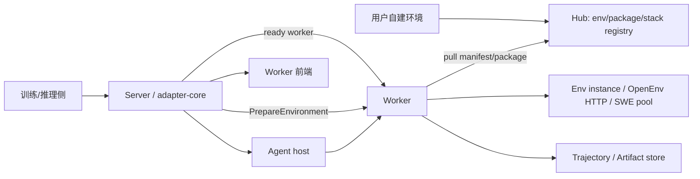
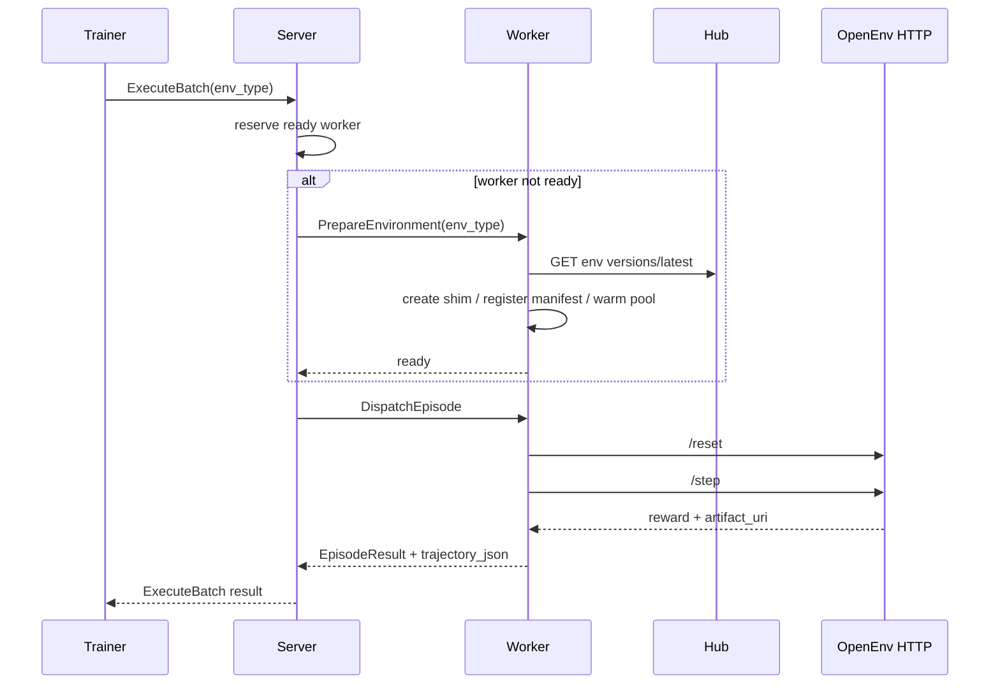

# UEnv 框架整体使用手册

> 日期：2026-08-06  
> 范围：从自建环境、Hub 注册，到 Server 调度、Worker 动态接入、训练/推理执行与前端观测。

---

## 1. 框架分层

UEnv 把“任务环境”和“平台设施”拆开：

- **Hub**：登记环境版本、EnvPackage、Episode Stack、Agent bridge、rubric/scorer、manifest 与制品 digest。
- **Server / adapter-core**：接收训练侧 episode，按 env_type / package / capacity 选择 Worker；必要时命令 Worker prepare。
- **Worker**：运行环境实例池、SWE Runtime Gateway、process plugin、OpenEnv HTTP shim、轨迹/Artifact 上传、reward 适配。
- **Agent host**：如 OpenHands / ToolEnv Agent，向 Server 注册，按 AgentJob 执行需要外部 agent 的 episode。
- **Frontend**：只读 Server/Obs/fleet 状态，展示 Worker 资源、支持环境、已准备 package、实例池。



---

## 2. 从 0 自建环境

首轮推荐把自建环境封装为 **OpenEnv HTTP**，即提供：

- `POST /reset`：创建或重置环境，返回 observation；
- `POST /step`：执行 action，返回 observation、reward、terminated/truncated、info；
- `POST /close`：释放环境；
- 可选 `GET /health`：健康检查。

最小返回示例：

```json
{
  "observation": {"prompt": "task ready"},
  "reward": 1.0,
  "terminated": true,
  "truncated": false,
  "info": {
    "artifact_uri": "file:///workspace/artifacts/trace.zip",
    "reward_adapter": "env_returned"
  }
}
```

浏览器类环境可把 Playwright trace、截图、HAR、DOM dump 作为 artifact 生成在容器/进程内部，然后在 `info.artifact_uri` 或约定 artifact manifest 中交给 Worker 轨迹协议保存。推荐目录：

```text
artifacts/
  trace.zip
  network.har
  screenshots/
  dom/
  manifest.json
```

`manifest.json` 建议声明 artifact 类型、相对路径、MIME、生成 step、sha256。

---

## 3. Hub 注册

创建环境元数据：

```bash
curl -H "Authorization: Bearer $UENV_HUB_TOKEN" \
  -H "Content-Type: application/json" \
  -d '{
    "env_type": "my-browser-env",
    "description": "browser task environment",
    "author": "team",
    "tags": ["browser", "openenv"]
  }' \
  http://8.130.95.176:8088/api/v1/envs
```

发布 OpenEnv HTTP 版本：

```bash
curl -H "Authorization: Bearer $UENV_HUB_TOKEN" \
  -H "Content-Type: application/json" \
  --data-binary @manifest.json \
  http://8.130.95.176:8088/api/v1/envs/my-browser-env/versions
```

`manifest.json` 最小形状：

```json
{
  "version": "0.1.0",
  "entrypoint": "http://127.0.0.1:19181",
  "supported_backends": ["openenv_http"],
  "health_check_path": "/health",
  "resources": {"cpu": 2, "memory_mb": 4096, "gpu": 0},
  "interface": {
    "action": {"type": "object"},
    "observation": {"type": "object"},
    "state": {"type": "object"}
  },
  "config_schema": {"type": "object"},
  "default_config": {}
}
```

如果是 Docker 自建环境，当前推荐方式是：容器内部启动 OpenEnv HTTP 服务，并让 Worker 可访问该 endpoint。纯 `container` manifest 暂不会自动变成通用 Worker backend；SWE 这类已有专用路径仍走 EnvPackage + `swe_instance_pool`。

---

## 4. Worker 动态接入

Worker 启动时需要：

- `hub.enabled: true`；
- `hub.endpoint: "http://8.130.95.176:8088"`；
- `UENV_HUB_TOKEN`；
- `UENV_OPENENV_PLUGIN_BIN=/root/UEnv/target/release/uenv-openenv-plugin`；
- 本地支持的固定环境可继续配置在 `env.types`，动态环境不必预先写入。

当 Server 收到一个 Worker 尚未支持的 `env_type`：

1. Scheduler 先找 ready Worker；
2. 没有匹配时找具备 `hub_dynamic_env` 的 preparable Worker；
3. Server 调用 Worker `PrepareEnvironment(env_type)`；
4. Worker 从 Hub 拉取 latest manifest；
5. 若 manifest 是 process/OpenEnv HTTP 兼容，Worker 注册本地 plugin/shim；
6. Worker 更新 `supported_env_types`、`package_states`、`pool_summary`；
7. Server 重新 reserve 并 dispatch episode。

---

## 5. Reward、轨迹和工具接入

Reward 支持两种首轮方式：

- 环境 `/step` 直接返回 `reward`；
- 环境在 `info.reward_adapter` / Hub manifest 中声明 reward adapter，后续由框架 reward runner 执行。

轨迹保存采用 Worker episode trajectory v2.2：

- Worker 记录每步 action、observation、reward、duration、termination；
- `trajectory_json` 随 EpisodeResult 返回；
- 大文件用 artifact URI 附件，不塞进 trajectory JSON；
- SWE / Agent 路径仍可通过 Runtime Gateway 上传完整轨迹与制品。

工具协议通过 `tool_schemas` 对外声明。当前 Worker 上报：

- `runtime/v1`；
- `browser-tools/v1`；
- `artifact_uri`；
- `trajectory_v2_2`；
- `reward_adapter_v1`。

---

## 6. 提交训练/推理 Episode

训练侧通过 adapter-core gRPC `ExecuteBatch` 提交：

```json
{
  "request_id": "req-1",
  "batch_id": "batch-1",
  "samples": [{
    "request_id": "ep-1",
    "batch_id": "batch-1",
    "env_type": "my-browser-env",
    "parallel_mode": "sync",
    "env_config_json": "<base64-json>",
    "episode_config_json": "<base64-json>",
    "reward_config_json": "<base64-json>",
    "timeout_seconds": 60
  }]
}
```

执行链路：



---

## 7. 前端观测

Worker 前端入口：

```text
http://8.130.75.157:8888/server/worker?worker=worker-7143-pro
```

页面应显示：

- 支持环境类型：包括动态接入后的 env_type；
- 平台能力：如 `hub_dynamic_env`、`trajectory_v2_2`；
- backend：如 `process_plugin`、`generic_openenv_plugin`；
- 轨迹/工具协议；
- 已准备 EnvPackage；
- 实例池 summary 和 slots。

Server admin 同源数据：

```bash
curl http://127.0.0.1:50052/status
curl http://127.0.0.1:8888/fleet/workers
```

---

## 8. 当前生产验收样例

2026-08-06 已在真实链路验证：

- Hub：`dyn-openenv-prod@0.1.2`；
- Server：`8.130.75.157:8088`；
- Worker：7143 `worker-7143-pro`；
- 结果：`ExecuteBatch(env_type=dyn-openenv-prod)` 完成，`reward=1`；
- 前端：Worker 详情显示 `dyn-openenv-prod` 已进入支持环境和实例池。

当前仍需后续补齐的主要方向：

- 任意 Docker/container manifest 自动 `docker load` + generic container lifecycle；
- Agent scaffold 按 Episode Stack 动态 sync；
- reward adapter 独立制品运行器；
- 浏览器 artifact manifest 的强 schema 校验；
- SWE 专用池进一步纳入统一 lease 账本。
