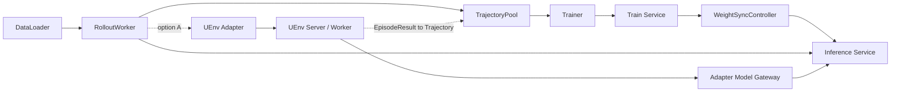

# NexRL 架构与 VeRL / ROLL 对比调研

> 日期：2026-07-26
> 目标：系统梳理 NexRL 的架构要点、运行链路、服务化抽象、与 VeRL / ROLL 的差异，并给出 UEnv 后续调研和接入判断。
> 范围：本文件是架构调研文档，不包含代码改动方案；最小样例推进计划见 [`NexRL调研与最小样例规划.md`](./NexRL调研与最小样例规划.md)。

## 1. 核心结论

NexRL 与 VeRL / ROLL 最大的差异不在于“是否支持 GRPO/PPO”，而在于它把训练系统显式拆成多个服务化组件：`RolloutWorker`、`TrajectoryPool`、`Trainer`、`Train Service`、`Inference Service` 和 `WeightSyncController`。这种设计会提高启动和部署复杂度，但更适合研究分布式后训练系统中的异步 rollout、异步训练、agent 接入、多推理后端和权重同步。

对当前 UEnv 项目来说，NexRL 的价值主要有三点：

1. 作为长期架构参考，帮助我们设计更清晰的 trajectory pool、model gateway、weight sync 和异步 result buffer。
2. 作为未来候选训练框架，验证 UEnv 能否接入服务化 rollout/training 架构，而不仅依赖 VeRL AgentLoop。
3. 作为对 VeRL / ROLL 的对照，判断“框架内部异步并行”和“服务化模块解耦”哪一种更适合 UEnv 的最终系统形态。

短期建议仍然是：先跑通 NexRL 原生 GSM8K 1step / 10step，不立刻接入 UEnv。原因是 NexRL 的 self-hosted 模式涉及 API server、GPU train worker、inference service、controller、Ray actors 和 weight sync，多组件稳定性需要先单独验证。

## 2. NexRL 的系统定位

NexRL 官方将其定位为 production-ready distributed LLM post-training framework，核心思想是 ultra-loosely-coupled，即极度松耦合。它把后训练流程拆成多个独立模块，并通过统一 API 连接训练后端、推理后端和 agent/rollout 逻辑。

从官方 README 和本地代码看，NexRL 有三类关键抽象：

| 抽象 | 说明 | 代表组件 |
|---|---|---|
| 核心训练组件 | 组织数据、rollout、trajectory、训练和权重同步 | `DataLoader`、`RolloutWorker`、`TrajectoryPool`、`Trainer`、`WeightSyncController` |
| 服务化后端 | 把推理和训练能力暴露为统一 API | `Inference Service`、`Train Service` |
| Agent 接入 | 让外部 agent 不需要理解 RL 细节，也能产出 trajectory | `Agent Service`、`AgentRolloutWorker` |

NexRL 的目标不是把所有逻辑塞进一个 trainer 进程，而是把“谁负责生成样本”“谁负责缓存样本”“谁负责训练”“谁负责同步权重”拆开。这个方向和 UEnv 目前正在形成的 Adapter / Server / Worker / Gateway 分层是相容的。

## 3. 架构图


简化流程如下：



这张图表达两个重点：

1. NexRL 原生链路中，RolloutWorker 负责调用 Inference Service 并生成 trajectory，Trainer 从 TrajectoryPool 取 batch 后调用 Train Service 更新模型。
2. 如果未来接入 UEnv，最自然的位置是让 UEnv 替换 RolloutWorker 中的环境执行部分，或者让 UEnv Worker/Agent 直接把 trajectory 推入 NexRL 的 TrajectoryPool / Agent Service。

## 4. 核心组件详解

### 4.1 DataLoader

`DataLoader` 负责提供训练样本。本地 `recipe/math/common.yaml` 中默认使用 `torch` 类型数据加载器，字段包括：

| 字段 | 作用 |
|---|---|
| `data_files` | 训练数据 parquet 列表 |
| `batch_size` | 每次 dataloader 输出的 prompt batch |
| `rollout_repeat_n` | 每个 prompt 重复采样次数，对 GRPO 的 group sampling 很关键 |
| `prompt_key` | prompt 字段名 |
| `max_prompt_length` | prompt token 长度上限 |
| `max_response_length` | response token 长度上限 |

与 VeRL 类似，DataLoader 本身不负责环境执行。差异在于 NexRL 后续会把样本交给 RolloutWorker，而不是直接进入一个同步 `generate_sequences()` 流程。

### 4.2 RolloutWorker

`RolloutWorker` 是 NexRL 中最接近 UEnv Adapter 接入点的组件。它负责：

1. 从 DataLoader 获取样本。
2. 调用 inference client 生成模型回答。
3. 执行任务 evaluator 或 agent interaction。
4. 计算 reward / score。
5. 组装 trajectory 并写入 TrajectoryPool。

本地代码中有多种 rollout worker：

| 文件 | 说明 |
|---|---|
| `nexrl/rollout_worker/single_turn_math.py` | 单轮数学任务，使用 rule-based judge |
| `nexrl/rollout_worker/agent_rollout_worker.py` | agent rollout 基类 |
| `nexrl/rollout_worker/simple_rollout_worker.py` | 简单 rollout worker |
| `nexrl/rollout_worker/base_nexau_rollout_worker.py` | NexAU agent 相关 worker |

对 UEnv 来说，RolloutWorker 是最重要的观察对象。未来如果要接入 NexRL，可能实现一个 `UEnvRolloutWorker`，内部把样本转成 `EpisodeRequest`，通过 UEnv Adapter/Core/Server/Worker 执行，再把 `EpisodeResult` 转成 NexRL `Trajectory`。

### 4.3 Inference Service

NexRL 的 Inference Service 使用 OpenAI-compatible API 作为统一接口。官方文档强调它可以切换 SGLang、vLLM、TGI 等推理后端，而上层 RolloutWorker 不需要改代码。

本地 `OpenAIInferenceServiceClient` 有几个对 UEnv 很关键的行为：

| 行为 | 影响 |
|---|---|
| 调用 `/v1/chat/completions` 或 `/v1/completions` | 与当前 Adapter Model Gateway 协议兼容 |
| 默认请求 `logprobs=True` | Worker/Gateway 需要保证 token-level logprob 可用 |
| 组装 `nexrl_train.prompt_tokens` | Trainer 后续训练需要 prompt token |
| 组装 `nexrl_train.response_tokens` | Trainer 后续训练需要 response token |
| 组装 `nexrl_train.response_logprobs` | old log prob / policy loss 相关 |
| 支持 reasoning parser 和 tool parser | 对 Qwen thinking / tool call 任务有影响 |

这和我们之前讨论的 UEnv 异步字段一致：如果未来 UEnv 接 NexRL，`EpisodeResult` 不能只返回自然语言答案和 reward，还需要保留 response token、token logprob、finish_reason、model version 等训练字段。

### 4.4 TrajectoryPool

`TrajectoryPool` 是 NexRL 与 VeRL/ROLL 差异最明显的组件之一。它不是简单列表，而是可以按配置进行分组、聚合和 batch ready 判断。

本地实现中有三类 store：

| Store | 说明 |
|---|---|
| `SimpleTrajectoryStore` | 不分组，trajectory 直接进入 finished samples |
| `GroupedTrajectoryStore` | 按一个 key 分组，例如按 `uid` 或 `group_id` 聚合 |
| `HierarchicalTrajectoryStore` | 按多个 key 分层聚合 |

这对 GRPO 很重要。GRPO 通常需要同一个 prompt 的多个 responses 构成 group，才能计算组内相对优势。NexRL 的 `group_key` / `group_size` / `key_list` 对应的就是这种需求。

与 UEnv 当前状态相比，NexRL 给了一个很清晰的启发：我们后续如果要做 fully async，就不应该只保存“请求列表”和“结果列表”，而应该有一个明确的 result/trajectory pool，支持：

1. 按 `run_id` 隔离任务。
2. 按 `batch_id` / `group_id` 聚合同组 rollout。
3. 按 `policy_version` 或 `model_tag` 区分样本新鲜度。
4. 支持 batch ready 判断和过期样本处理。

### 4.5 Trainer

NexRL 的 Trainer 负责算法逻辑，并从 TrajectoryPool 中取训练 batch。当前本地 recipe 中 math self-hosted 配置使用：

```yaml
trainer:
  type: "self_hosted_grpo"
  algorithm:
    type: "grpo"
```

Trainer 并不直接绑定某一个训练实现，而是通过 Train Service 把 forward、forward_backward、update 等能力交给训练后端。这样做的好处是训练算法层和底层 FSDP/Megatron/Tinker/Weaver 可以解耦。

### 4.6 Train Service

Train Service 是 NexRL 的核心服务化抽象之一。官方描述中，它通过标准化的 `forward()` 和 `forward_backward()` API 连接不同训练后端。当前本地代码和配置中可以看到几类 trainer/backend：

| 类型 | 文件或配置 | 说明 |
|---|---|---|
| self-hosted FSDP | `self_hosted_grpo_trainer.py`、`train_service_backend/fsdp_worker` | 自托管 GPU 训练 |
| direct-zmq | `train_service_backend/api/direct_zmq_client.py` | 本地/服务化 API 调度 |
| remote API | `remote_api_grpo_trainer.py` 等 | 面向外部训练服务 |
| Tinker / Weaver | `nexrl/tinker`、`nexrl/weaver`、recipe | 外部 Training API |

这和 VeRL/ROLL 的区别是：VeRL/ROLL 更像是训练框架直接管理训练 worker，而 NexRL 试图把训练能力抽象成服务。对 UEnv 来说，这种抽象有利于未来支持不同训练后端，但短期启动复杂度更高。

### 4.7 WeightSyncController

`WeightSyncController` 负责协调训练后的权重同步到推理服务。它与我们之前讨论的 model version / gateway version 问题直接相关。

在同步训练中，权重同步通常是：

```text
trainer update actor
  -> export/sync weights
  -> inference service reload/freeze/unfreeze
  -> next rollout uses new policy
```

在异步训练中，权重同步会更复杂：

1. rollout 可能正在使用旧权重。
2. trainer 可能已经更新到新权重。
3. trajectory 需要知道自己由哪个 policy version 生成。
4. inference service 更新期间要避免“请求以为是新模型，实际用了旧模型”的错配。

NexRL 的 WeightSyncController 值得 UEnv 借鉴。尤其是我们已经有 Adapter Model Gateway，如果未来要做多 vLLM endpoint + 多训练 step 异步，需要明确：

1. trainer 什么时候宣布新版本。
2. gateway / endpoint 什么时候加载完成。
3. worker 拿到的 `model_version` 来自生成响应本身，而不是生成后另查接口。
4. trajectory 使用该版本参与 staleness 判断。

## 5. NexRL 的训练数据流

NexRL 的数据流可以拆成两条闭环：rollout 生产闭环和 training 消费闭环。

### 5.1 Rollout 生产闭环

```text
DataLoader sample
  -> RolloutWorker
  -> Inference Service
  -> response + token ids + logprobs
  -> reward/evaluator
  -> Trajectory
  -> TrajectoryPool
```

关键数据：

| 字段 | 作用 |
|---|---|
| prompt tokens | 训练时构造输入 |
| response tokens | 训练 actor loss |
| response logprobs | old log prob / off-policy 校正 |
| reward / score | GRPO advantage |
| group_id / uid | 组内优势计算 |
| model_tag / identifier | 多模型、多推理服务区分 |
| finish_reason | 截断样本过滤或降权 |

### 5.2 Training 消费闭环

```text
TrajectoryPool ready batch
  -> Trainer get batch
  -> Train Service forward / forward_backward
  -> actor update
  -> checkpoint / sync weight
  -> WeightSyncController
  -> Inference Service
```

关键点是 Trainer 不需要知道 rollout worker 如何执行环境，只需要拿到满足算法字段要求的 trajectory batch。这一点非常适合 UEnv，因为 UEnv 的 Server/Worker 本来就是外部环境执行系统。

## 6. 与 VeRL 的详细对比

### 6.1 架构差异

| 维度 | VeRL | NexRL |
|---|---|---|
| 主入口 | `main_ppo` / trainer 脚本 | `nexrl.main` + CLI / controller |
| 组件关系 | trainer 进程内组织 rollout、reward、logprob、update | controller 管理 DataLoader、RolloutWorker、TrajectoryPool、Trainer、services |
| rollout 接入 | AgentLoop / rollout manager | RolloutWorker / Agent Service |
| queue/pool | VeRL async 路径中有 queue，但同步路径不强调外部 pool | TrajectoryPool 是核心一等组件 |
| 推理服务 | VeRL 可启动 vLLM/SGLang，也可配置 endpoint | Inference Service 是统一 API 抽象 |
| 训练后端 | VeRL 自身 FSDP/Megatron/Ray worker | Train Service 适配 FSDP/Megatron/Tinker/Weaver |
| 权重同步 | trainer 驱动 rollout engine 更新 | WeightSyncController 独立负责协调 |
| 上手难度 | 低到中 | 中到高 |

### 6.2 对 UEnv 的影响

VeRL 的优势是当前项目已经跑通，最适合作为近期主线。我们已经能从 AgentLoop 接出 `EpisodeRequest`，并把 `EpisodeResult` 回填为 VeRL 所需的数据结构。

NexRL 的优势是接口边界更贴近 UEnv 长期系统形态。如果我们未来希望 UEnv 不只是“VeRL 的外部环境”，而是一个通用的 RL 环境服务层，那么 NexRL 的 RolloutWorker / TrajectoryPool / Train Service 结构更值得参考。

### 6.3 风险对比

| 风险 | VeRL | NexRL |
|---|---|---|
| 接入工作量 | 已完成主路径，增量可控 | 需要新写 UEnv RolloutWorker 或 Agent Service adapter |
| 调试难度 | 相对集中 | 多服务、多 actor、多日志 |
| 训练性能 | 已有实测基础 | 需要重新建立 baseline |
| 异步能力 | experimental，但路径明确 | 架构支持解耦，但要验证具体算法实现 |
| 模型版本 | VeRL 原生有参数版本管理逻辑 | 需要结合 WeightSyncController 理解并接入 |

## 7. 与 ROLL 的详细对比

### 7.1 架构差异

| 维度 | ROLL | NexRL |
|---|---|---|
| 定位 | 面向大模型 RL 的分布式训练框架 | 服务化 LLM 后训练框架 |
| 异步能力 | 重点看 sync / async rollout / async training 配置 | 重点看 trajectory pool / train service / inference service 解耦 |
| 资源管理 | 更强调训练框架内的资源切分和调度 | 更强调服务部署和组件协作 |
| rollout 侧 | 框架 rollout worker/task 配置 | RolloutWorker / Agent Service |
| training 侧 | ROLL 内部 trainer | Train Service 抽象后端 |
| 适用场景 | 做 step 级并行实验和资源切分对比 | 做长期服务化、agent training、多后端调研 |

ROLL 更适合作为“和 VeRL 对比训练效率”的实验对象，因为它的 sync / async rollout / async training 更贴近我们当前的 step 级并行问题。NexRL 更适合作为“系统架构对照”，尤其是我们想要把训练、环境、推理和权重同步拆成长期可维护服务时。

### 7.2 对 UEnv 的影响

如果目标是短期比较训练加速效果，ROLL 的优先级高于 NexRL。因为 ROLL 的异步训练模式更直接对应：

```text
sync vs async rollout vs async training
```

如果目标是长期设计 UEnv 的跨框架统一层，NexRL 的优先级会上升。因为它已经把下面这些概念拆成一等组件：

1. Inference Service
2. Train Service
3. TrajectoryPool
4. WeightSyncController
5. Agent Service

这些概念都可以映射到 UEnv 的未来设计中。

## 8. 与 UEnv 的接入方案

### 8.1 方案 A：实现 UEnv RolloutWorker

这是最小侵入方案。

```text
NexRL DataLoader
  -> UEnvRolloutWorker
  -> UEnv Adapter/Core
  -> UEnv Server/Worker
  -> EpisodeResult
  -> NexRL Trajectory
  -> TrajectoryPool
```

需要实现的转换：

| NexRL 输入/输出 | UEnv 对应字段 |
|---|---|
| sample prompt | `EpisodeRequest.prompt/messages` |
| task metadata | `EpisodeRequest.metadata/payload` |
| model endpoint | `EpisodeRequest.model_endpoint` 或 UEnv gateway |
| reward | `EpisodeResult.reward` |
| response text | `EpisodeResult.output_text` / trajectory step action |
| response tokens | Worker/Gateway 返回 token ids |
| response logprobs | Worker/Gateway 返回 token logprob |
| finish reason | Worker 返回 `finish_reason` |
| model version | gateway / endpoint 在生成响应中返回版本 |

优点：

1. NexRL 训练侧不需要知道 UEnv Server/Worker。
2. UEnv 仍作为环境执行系统存在。
3. 可以复用 TrajectoryPool 的 batch ready / group 逻辑。

主要难点：

1. NexRL 训练需要 token/logprob，UEnv 必须稳定返回。
2. `EpisodeResult` 到 `Trajectory` 的映射要完整。
3. 异步模式下要维护 `run_id`、`batch_id`、`group_id`、`policy_version`。

### 8.2 方案 B：UEnv Worker/Agent 直连 Agent Service

这种方案更符合 NexRL 的 agent training 理念，但改动更大。

```text
UEnv Server dispatch
  -> UEnv Worker / Agent
  -> NexRL Agent Service
  -> TrajectoryPool
  -> Trainer
```

优点：

1. Worker 可以独立产出 trajectory。
2. 对多 agent、多环境、长任务更自然。
3. Adapter 可以变薄。

缺点：

1. UEnv Server/Worker 需要感知 NexRL service。
2. request/result 生命周期会从同步 RPC 变成异步事件流。
3. 失败重试、去重、trajectory 归属和结果追踪会更复杂。

### 8.3 方案 C：只借鉴架构，不直接接入

短期保持 VeRL 主线，继续用 ROLL 做异步训练对照；NexRL 只作为 UEnv 架构参考。

可迁移的设计包括：

1. Adapter 侧新增明确的 trajectory/result pool。
2. Gateway 侧明确 model version 和 endpoint readiness。
3. Server/Worker 侧把 episode lifecycle 事件化，支持异步消费。
4. 用 run_id / model_tag / policy_version 管理多任务、多模型。

这是最保守也最稳的方案。

## 9. Step 级并行角度的判断

NexRL 架构天然支持 rollout 与 training 解耦，但这不等价于“已经证明比 VeRL/ROLL 更快”。原因是：

1. TrajectoryPool 只是解耦机制，吞吐还取决于 rollout worker 数量、推理服务吞吐、训练 batch 消费速度和 weight sync 开销。
2. 如果模型权重同步很慢，异步 rollout 可能生成过多 stale trajectory。
3. 如果 inference service 需要 token logprob 且 logprob 开销较大，rollout 仍可能是瓶颈。
4. 如果 Kubernetes / Volcano / shared storage 配置不稳定，系统开销会掩盖算法层收益。

因此，对 NexRL 的 step 级并行调研应按以下顺序推进：

| 阶段 | 目标 | 判断标准 |
|---|---|---|
| 1 | mock GSM8K 1step | 验证 controller / train service / worker / pool 能闭环 |
| 2 | 真实 vLLM GSM8K 1step | 验证 OpenAI API、token、logprob、trainer update |
| 3 | 真实 vLLM GSM8K 10step | 统计 step time、rollout time、update time |
| 4 | 增加 rollout worker / inference replicas | 观察 TrajectoryPool 是否能提高 trainer 利用率 |
| 5 | 对齐 VeRL / ROLL 小规模配置 | 做同模型、同数据、同 GPU 的时间对比 |
| 6 | 再评估 UEnv 接入 | 选择 UEnvRolloutWorker 或 Agent Service 接入方案 |

## 10. 配置与运行复杂度

NexRL 相比 VeRL 最大的工程成本是启动链路更复杂。

VeRL 典型启动方式：

```text
run_xxx.sh
  -> python -m verl.trainer.main_ppo
  -> trainer 内部启动/管理 rollout、actor、ref、reward 等组件
```

NexRL self-hosted 典型启动方式：

```text
nexrl CLI / local script
  -> inference service
  -> train service API server
  -> GPU train worker
  -> nexrl.main controller
  -> Ray actors: DataLoader / RolloutWorker / TrajectoryPool / Trainer
```

生产环境还会引入：

1. Kubernetes
2. Volcano Scheduler
3. ConfigMaps
4. public/custom images
5. shared storage，例如 NFS/GPFS

所以 NexRL 并不意味着训练效率天然更低，也不意味着训练效率天然更高。它只是把原本框架内部的训练/推理/rollout 组件显式服务化。实际效率取决于部署质量和资源编排。

## 11. UEnv 当前应重点学习什么

结合 UEnv 目前的问题，NexRL 最值得借鉴的是：

| UEnv 问题 | NexRL 可参考设计 |
|---|---|
| 多个 episode/result 需要异步归并 | `TrajectoryPool` 的 group / batch ready 机制 |
| 多模型/多任务归属 | `model_tag` / `identifier` |
| gateway 访问多个 inference endpoint | `Inference Service` 统一 API |
| trainer 更新后 endpoint 版本对齐 | `WeightSyncController` |
| agentic env 接入 RL 训练 | `Agent Service` / `AgentRolloutWorker` |
| 可观测性和故障定位 | Activity tracker / health check / error reporter |

这也说明，如果 UEnv 未来要做跨框架统一层，重点不一定是统一所有框架的参数，而是统一以下中间语义：

1. trajectory schema
2. model version schema
3. endpoint readiness / freeze / unfreeze 状态
4. request/result lifecycle
5. run_id / episode_id / batch_id / group_id
6. token/logprob/reward/finish_reason 字段

## 12. 后续建议

短期建议：

1. 先跑通 `/data/ronghao/third_party/NexRL/local_gsm8k_smoke/run_gsm8k_1step_direct_zmq.sh`。
2. 再把 mock OpenAI endpoint 替换成真实 vLLM endpoint。
3. 确认 NexRL 对 token ids / logprobs 的要求是否能由 vLLM 稳定满足。
4. 做 1step、10step、小 batch 的时间统计。

中期建议：

1. 对齐 VeRL / ROLL 的 GSM8K 小规模配置。
2. 记录 rollout time、train update time、pool wait time、weight sync time。
3. 判断 NexRL 的服务化解耦是否真的降低 trainer idle。

长期建议：

1. 如果 NexRL 原生链路稳定，再写 `UEnvRolloutWorker` 最小接入。
2. 如果 NexRL 原生链路不稳定，先把 TrajectoryPool / WeightSyncController 思路迁移到现有 Adapter 文档和实现中。
3. 不建议在 NexRL 尚未跑通真实 vLLM 1step 前启动 UEnv 全链路接入。

## 13. 参考资料

| 类型 | 路径或链接 |
|---|---|
| NexRL 官方仓库 | <https://github.com/nex-agi/NexRL> |
| NexRL Blog | <https://dawning-road.github.io/blog/nexrl> |
| 本地 NexRL README | `/data/ronghao/third_party/NexRL/README.md` |
| 本地 NexRL 中文 README | `/data/ronghao/third_party/NexRL/docs/README-CN.md` |
| NexRL User Guide | `/data/ronghao/third_party/NexRL/docs/user-guide.md` |
| NexRL CLI Reference | `/data/ronghao/third_party/NexRL/cli/README.md` |
| 本地 GSM8K smoke | `/data/ronghao/third_party/NexRL/local_gsm8k_smoke/` |
| 本文架构图 | [`asset/nexrl-architecture-uenv.drawio`](./asset/nexrl-architecture-uenv.drawio) |
