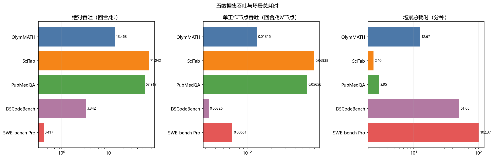
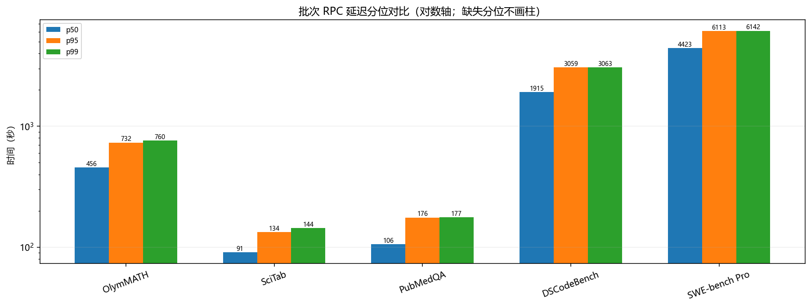
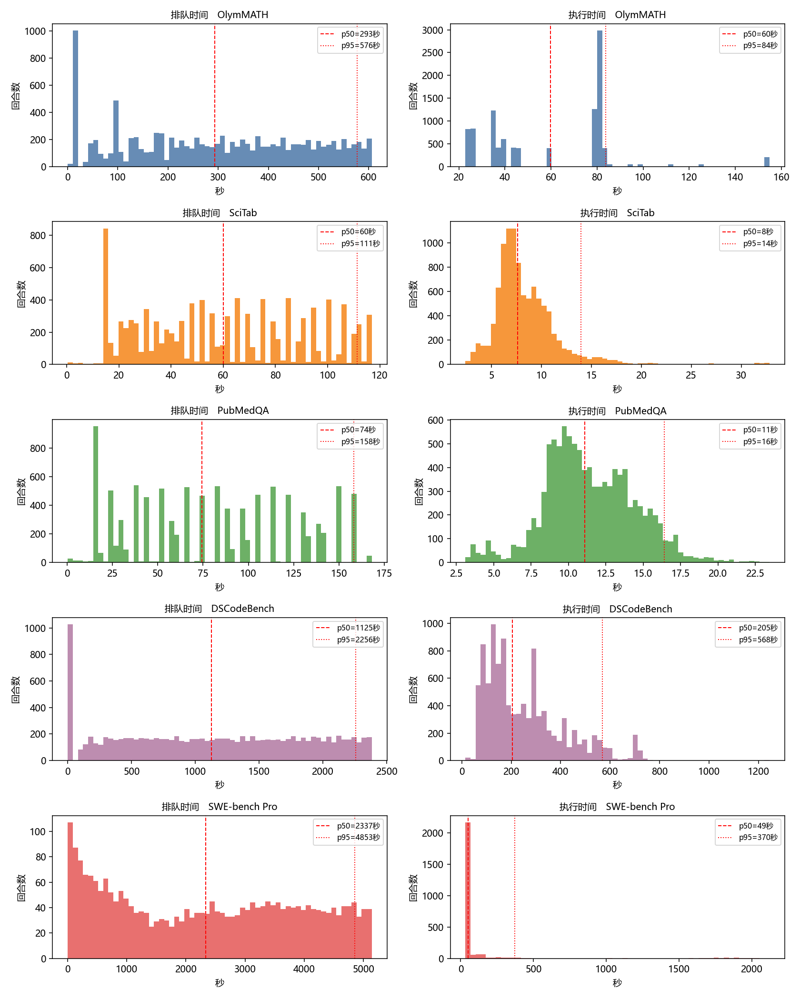
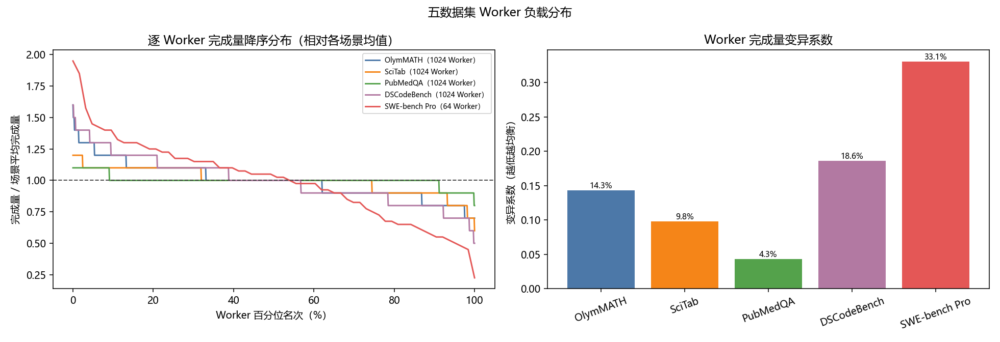
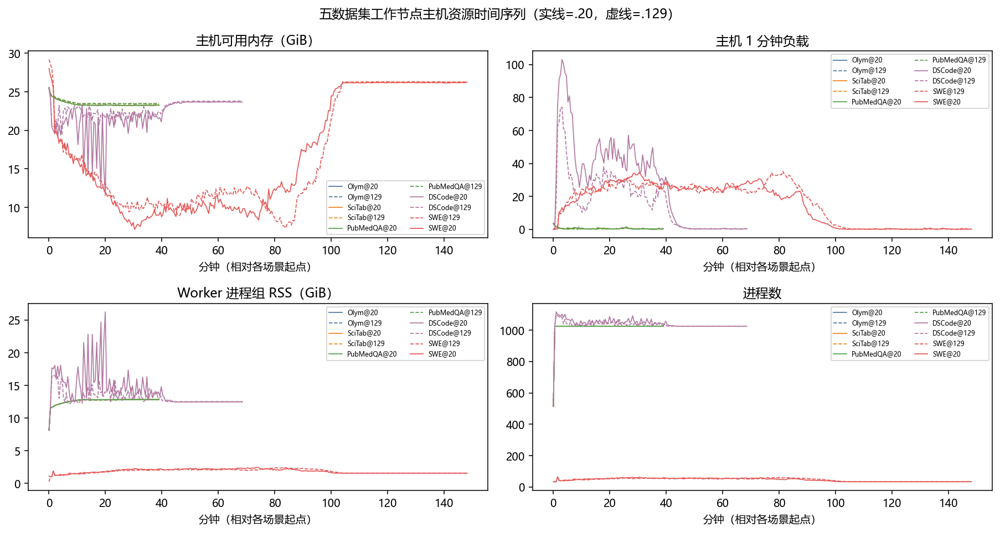

# 五数据集规模压测总结报告

## 1. 实验设置

### 1.1 系统部署

实验部署由 1 个 Server 节点和 2 个 Worker 节点组成。Server 负责请求接收、队列维护、任务调度与结果汇总；Worker 负责执行 Episode。三个节点采用相同的处理器、内存、磁盘和操作系统配置。

**表 1　实验节点配置**

| 节点 | 角色 | 硬件与操作系统 | 网络地址 | 主要职责 |
|---|---|---|---|---|
| 8.130.75.157 | Server / 控制节点 | 8 vCPU（Intel Xeon 6982P-C）；30.44 GiB 内存；252 GiB 根盘；Ubuntu 24.04.4 LTS | 公网 `8.130.75.157`；私网 `192.168.0.136` | 启动场景、接收全部批次、维护队列、调度 Worker、汇总结果 |
| 8.130.65.20 | Worker 节点 1 | 8 vCPU（Intel Xeon 6982P-C）；30.44 GiB 内存；252 GiB 根盘；Ubuntu 24.04.4 LTS | 公网 `8.130.65.20`；私网 `192.168.0.139` | 运行 UEnv Worker 和数据集对应的执行组件，完成 Episode |
| 8.145.51.129 | Worker 节点 2 | 8 vCPU（Intel Xeon 6982P-C）；30.44 GiB 内存；252 GiB 根盘；Ubuntu 24.04.4 LTS | 公网 `8.145.51.129`；私网 `192.168.0.138` | 运行 UEnv Worker 和数据集对应的执行组件，完成 Episode |

### 1.2 工作负载与执行方法

五个数据集按 OlymMATH、SciTab、PubMedQA、DSCodeBench 和 SWE-bench Pro 的顺序独立运行。数据集之间串行执行，避免不同工作负载相互争用 Worker 资源。

**表 2　工作负载与并发配置**

| 数据集 | 工作负载 | Episode | 计划批次 | 同时提交批次 | 请求并发 | Worker | 容量槽 | 容量波次 |
|---|---|---:|---:|---:|---:|---:|---:|---:|
| OlymMATH | 数学推理 | 10,240 | 40 | 40 | 10,240 | 1,024 | 1,024 | 10 |
| SciTab | 表格问答 | 10,240 | 40 | 40 | 10,240 | 1,024 | 1,024 | 10 |
| PubMedQA | 医学问答 | 10,240 | 40 | 40 | 10,240 | 1,024 | 1,024 | 10 |
| DSCodeBench | 代码评测 | 10,240 | 40 | 40 | 10,240 | 1,024 | 1,024 | 10 |
| SWE-bench Pro | 仓库级软件工程 | 2,560 | 20 | 20 | 2,560 | 64 | 64 | 40 |

每个场景均在等待任何批次完成之前提交全部计划批次。Server 接收请求后，根据 Worker 可用状态维护队列并分配 Episode。

### 1.3 评价指标

**表 3　评价指标及其定义**

| 指标 | 定义 |
|---|---|
| 场景吞吐 | 完成 Episode 数除以场景总耗时 |
| 单 Worker 吞吐 | 场景吞吐除以 Worker 数 |
| 容量波次 | 提交 Episode 数除以 Worker 容量槽 |
| batch 延迟 | 客户端批次 RPC 的持续时间，报告 p50、p95 和 p99 |
| 排队时间 | `episode_dispatching` 时刻减去客户端提交时刻 |
| 执行时间 | `episode_completed` 时刻减去 `episode_dispatching` 时刻 |
| 模型调用轮数 | 每个 Episode 实际触发模型回复的次数 |
| 模型回复长度 | 真实回放轨迹中单次模型回复的 Qwen3 Token 数 |
| 单轮回复时长 | 真实回放轨迹中单次模型回复采用的 `replay_wait_ms` |
| 完成率 | 完成 Episode 数除以提交 Episode 数 |
| Worker 负载离散度 | 各 Worker 完成量的标准差和变异系数 |
| 可用内存 | Linux `MemAvailable`，表示无需交换即可供新任务使用的内存估计值 |
| load1/5/15 | Linux 系统负载在过去 1、5 和 15 分钟的移动平均值，统计可运行任务和不可中断等待任务的平均数量，不表示 CPU 使用率百分比 |
| Worker 进程组 RSS | Worker fleet 进程组内各进程 `VmRSS` 之和，表示采样时驻留在物理内存中的进程页面总量 |
| 进程运行状态 | Worker 进程组的进程数、线程数和打开文件描述符数 |

load1、load5 和 load15 分别对应过去 1、5 和 15 分钟的系统负载移动平均值。表 9 报告三个时间序列在测试期间各自出现的最大值，三个最大值不要求出现在同一采样时刻。对于本报告使用的 8 vCPU 主机，load1 为 8 表示过去 1 分钟平均约有 8 个任务处于可运行或不可中断等待状态。load1 高于 8 表示任务需求超过逻辑处理器数量，或存在较多不可中断等待任务，但不能仅凭该指标区分 CPU 计算压力和 I/O 等待。

RSS 表示 Resident Set Size。报告中的 RSS 是 Worker 进程组内各进程驻留内存的求和，用于观察 Worker 相关进程占用的物理内存规模。由于不同进程可能映射相同共享页面，求和值可能重复计算共享内存，因此不能等同于整台主机的实际独占内存消耗。

## 2. 总体结果

五个场景共提交 43,520 个 Episode，并完成 43,520 个。测试记录到 0 个 Episode 失败、0 个 RPC 错误和 0 个协议错误。

**表 4　各场景的总体结果**

| 数据集 | 完成 / 提交 | Worker | 总耗时（min） | 吞吐（ep/s） | 单 Worker 吞吐（ep/s） | 完成率 | 失败 / RPC / 协议错误 |
|---|---:|---:|---:|---:|---:|---:|---:|
| OlymMATH | 10,240 / 10,240 | 1,024 | 12.67 | 13.468 | 0.01315 | 100.0% | 0 / 0 / 0 |
| SciTab | 10,240 / 10,240 | 1,024 | 2.40 | 71.042 | 0.06938 | 100.0% | 0 / 0 / 0 |
| PubMedQA | 10,240 / 10,240 | 1,024 | 2.95 | 57.917 | 0.05656 | 100.0% | 0 / 0 / 0 |
| DSCodeBench | 10,240 / 10,240 | 1,024 | 51.06 | 3.342 | 0.00326 | 100.0% | 0 / 0 / 0 |
| SWE-bench Pro | 2,560 / 2,560 | 64 | 102.37 | 0.417 | 0.00651 | 100.0% | 0 / 0 / 0 |

图 1 汇总各场景的吞吐、单位 Worker 吞吐和总耗时。表 4 同时给出实际 Worker 数，便于在解释单位吞吐和总吞吐时保留资源规模信息。

*图 1 吞吐、单位 Worker 吞吐与场景总耗时。三幅子图分别展示各场景的吞吐、单位 Worker 吞吐和总耗时；数值轴采用对数尺度。*

### 2.1 批次接收与完成情况

OlymMATH、SciTab、PubMedQA 和 DSCodeBench 均形成 10 个容量波次；SWE-bench Pro 形成 40 个容量波次。五个场景的完成率均为 100%，且未出现 Episode 失败、RPC 错误或协议错误。

四个 1,024 Worker 场景的提交规模均为 Worker 容量槽的 10 倍，SWE-bench Pro 的提交规模为其 64 个容量槽的 40 倍。这些请求分别形成 10 个和 40 个连续容量波次。所有 Episode 最终完成且三类错误计数均为 0，说明 Server 在本轮配置下完成了高于即时执行容量的请求积压处理。

## 3. 性能分析

### 3.1 吞吐与批次延迟

**表 5　吞吐与批次延迟分位数**

| 数据集 | Worker | 总耗时（min） | 吞吐（ep/s） | 单 Worker 吞吐（ep/s） | batch p50 / p95 / p99（s） |
|---|---:|---:|---:|---:|---:|
| OlymMATH | 1,024 | 12.67 | 13.468 | 0.01315 | 455.74 / 732.19 / 760.12 |
| SciTab | 1,024 | 2.40 | 71.042 | 0.06938 | 90.68 / 133.59 / 143.84 |
| PubMedQA | 1,024 | 2.95 | 57.917 | 0.05656 | 105.96 / 175.80 / 176.60 |
| DSCodeBench | 1,024 | 51.06 | 3.342 | 0.00326 | 1914.93 / 3058.98 / 3063.15 |
| SWE-bench Pro | 64 | 102.37 | 0.417 | 0.00651 | 4422.93 / 6113.17 / 6142.34 |

表 5 报告各场景在其既定工作负载和 Worker 配置下的测量结果。图 2 使用对数坐标呈现不同数量级的 batch 延迟分位数。

*图 2 批次延迟分位数。对数轴同时容纳不同数量级的延迟；五个数据集均展示 p50、p95 和 p99。*

在 Episode 数和 Worker 数相同的前四个场景中，SciTab 的吞吐为 71.042 ep/s，DSCodeBench 为 3.342 ep/s，二者相差 21.26 倍。对应总耗时分别为 2.40 分钟和 51.06 分钟，耗时比例为 21.28 倍。吞吐排序与总耗时排序保持相反关系，说明在固定 Episode 数和 Worker 数下，不同工作负载的端到端处理成本存在约 21 倍跨度。由于任务语义不同，这一跨度不表示调度器在某一数据集上获得了等比例收益。

前四个场景的 batch 延迟分位数反映了各自的全部批次均在场景开始阶段提交，并在客户端等待其完成。SWE-bench Pro 的 batch 延迟分位数由本轮 20 个批次的完整 RPC 记录计算，不与其他工作负载构成统一的时延排序。

### 3.2 Episode 排队与执行时间

**表 6　Episode 排队与执行时间统计**

| 数据集 | 关联 Episode | 排队 p50 / p95 / p99（s） | 执行 p50 / p95 / p99（s） |
|---|---:|---:|---:|
| OlymMATH | 10,240 / 10,240 | 293.16 / 576.42 / 601.57 | 59.72 / 83.78 / 154.82 |
| SciTab | 10,240 / 10,240 | 59.95 / 111.23 / 116.63 | 7.63 / 13.95 / 18.84 |
| PubMedQA | 10,240 / 10,240 | 74.38 / 158.23 / 158.89 | 11.08 / 16.42 / 19.07 |
| DSCodeBench | 10,240 / 10,240 | 1124.72 / 2256.39 / 2356.57 | 205.27 / 567.70 / 709.91 |
| SWE-bench Pro | 2,560 / 2,560 | 2336.69 / 4852.62 / 5092.62 | 49.47 / 370.15 / 1907.70 |

排队和执行时间均按 `episode_id` 关联客户端提交记录与 Server 事件。五个场景的关联 Episode 数均等于提交 Episode 数。

*图 3 Episode 排队与执行时间分布。每行对应一个数据集；左列为排队时间，右列为执行时间，红线标示 p50 和 p95。*

排队和执行时间均使用本轮客户端观测与服务端事件按 Episode 标识关联。由于五个场景的 Episode 规模、Worker 数量和执行组件不同，表 6 用于描述各自场景中的排队和执行分布，而非跨数据集的统一时延排序。

SciTab 和 PubMedQA 均没有排队时间严格等于 0 的 Episode。两者排队时间小于 1 秒的 Episode 分别为 6 个和 9 个，小于 5 秒的分别为 21 个和 39 个。当范围扩大到 20 秒时，累计数量分别达到 1,078 个和 1,091 个，与第一波 1,024 个 Worker 容量槽接近。排队时间从客户端提交时刻开始计算，即使第一波 Episode 也包含请求传输、入队和调度开销，因此不会集中在严格的零值。其余 Episode 分布在后续九个容量波次中，需要等待已有任务释放容量。

### 3.3 模型交互特征

**表 7　模型调用轮数、回复长度与单轮回复时长分布**

| 数据集 | Episode 样本 | 模型调用轮数 min / 均值 / p50 / p95 / max | 轨迹回复样本 | 回复长度 min / 均值 / p50 / p95 / max（Token） | 单轮回复时长 min / 均值 / p50 / p95 / max（s） |
|---|---:|---:|---:|---:|---:|
| OlymMATH | 10,240 | 1.00 / 1.00 / 1.00 / 1.00 / 1.00 | 200 | 433.00 / 1226.59 / 1017.00 / 2115.00 / 4756.00 | 22.86 / 60.41 / 59.69 / 83.76 / 154.81 |
| SciTab | 10,240 | 1.00 / 1.00 / 1.00 / 1.00 / 1.00 | 200 | 1.00 / 2.46 / 2.00 / 4.00 / 4.00 | 0.81 / 3.78 / 2.71 / 8.50 / 26.91 |
| PubMedQA | 10,240 | 1.00 / 1.00 / 1.00 / 1.00 / 1.00 | 200 | 1.00 / 1.50 / 1.00 / 2.00 / 2.00 | 0.76 / 2.97 / 1.93 / 6.14 / 11.31 |
| DSCodeBench | 10,240 | 2.00 / 7.98 / 8.00 / 8.00 / 8.00 | 200 | 72.00 / 384.44 / 293.00 / 940.00 / 2632.00 | 7.07 / 29.38 / 23.15 / 68.56 / 88.00 |
| SWE-bench Pro | 2,560 | 1.00 / 1.00 / 1.00 / 1.00 / 1.00 | 50 | 81.00 / 124.42 / 123.00 / 152.00 / 212.00 | 1.10 / 4.26 / 3.89 / 6.75 / 14.46 |

模型调用轮数来自结果中逐 Episode 的 `actual_steps` 字段。回复长度和单轮回复时长来自本轮加载的真实回放轨迹，分别按 `target_qwen3_tokens` 和 `replay_wait_ms` 统计。轨迹回复样本按唯一轨迹轮次计算，不按 Episode 的重复回放次数加权；每个数据集仅统计其结果记录可达到的轨迹前缀。

三个数学相关场景均为单轮模型调用，但回复规模和等待时长存在明显差异。OlymMATH 的回复长度 p50 为 1017 Token，单轮回复时长 p50 为 59.69 秒。SciTab 的对应数值为 2 Token 和 2.71 秒，PubMedQA 为 1 Token 和 1.93 秒。OlymMATH 的单轮交互负载因而高于另外两个单轮分类场景。

DSCodeBench 的模型调用轮数 p50 和 p95 均为 8 轮，SWE-bench Pro 均为 1 轮。DSCodeBench 的回复长度 p50 为 293 Token，单轮回复时长 p50 为 23.15 秒。SWE-bench Pro 的对应数值为 123 Token 和 3.89 秒。本轮 SWE-bench Pro 的结果记录中 `actual_steps` 均为 1，因此表中仅使用每条真实轨迹的首轮回复。配置中的 10 轮为执行上限，不表示每个 Episode 必然达到该轮数。

## 4. 调度与资源行为

### 4.1 Worker 负载分布

**表 8　逐 Worker 完成量分布**

| 数据集 | Worker 数 | 最少 | 均值 | p50 | p95 | p99 | 最多 | 标准差 | 变异系数 |
|---|---:|---:|---:|---:|---:|---:|---:|---:|---:|
| OlymMATH | 1024 | 7 | 10.0 | 10.0 | 13.0 | 14.0 | 16 | 1.43 | 14.3% |
| SciTab | 1024 | 6 | 10.0 | 10.0 | 11.0 | 12.0 | 12 | 0.98 | 9.8% |
| PubMedQA | 1024 | 8 | 10.0 | 10.0 | 11.0 | 11.0 | 11 | 0.43 | 4.3% |
| DSCodeBench | 1024 | 5 | 10.0 | 10.0 | 13.0 | 14.0 | 16 | 1.86 | 18.6% |
| SWE-bench Pro | 64 | 9 | 40.0 | 41.0 | 58.0 | 78.0 | 78 | 13.23 | 33.1% |

图 4 将各 Worker 完成量除以对应场景的均值，并按完成量降序排列。右侧子图给出表 8 中的变异系数。

*图 4 Worker 完成量分布。左图为按场景均值归一化后的逐 Worker 完成量，右图为完成量变异系数。*

在四个 1,024 Worker 场景中，每个 Worker 平均完成 10 个 Episode。PubMedQA 的变异系数最低，为 4.3%，其完成量范围为 8 至 11。DSCodeBench 的变异系数最高，为 18.6%，其完成量范围为 5 至 16。这表明相同 Worker 规模下，PubMedQA 的完成量分布最集中，DSCodeBench 的完成量分布最分散。

本轮 SWE-bench Pro 的 64 个 Worker 平均完成 40.0 个 Episode，完成量范围为 9 至 78，变异系数为 33.1%。完成量统计不能单独区分任务持续时间差异与调度行为的各自影响。

### 4.2 Worker 主机资源

**表 9　Worker 主机资源统计**

| 数据集 | 节点 | 样本 | 可用内存 min/max（GiB） | load1/5/15 最大值 | RSS 最大（GiB） | 进程/线程/FD 最大值 |
|---|---|---:|---:|---:|---:|---:|
| OlymMATH | 8.130.65.20 | 78 | 23.21/25.46 | 3.71/0.87/0.49 | 12.85 | 1025/10229/13505 |
| OlymMATH | 8.145.51.129 | 78 | 23.42/25.62 | 3.62/0.91/0.46 | 12.80 | 1025/10231/13565 |
| SciTab | 8.130.65.20 | 78 | 23.21/25.46 | 3.71/0.87/0.49 | 12.85 | 1025/10229/13505 |
| SciTab | 8.145.51.129 | 78 | 23.42/25.62 | 3.62/0.91/0.46 | 12.80 | 1025/10231/13565 |
| PubMedQA | 8.130.65.20 | 78 | 23.21/25.46 | 3.71/0.87/0.49 | 12.85 | 1025/10229/13505 |
| PubMedQA | 8.145.51.129 | 78 | 23.42/25.62 | 3.62/0.91/0.46 | 12.80 | 1025/10231/13565 |
| DSCodeBench | 8.130.65.20 | 136 | 11.55/25.45 | 103.08/60.37/40.91 | 26.25 | 1117/9990/14037 |
| DSCodeBench | 8.145.51.129 | 136 | 19.41/25.61 | 74.16/36.14/24.50 | 16.64 | 1097/9314/14106 |
| SWE-bench Pro | 8.145.51.129 | 294 | 7.33/29.20 | 35.26/31.58/28.25 | 2.43 | 64/642/763 |
| SWE-bench Pro | 8.130.65.20 | 294 | 7.15/28.04 | 34.28/31.76/26.85 | 2.47 | 64/624/762 |

资源监控对两台 Worker 主机采用相同采样字段。
图 5 展示可用内存、load1、Worker 进程组 RSS 和进程数的时间序列；某场景未采集的字段不绘制曲线。

*图 5 Worker 主机资源时序。曲线展示五个场景在两台 Worker 主机上的可用内存、系统负载、进程组 RSS 和进程数。*

OlymMATH、SciTab 和 PubMedQA 在表 9 中具有相同的样本数和资源极值，且各字段在当前显示精度下完全一致。因此，这组记录不能支持三种数学相关工作负载之间的资源差异分析。

DSCodeBench 的两台 Worker 主机呈现明显不对称。节点 8.130.65.20 的最低可用内存比节点 8.145.51.129 少 7.86 GiB，最大 load1 为后者的 1.39 倍，进程组最大 RSS 为后者的 1.58 倍。该差异同时出现在内存、负载和 RSS 三类指标中，说明资源压力在两台主机之间并未均匀分布。

节点 8.130.65.20 在 DSCodeBench 场景中的最大 load1 为 103.08。该数值表示 1 分钟窗口内可运行任务与不可中断等待任务的平均数量，不表示 CPU 使用率为 103.08%。由于现有资源表未同时给出 CPU 利用率和 I/O 等待比例，无法仅根据 load1 确定高负载来自计算竞争还是 I/O 等待。
